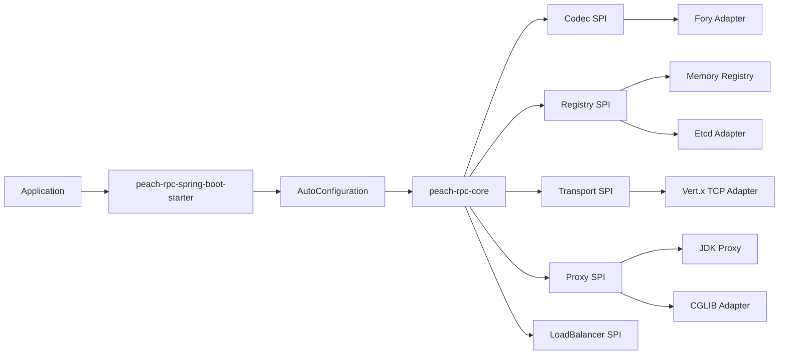

# Peach RPC

[简体中文](README.md) | English

<!-- doc-section:overview -->
## Overview

Peach RPC is a high-performance and extensible Java RPC framework. The `0.1.x` line focuses on a durable data/control-plane foundation: long-lived multiplexed connections, local service directories, bounded concurrency, SPI extensions, a binary protocol, a Spring Boot Starter, and reproducible benchmarks.

> Status: Preview. The codebase is suitable for continued medium-project integration and validation, but TLS/mTLS, retry budgets, circuit breaking/outlier ejection, streaming RPC, generated stubs/dispatchers, and OpenTelemetry remain production gates.

Current capabilities include Vert.x TCP multiplexing, Etcd Lease + revision-aware Range/Watch discovery, local service snapshots, P2C+EWMA load balancing, bounded virtual-thread provider execution, Fory codec, SPI adapters, JDK/CGLIB proxy options, and Spring Boot annotations.

<!-- doc-section:architecture -->
## Architecture



Third-party framework types do not belong in Core contracts, and control-plane work must not enter the per-request hot path.

See the Chinese-first [architecture document](docs/architecture.md).

<!-- doc-section:modules -->
## Modules

The Reactor is reduced from the early 17-module layout to 9 modules:

| Module | Responsibility |
|---|---|
| `peach-rpc-core` | API, SPI, protocol, client/server runtime and lightweight defaults |
| `peach-rpc-codec-fory` | Apache Fory codec |
| `peach-rpc-transport-vertx` | Vert.x TCP transport |
| `peach-rpc-registry-etcd` | Etcd registry |
| `peach-rpc-proxy-cglib` | Optional CGLIB proxy |
| `peach-rpc-spring-boot-autoconfigure` | Spring Boot auto-configuration |
| `peach-rpc-spring-boot-starter` | Recommended application dependency |
| `peach-rpc-examples` | Spring Boot quickstart |
| `peach-rpc-benchmarks` | JMH benchmarks |

<!-- doc-section:compatibility -->
## Compatibility

- JDK 21
- Maven 3.9+
- Spring Boot 3.5.4
- Vert.x 4.5.34
- Jetcd 0.8.7
- Apache Fory 1.5.0

<!-- doc-section:quick-start -->
## Quick start

```xml
<dependency>
    <groupId>io.peach.rpc</groupId>
    <artifactId>peach-rpc-spring-boot-starter</artifactId>
    <version>0.1.0-SNAPSHOT</version>
</dependency>
```

Provider:

```java
@PeachRpcService(interfaceClass = UserService.class, version = "1.0.0")
public class UserServiceImpl implements UserService {
    @Override
    public User findById(Long id) {
        return loadUser(id);
    }
}
```

Consumer:

```java
@PeachRpcReference(version = "1.0.0")
private UserService userService;
```

<!-- doc-section:configuration -->
## Configuration

The default setup uses the in-memory registry, Vert.x transport, Fory codec, JDK proxy, and P2C+EWMA load balancing. Configure `peach.rpc.registry.type=etcd` for Etcd discovery and `peach.rpc.server.enabled=true` for providers.

See [Starter configuration](docs/starter.md).

<!-- doc-section:build -->
## Build

```bash
python3 scripts/check_project.py
mvn -B -ntp clean verify -Pquality
```

<!-- doc-section:docs -->
## Documentation

Repository documentation is maintained primarily in Simplified Chinese. Start with [Architecture](docs/architecture.md), [Starter](docs/starter.md), [Maven](docs/maven.md), and [Production readiness](docs/readiness.md).
