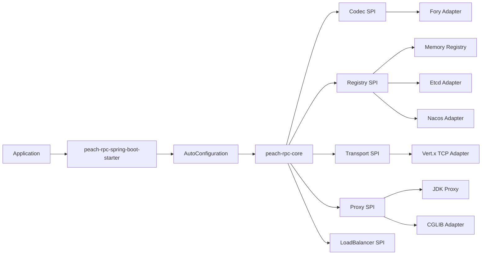

# Peach RPC

[简体中文](README.md) | English

<!-- doc-section:overview -->
## Overview

Peach RPC is a high-performance and extensible Java RPC framework. The `0.1.x` line focuses on a durable data/control-plane foundation: long-lived multiplexed connections, local service directories, bounded concurrency, SPI extensions, a binary protocol, a Spring Boot Starter, and reproducible benchmarks.

> Status: Preview. V2-C.1 delivers annotation-driven runtimes, split API/Provider/Consumer examples, and the Nacos 3.2.4 Registry Adapter. V2-C.2 is Current on this branch: negotiated heartbeat/idle detection, bounded full-jitter reconnect, relative timeout budgets, Etcd compaction/restart/three-node leader-transfer recovery, Nacos restart/re-registration/re-subscription, independent-JVM recovery E2E, and connection lifecycle observation are implemented and verified. The project remains Preview because TLS/mTLS, Micrometer/OpenTelemetry/JFR adapters, wire compatibility, the full performance matrix, network-blackhole/long soak tests, and capacity/upgrade/rollback guidance are still production gates. See the [Production Roadmap / Capability Matrix](docs/production-roadmap.md) for the authoritative status view.

Current capabilities include Vert.x TCP multiplexing with connection-local request IDs, negotiated heartbeat/idle detection and reconnect backoff, Etcd Lease + revision-aware Range/Watch discovery with compaction/restart/leader-transfer recovery coverage, Nacos temporary-instance discovery with restart/re-registration/re-subscription E2E, immutable array service snapshots, allocation-light P2C+EWMA selection, annotation-driven lazy runtimes, BLOCKING_VIRTUAL/CPU/guarded DIRECT provider execution, generated client/server paths, bounded retries, outlier ejection, circuit breaking, cancellation propagation, graceful draining, independent-JVM examples, and connection lifecycle events through the low-dependency RpcObserver contract.

<!-- doc-section:architecture -->
## Architecture


```mermaid
flowchart LR
    App[Application] --> Starter[peach-rpc-spring-boot-starter]
    Starter --> Auto[AutoConfiguration]
    Auto --> Core[peach-rpc-core]
    Core --> Codec[Codec SPI]
    Core --> Registry[Registry SPI]
    Core --> Transport[Transport SPI]
    Core --> Proxy[Proxy SPI]
    Core --> LB[LoadBalancer SPI]
    Codec --> Fory[Fory Adapter]
    Registry --> Memory[Memory Registry]
    Registry --> Etcd[Etcd Adapter]
    Registry --> Nacos[Nacos Adapter]
    Transport --> Vertx[Vert.x TCP Adapter]
    Proxy --> Jdk[JDK Proxy]
    Proxy --> Cglib[CGLIB Adapter]
```

Third-party framework types do not belong in Core contracts, and control-plane work must not enter the per-request hot path.

See the Chinese-first [architecture document](docs/architecture.md), [Production Roadmap / Capability Matrix](docs/production-roadmap.md), and [V2 high-performance kernel plan](docs/high-performance-kernel-v2-plan.md).

<!-- doc-section:modules -->
## Modules

The Reactor is reduced from the early concept-granularity layout and now contains 12 modules with real dependency-isolation value:

| Module | Responsibility |
|---|---|
| `peach-rpc-core` | API, SPI, protocol, client/server runtime and lightweight defaults |
| `peach-rpc-codegen` | Compile-time consumer stub annotation processor; not part of the runtime hot path |
| `peach-rpc-codec-fory` | Apache Fory codec |
| `peach-rpc-transport-vertx` | Vert.x TCP transport |
| `peach-rpc-registry-etcd` | Etcd registry |
| `peach-rpc-registry-nacos` | Nacos registry |
| `peach-rpc-proxy-cglib` | Optional CGLIB proxy |
| `peach-rpc-proxy-bytebuddy` | Optional Byte Buddy runtime proxy fallback |
| `peach-rpc-spring-boot-autoconfigure` | Spring Boot auto-configuration |
| `peach-rpc-spring-boot-starter` | Recommended application dependency |
| `peach-rpc-examples` | Spring Boot quickstart |
| `peach-rpc-benchmarks` | JMH benchmarks |

<!-- doc-section:compatibility -->
## Compatibility

- JDK 21
- Maven 3.9+
- Spring Boot 3.5.4
- Vert.x 4.5.34
- Jetcd 0.8.7
- Nacos Client 3.2.4
- Apache Fory 1.5.0

<!-- doc-section:quick-start -->
## Quick start

```xml
<dependency>
    <groupId>io.peach.rpc</groupId>
    <artifactId>peach-rpc-spring-boot-starter</artifactId>
    <version>0.1.0-SNAPSHOT</version>
</dependency>
```

Provider:

```java
@PeachRpcService(interfaceClass = UserService.class, version = "1.0.0")
public class UserServiceImpl implements UserService {
    @Override
    public User findById(Long id) {
        return loadUser(id);
    }
}
```

Consumer:

```java
@PeachRpcReference(version = "1.0.0")
private UserService userService;
```

<!-- doc-section:configuration -->
## Configuration

The default setup uses the in-memory registry, Vert.x transport, Fory codec, JDK proxy, and P2C+EWMA load balancing. Use `peach.rpc.registry.type=etcd` or `nacos` for distributed discovery. Provider and Consumer runtimes are created only when a service/reference annotation or explicit programmatic use requires them; `client.enabled` and `server.enabled` are capability guards rather than role declarations.

See [Starter configuration](docs/starter.md). Retry is opt-in per method through `@PeachRpcIdempotent`; non-idempotent methods are never retried automatically.

The V2-B.1 production-kernel behavior and remaining gates are documented in [production-kernel-v2b1.md](docs/production-kernel-v2b1.md).

For the high-performance path, annotate service interfaces with `@PeachRpcContract` and configure `peach-rpc-codegen` as an annotation processor. The processor emits both the consumer stub and provider dispatcher. Runtime discovery prefers generated code and falls back to the configured proxy/MethodHandle path when generated artifacts are absent.

<!-- doc-section:build -->
## Build

```bash
python3 scripts/check_project.py
mvn -B -ntp clean verify -Pquality
```

CI also runs the independent-JVM Nacos recovery E2E. The bounded three-node Etcd leader-transfer chaos gate can be run locally with:

```bash
mvn -B -ntp -pl peach-rpc-registry-etcd -am test -Petcd-chaos
```

<!-- doc-section:docs -->
## Documentation

Repository documentation is maintained primarily in Simplified Chinese. Start with [Production Roadmap / Capability Matrix](docs/production-roadmap.md), [Architecture](docs/architecture.md), [Starter](docs/starter.md), [Nacos Registry](docs/registry-nacos.md), [Maven](docs/maven.md), and [Production readiness](docs/readiness.md).
