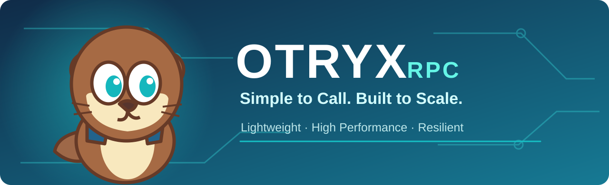
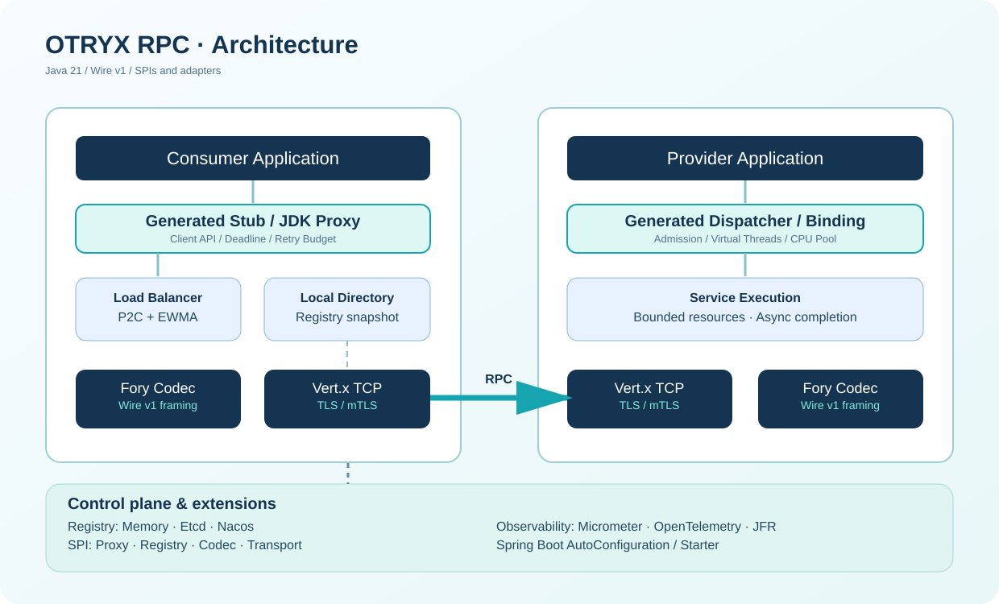
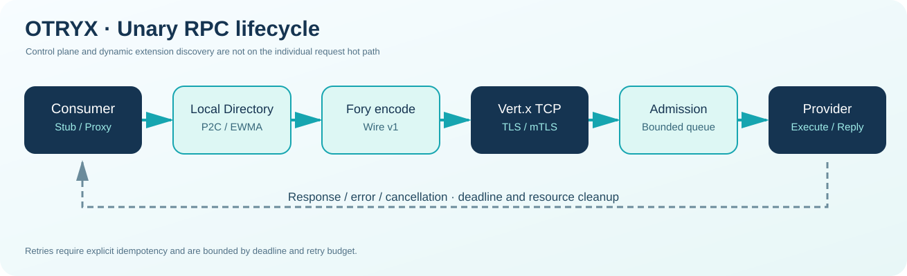

# OTRYX RPC

[简体中文](README.md) | [English](README.en-US.md)

<!-- release-status:project=migration -->
<!-- release-status:version=2.0.0-SNAPSHOT -->
<!-- release-status:wire=v1 -->

<!-- doc-section:overview -->
## Overview

**OTRYX RPC** is a lightweight, high-performance, highly available Java RPC framework evolving from Peach RPC 1.0.x.
Meet Otti, the engineering otter: **Simple to Call. Built to Scale.**

**Source: 2.0.0-SNAPSHOT (migration in progress, not yet publicly released)**
· **Java 21** · **Spring Boot 3.5.4** · **Wire v1** · **MIT**

This release migrates Maven coordinates, Java namespaces and public APIs. It retains Wire v1 framing, **but it does not promise compatibility with Peach RPC 1.0.x Java APIs, Type IDs, Method IDs or schema fingerprints**. See the [migration guide](docs/migration-to-otryx.md).

<!-- doc-section:capabilities -->
## Core capabilities

- **Unary RPC**: Generated Stubs / Dispatchers with JDK Proxy / MethodHandle fallback.
- **Transport**: Vert.x TCP, sharded connections, heartbeat, reconnect, CANCEL, GO_AWAY and graceful drain.
- **Security**: PLAINTEXT / TLS / mTLS, hostname verification and certificate reload.
- **Registry**: Memory, Etcd, Nacos; consumer hot path reads a local service directory.
- **Load balancing**: P2C + EWMA, inflight count and static weights.
- **Resilience**: end-to-end deadline, explicitly idempotent retries, retry budget, circuit breaker, outlier ejection and provider admission.
- **Execution**: virtual threads, bounded CPU resources, Fory and stable type IDs.
- **Observability**: Micrometer, OpenTelemetry, JFR and Grafana / Prometheus examples.
- **Engineering**: JMH, 10k logical-concurrency soak harness, chaos and independent-process tests.

<!-- doc-section:architecture -->
## Architecture

**Design**: control-plane/data-plane isolation; SPI and adapters for implementations; no registry I/O, SPI scan or dynamic parsing per request.

<!-- doc-section:compatibility -->
## Compatibility and migration

Wire v1 keeps its 32-byte header, message/codec IDs and historical registry compatibility metadata.
However, full Java class names affect type and method identifiers and schema fingerprints. OTRYX 2.0 is therefore a **breaking API namespace migration**.

- The original Peach RPC baseline remains available and is not republished under a new GAV.
- Isolate deployments or use blue/green upgrades until cross-version service contract compatibility is independently verified.
- Frozen registry keys remain peach.rpc.protocol.version / peach.rpc.schema.version / peach.rpc.schema.fingerprint.

[Wire compatibility](docs/wire-compatibility.md) · [Migration/rollback](docs/migration-to-otryx.md)

<!-- doc-section:quick-start -->
## Quick start

Requires **JDK 21, Maven and Spring Boot 3.5.4**. Build the development version from source:

~~~bash
mvn -B -ntp clean install -DskipTests
mvn -B -ntp clean verify -Pquality
~~~

Run the independent Provider / Consumer example from [otryx-examples](otryx-examples/README.md); see [Getting started](docs/getting-started.md) for complete setup.

<!-- doc-section:dependency -->
## Maven coordinates

Development version:

~~~xml
<dependency>
    <groupId>com.peachsoft.otryx</groupId>
    <artifactId>otryx-spring-boot-starter-lite</artifactId>
    <version>2.0.0-SNAPSHOT</version>
</dependency>
~~~

The full starter is otryx-spring-boot-starter. **No Maven Central release is claimed for this snapshot.**

<!-- doc-section:configuration -->
## Configuration

~~~yaml
otryx:
  rpc:
    enabled: true
    registry:
      type: memory
~~~

See [Starter guide](docs/starter.md) and [Production configuration](docs/production-configuration.md) for validated options, TLS and registry setup.

<!-- doc-section:operations -->
## Performance and operations

Validate deadline, admission, backpressure, retries, TLS and observability against your actual workloads. Shared CI-runner smoke results are not production throughput, p99 or capacity claims.

[Performance evidence](docs/performance-evidence.md) · [Capacity planning](docs/capacity-planning.md) · [Observability](docs/observability.md)

<!-- doc-section:documentation -->
## Documentation

[Requirements](docs/requirements-blueprint.md) · [Technical solution](docs/technical-solution.md) · [Architecture](docs/architecture.md) · [Detailed design](docs/detailed-design.md) · [Features](docs/features.md) · [Protocol](docs/protocol.md) · [SPI](docs/spi.md) · [Brand guidelines](docs/brand-guidelines.md) · [Migration guide](docs/migration-to-otryx.md) · [Historical release notes](docs/release-notes-1.0.1.md)

<!-- doc-section:development -->
## Development and contributing

[Contributing](CONTRIBUTING.md) · [Security](SECURITY.md) · [Agent contract](AGENTS.md).

The repository requires **Chinese standard Javadoc, English structured logs and reproducible compatibility/performance evidence**.

<!-- doc-section:license -->
## License

[MIT License](LICENSE)
