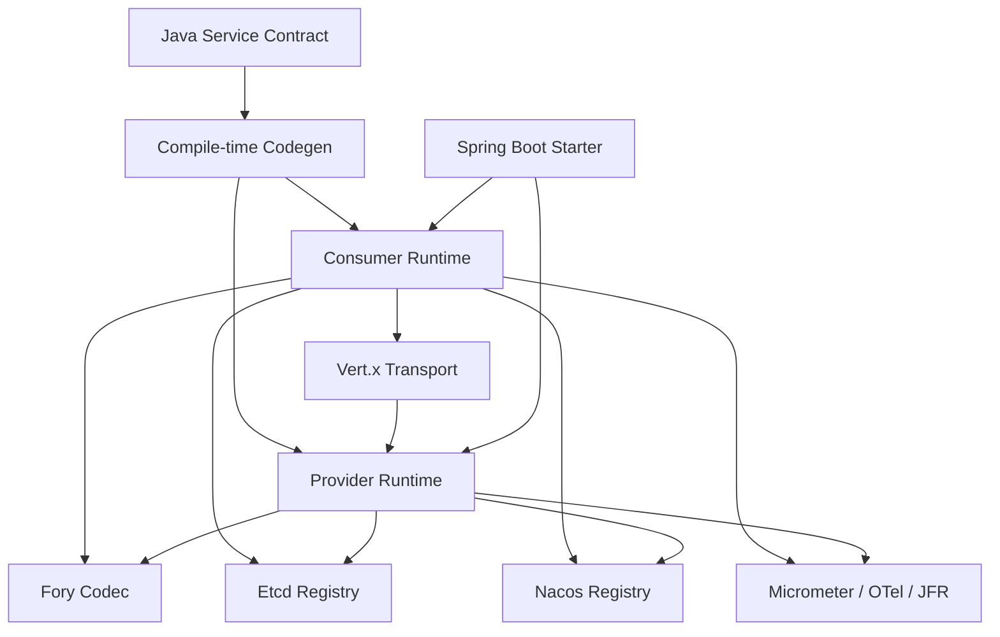

# Peach RPC

[简体中文](README.md) | English

<!-- release-status:project=ga -->
<!-- release-status:version=1.0.0 -->
<!-- release-status:wire=v1 -->

<!-- doc-section:overview -->
## Overview

Peach RPC is a lightweight, high-performance, extensible RPC framework for **Java service-to-service communication**. Version 1.0.0 provides a complete Unary RPC stack with service discovery, load balancing, timeout/retry/circuit breaking, TLS/mTLS, observability, N/N+1 rolling compatibility, chaos testing, and release engineering.

**Stable version: 1.0.0 GA**  
**Java: 21**  
**Spring Boot: 3.5.4**  
**Wire: v1 (frozen for 1.0.x)**  
**License: MIT**

Peach RPC does not turn shared CI-runner numbers into production performance claims. Official performance or capacity numbers require controlled fixed-environment evidence.

<!-- doc-section:capabilities -->
## Core capabilities

- **Unary RPC** with generated Stub/Dispatcher preferred and Proxy/MethodHandle fallbacks.
- **Transport**: Vert.x TCP connections, sharding, heartbeat, reconnect, CANCEL, GO_AWAY, graceful drain.
- **Security**: PLAINTEXT / TLS / mTLS, hostname verification, certificate validation and live reload.
- **Registry**: Memory, Etcd and Nacos; the request hot path reads a local service directory only.
- **Load balancing**: P2C + EWMA + inflight + static weight.
- **Resilience**: logical deadline, explicit-idempotency retry, retry budget, circuit breaker, outlier ejection and provider admission.
- **Provider execution**: virtual threads by default, bounded CPU executor, guarded DIRECT mode.
- **Codec**: Fory with stable type-ID collision detection.
- **Compatibility**: Wire v1, Schema Fingerprint v1, N/N+1 mixed deployment and rollback.
- **Observability**: Micrometer, OpenTelemetry, JFR, Grafana dashboard and Prometheus alert examples.
- **Engineering**: JMH, 10k logical-concurrency soak harness, Etcd/Nacos chaos, rolling compatibility and release readiness.

See the Chinese-first [feature reference](docs/features.md) for the full capability matrix.

<!-- doc-section:architecture -->
## Architecture


```mermaid
flowchart TB
    Contract[Java Service Contract]
    Codegen[Compile-time Codegen]
    Client[Consumer Runtime]
    Server[Provider Runtime]
    Fory[Fory Codec]
    Vertx[Vert.x Transport]
    Etcd[Etcd Registry]
    Nacos[Nacos Registry]
    Obs[Micrometer / OTel / JFR]
    Starter[Spring Boot Starter]

    Contract --> Codegen
    Codegen --> Client
    Codegen --> Server
    Client --> Vertx --> Server
    Client --> Fory
    Server --> Fory
    Client --> Etcd
    Client --> Nacos
    Server --> Etcd
    Server --> Nacos
    Client --> Obs
    Server --> Obs
    Starter --> Client
    Starter --> Server
```

The central design rule is: **separate control plane from data plane, isolate third-party technology behind adapters, and keep compile-time/startup bindings out of the per-RPC hot path.**

- [Requirements blueprint](docs/requirements-blueprint.md)
- [Technical solution](docs/technical-solution.md)
- [Architecture](docs/architecture.md)
- [Detailed design](docs/detailed-design.md)
- [Project structure](docs/project-structure.md)

<!-- doc-section:compatibility -->
## Compatibility

Frozen for 1.0.x:

- Wire Protocol v1;
- Public Core API;
- Stable Type ID rules;
- Schema Fingerprint v1;
- assigned Codec / Message Type IDs;
- Registry compatibility metadata keys.

Automated rolling compatibility verifies:

```text
N Consumer   -> N Provider
N+1 Consumer -> N Provider
N Consumer   -> N+1 Provider
N+1 Consumer -> N+1 Provider
N+1 Consumer -> N Provider rollback
```

See [Wire Compatibility](docs/wire-compatibility.md) and [Upgrade/Rollback](docs/upgrade-rollback.md).

<!-- doc-section:quick-start -->
## Quick start

### Prerequisites

- JDK 21
- Maven 3.9+
- Docker for the official Nacos example

### Run the independent-process example from source

```bash
git clone https://github.com/Ryan-Guizhou/peach-rpc.git
cd peach-rpc

docker compose -f peach-rpc-examples/docker-compose.yml up -d
mvn -B -ntp -pl peach-rpc-examples -am clean package
```

Start the Provider:

```bash
java -jar peach-rpc-examples/peach-rpc-example-provider/target/*-exec.jar
```

Start the Consumer in another terminal:

```bash
java -jar peach-rpc-examples/peach-rpc-example-consumer/target/*-exec.jar
```

Expected output:

```text
RPC demo completed successfully: Hello, Peach RPC!
```

See [Getting Started](docs/getting-started.md).

<!-- doc-section:dependency -->
## Spring Boot dependency

GA coordinates:

```xml
<dependency>
    <groupId>io.peach.rpc</groupId>
    <artifactId>peach-rpc-spring-boot-starter</artifactId>
    <version>1.0.0</version>
</dependency>
```

If 1.0.0 is not yet available in the Maven repository you use, install from source first:

```bash
mvn -B -ntp clean install -DskipTests
```

The same 1.0.0 coordinates will then resolve from your local Maven repository.

<!-- doc-section:configuration -->
## Minimal usage

Provider:

```java
@PeachRpcService(
        interfaceClass = OrderService.class,
        version = "1.0.0")
public class OrderServiceImpl implements OrderService {
}
```

Consumer:

```java
@PeachRpcReference(version = "1.0.0")
private OrderService orderService;
```

See [Spring Boot Starter](docs/starter.md) for complete configuration, execution policies, security, code generation and registry behavior.

<!-- doc-section:operations -->
## Production and operations

- [Production configuration](docs/production-configuration.md)
- [TLS / mTLS](docs/security.md)
- [Observability](docs/observability.md)
- [Dashboard / Alert / SLO](docs/production-observability.md)
- [Capacity planning](docs/capacity-planning.md)
- [Performance evidence](docs/performance-evidence.md)
- [Upgrade and rollback](docs/upgrade-rollback.md)

> GA does not mean every machine has the same capacity. Connections, threads, heap, QPS/Core and tail latency must be validated in the target environment.

<!-- doc-section:documentation -->
## Documentation

### Product and design

- [Requirements blueprint](docs/requirements-blueprint.md)
- [Technical solution](docs/technical-solution.md)
- [Features](docs/features.md)
- [Detailed design](docs/detailed-design.md)
- [Project structure](docs/project-structure.md)
- [Architecture](docs/architecture.md)
- [Protocol](docs/protocol.md)
- [SPI](docs/spi.md)

### Usage and operations

- [Getting started](docs/getting-started.md)
- [Starter and configuration](docs/starter.md)
- [Nacos Registry](docs/registry-nacos.md)
- [FAQ](docs/faq.md)

### Releases

- [Release policy](docs/release-policy.md)
- [Release readiness](docs/release-readiness.md)
- [1.0.0-RC1 Release Notes](docs/release-notes-1.0.0-RC1.md)
- [1.0.0 Release Notes](docs/release-notes-1.0.0.md)
- [CHANGELOG](CHANGELOG.md)
- [Roadmap](ROADMAP.md)

<!-- doc-section:development -->
## Development and contributing

Base gates:

```bash
python3 scripts/check_project.py
mvn -B -ntp clean verify -Pquality
```

Registry, wire, transport and hot-path changes require the corresponding integration, chaos, rolling-compatibility or benchmark evidence.

- [Contributing](CONTRIBUTING.md)
- [Development guide](docs/development.md)
- [Security Policy](SECURITY.md)
- [Code of Conduct](CODE_OF_CONDUCT.md)

<!-- doc-section:license -->
## License

[MIT](LICENSE)
