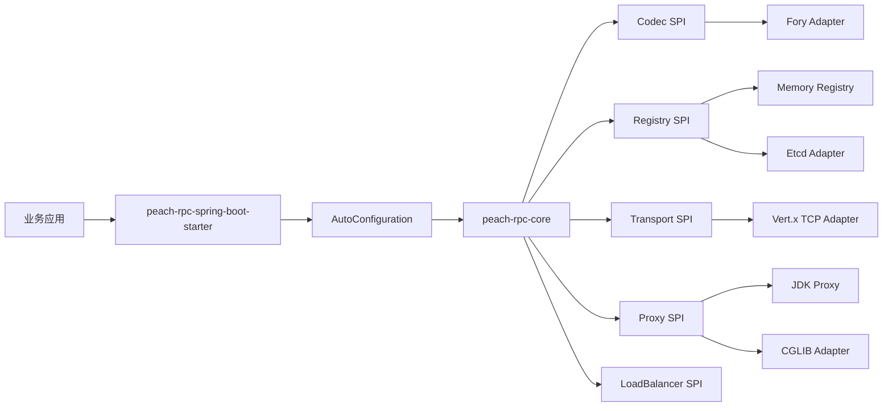

# Peach RPC

简体中文 | [English](README.en-US.md)

<!-- doc-section:overview -->
## 项目简介

Peach RPC 是一个面向 Java 服务间通信的高性能、可扩展 RPC 框架。当前 `0.1.x` 重点不是堆叠功能，而是先建立可长期演进的数据面与控制面边界：长连接多路复用、本地服务目录、有界并发、SPI 扩展、二进制协议、Spring Boot Starter 和可重复性能基准。

> 当前状态：Preview。V2-B 已接通编译期 Consumer Stub / Provider Dispatcher、真实 HELLO/HELLO_ACK、连接分片、connection-local pending、FrameView 与 Unary 协议快路径；TLS/mTLS、完整 Retry Budget、熔断/异常实例剔除、流式 RPC、OpenTelemetry 和端到端 Buffer ownership 仍属于后续生产门禁。

核心能力：

- Vert.x TCP 长连接，基于 connection-local Request ID 多路复用；支持每端点连接分片、握手超时和 GO_AWAY。
- Consumer 本地服务目录，请求热路径不访问 Etcd。
- Etcd Lease + Range/Watch + revision 感知重同步。
- P2C + EWMA + inflight + 静态权重负载均衡；默认热路径直接读取数组快照与实时指标，不构建候选 List。
- Provider 虚拟线程执行，同时通过并发准入限制保护资源边界。
- Fory 默认编解码；方法级 Codec 支持直接从 Frame payload slice 解码，框架错误继续使用 Core 独立线协议。
- 标注 `@PeachRpcContract` 的接口同时生成 Consumer Stub 与 Provider Dispatcher；0~4 参数 Consumer CallSite 使用专用入口，JDK/CGLIB/Byte Buddy 只作为 fallback。
- Spring Boot Starter，支持 `@PeachRpcService` 和 `@PeachRpcReference`。

<!-- doc-section:architecture -->
## 架构



核心规则：**Spring、Vert.x、Jetcd、Fory、CGLIB 等第三方类型不得进入 Core 公共契约；注册中心访问、SPI 解析和配置解析不得进入单次 RPC 热路径。**

详细说明见 [架构设计](docs/architecture.md) 与 [高性能内核 V2 计划](docs/high-performance-kernel-v2-plan.md)。

<!-- doc-section:modules -->
## 模块

当前 Reactor 从早期 17 个“概念粒度模块”收敛后，在高性能 V2 中保持 11 个有真实依赖隔离价值的模块：

| 模块 | 职责 |
|---|---|
| `peach-rpc-core` | 公共 API、SPI、协议、Client/Server、内存 Registry、P2C/EWMA、JDK Proxy |
| `peach-rpc-codegen` | 编译期 Consumer Stub 注解处理器；不进入运行时热路径 |
| `peach-rpc-codec-fory` | Apache Fory Codec |
| `peach-rpc-transport-vertx` | Vert.x TCP Transport |
| `peach-rpc-registry-etcd` | Etcd Registry |
| `peach-rpc-proxy-cglib` | 可选 CGLIB Proxy |
| `peach-rpc-proxy-bytebuddy` | 可选 Byte Buddy Runtime Proxy fallback |
| `peach-rpc-spring-boot-autoconfigure` | Spring Boot 自动装配 |
| `peach-rpc-spring-boot-starter` | 业务项目推荐依赖入口 |
| `peach-rpc-examples` | Spring Boot 使用示例 |
| `peach-rpc-benchmarks` | JMH 性能基准 |

<!-- doc-section:compatibility -->
## 环境基线

- JDK 21
- Maven 3.9+
- Spring Boot 3.5.4
- Vert.x 4.5.34
- Jetcd 0.8.7
- Apache Fory 1.5.0

Spring Boot 版本与 `peach-cloud` 当前基线保持一致，方便后续直接引入。

<!-- doc-section:quick-start -->
## 快速开始

### 1. 引入 Starter

```xml
<dependency>
    <groupId>io.peach.rpc</groupId>
    <artifactId>peach-rpc-spring-boot-starter</artifactId>
    <version>0.1.0-SNAPSHOT</version>
</dependency>
```

### 2. Provider

```java
@PeachRpcService(interfaceClass = UserService.class, version = "1.0.0")
public class UserServiceImpl implements UserService {
    @Override
    public User findById(Long id) {
        return loadUser(id);
    }
}
```

```yaml
peach:
  rpc:
    registry:
      type: etcd
      endpoints: http://127.0.0.1:2379
    server:
      enabled: true
      host: 0.0.0.0
      port: 19090
```

### 3. Consumer

```java
@Component
public class UserFacade {

    @PeachRpcReference(version = "1.0.0")
    private UserService userService;

    public User query(Long id) {
        return userService.findById(id);
    }
}
```

如果未配置 Etcd，默认使用内存注册中心，适合单 JVM 示例和测试。

### 4. 可选：启用编译期 Consumer Stub

高性能路径不会把动态代理作为最终主线。服务接口增加：

```java
@PeachRpcContract
public interface UserService {
    User findById(Long id);
}
```

并在编译器 annotation processor path 中加入 `peach-rpc-codegen`。运行时会优先使用生成 Stub；未生成时仍回退到配置的 ProxyFactory，因此 Starter 的基本使用方式不变。

<!-- doc-section:configuration -->
## 核心配置

| 配置项 | 默认值 | 说明 |
|---|---:|---|
| `peach.rpc.enabled` | `true` | RPC 总开关 |
| `peach.rpc.registry.type` | `memory` | Registry SPI 名称 |
| `peach.rpc.registry.endpoints` | `http://127.0.0.1:2379` | 注册中心地址 |
| `peach.rpc.registry.namespace` | `default` | 注册中心逻辑命名空间 |
| `peach.rpc.registry.lease-ttl-seconds` | `30` | Etcd Lease TTL |
| `peach.rpc.transport.type` | `vertx` | Transport SPI 名称 |
| `peach.rpc.transport.handshake-timeout` | `3s` | TCP 建连后协议握手超时 |
| `peach.rpc.transport.connections-per-endpoint` | `1` | 每个服务端点的连接分片数 |
| `peach.rpc.client.enabled` | `true` | 是否创建 Consumer |
| `peach.rpc.client.timeout` | `3s` | 默认 RPC 超时 |
| `peach.rpc.client.proxy` | `jdk` | Proxy SPI 名称 |
| `peach.rpc.client.load-balancer` | `p2c-ewma` | LoadBalancer SPI 名称 |
| `peach.rpc.server.enabled` | `false` | 是否启动 Provider |
| `peach.rpc.server.port` | `19090` | Provider 端口 |
| `peach.rpc.server.max-concurrent` | `4096` | Provider 最大并发业务请求数 |

完整说明见 [Spring Boot Starter 与配置](docs/starter.md)。

<!-- doc-section:build -->
## 构建与验证

```bash
python3 scripts/check_project.py
mvn -B -ntp clean verify -Pquality
```

CI 使用 JDK 21 执行相同门禁。根 POM 使用 `${revision}` 和 flatten plugin，后续可通过 Maven `deploy` 发布到 Nexus，再由 `peach-cloud` 直接引入 Starter。

<!-- doc-section:docs -->
## 文档

- [架构设计](docs/architecture.md)
- [Spring Boot Starter 与配置](docs/starter.md)
- [Maven 结构与发布](docs/maven.md)
- [协议说明](docs/protocol.md)
- [SPI 扩展指南](docs/spi.md)
- [性能基准](docs/performance.md)
- [生产就绪门禁](docs/readiness.md)
- [开发规范](docs/development.md)
- [实施路线](docs/implementation-plan.md)
- [高性能内核 V2 计划](docs/high-performance-kernel-v2-plan.md)
- [高性能内核 V2-B 实现](docs/high-performance-kernel-v2b.md)

