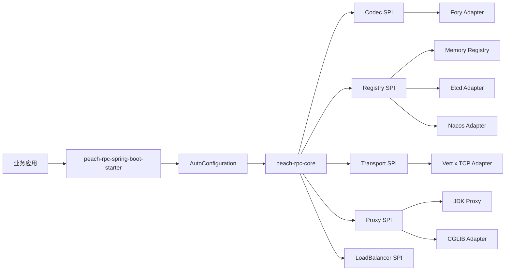

# Peach RPC

简体中文 | [English](README.en-US.md)

<!-- capability-status:project=preview -->
<!-- capability-status:v2-c3=current -->
<!-- capability-status:v2-d=in-progress -->
<!-- capability-status:v2-d2=in-progress -->
<!-- capability-status:v2-e1=engineering-ready -->
<!-- capability-status:v2-e2=engineering-ready -->
<!-- capability-status:v2-f1=engineering-ready -->
<!-- capability-status:v2-f2=validation-pending -->
<!-- capability-status:v2-g1=engineering-ready -->
<!-- capability-status:v2-g2=engineering-ready -->

<!-- doc-section:overview -->
## 项目简介

Peach RPC 是一个面向 Java 服务间通信的高性能、可扩展 RPC 框架。当前 `0.1.x` 重点不是堆叠功能，而是先建立可长期演进的数据面与控制面边界：长连接多路复用、本地服务目录、有界并发、SPI 扩展、二进制协议、Spring Boot Starter 和可重复性能基准。

> 当前状态：Preview。V2-C.x 与 V2-D 基础能力已经形成主线；当前分支进一步完成 Stable Type ID、Schema Fingerprint、Registry 兼容过滤、协议畸形/随机分片测试、Nacos Chaos 工程入口、logical-call Micrometer 指标、Dashboard/Alert/SLO 模板以及升级/回滚/发布资产。项目仍保持 Preview：V2-D.2-E1 的真实固定硬件三轮 Evidence、V2-D.2-E2 的阈值与 Baseline、V2-D.4 的真实性能收口，以及最终 Chaos/RC 环境验证仍是 Production GA 门禁。统一能力状态与优先级见 [Production Roadmap / Capability Matrix](docs/production-roadmap.md)。

核心能力：

- Vert.x TCP 长连接，基于 connection-local Request ID 多路复用；支持每端点连接分片、握手超时、协商式 PING/PONG Heartbeat、idle detection、异常重连退避和 GO_AWAY。
- Consumer 本地服务目录，请求热路径不访问 Etcd/Nacos 等注册中心。
- Etcd Lease + Range/Watch + revision 感知重同步。
- Nacos 临时实例注册、查询、订阅、健康/启用过滤、静态权重和元数据映射；Nacos 阻塞 SDK 与 Vert.x Event Loop 隔离。
- P2C + EWMA + inflight + 静态权重负载均衡；默认热路径直接读取数组快照与实时指标，不构建候选 List。
- Provider 默认使用 BLOCKING_VIRTUAL；可通过 `@PeachRpcExecution(CPU)` 使用有界 CPU 线程池，DIRECT 默认关闭且必须显式允许。
- Fory 默认编解码；方法级 Codec 支持直接从 Frame payload slice 解码，框架错误继续使用 Core 独立线协议。
- 标注 `@PeachRpcContract` 的接口同时生成 Consumer Stub 与 Provider Dispatcher；0~4 参数 Consumer CallSite 使用专用入口，JDK/CGLIB/Byte Buddy 只作为 fallback。
- Spring Boot Starter，支持 `@PeachRpcService` 和 `@PeachRpcReference`。
- Consumer 可使用 `@PeachRpcIdempotent` 显式声明允许自动重试的方法；重试受全局 Budget、整体 Deadline 与抖动退避共同约束。
- Endpoint 连续基础设施失败会被临时剔除，方法级连续失败会触发 Circuit Breaker，避免故障实例和依赖持续放大尾延迟。
- Consumer timeout/主动取消会通过 `CANCEL` 控制帧传播到 Provider；Provider 关闭时先注销服务、发送 GO_AWAY 并等待 inflight 排空。
- Core 提供无 Micrometer/OpenTelemetry/JFR 依赖的 `RpcObserver`、`RpcTracingBridge` 与 `RpcMetadataPropagator`；覆盖 Client/Provider、Connection、Registry、TLS 和证书生命周期事件。可选 Micrometer Adapter 提供标准指标，OpenTelemetry Adapter 传播 W3C Trace Context，JFR Adapter 提供低频高价值运行诊断；未安装 Adapter 时保持 NOOP 路径。
- Etcd Adapter 具备真实 Etcd 集成与 Chaos 门禁：覆盖注册/注销、Watch、namespace、Lease 过期、compaction 后 Range+Watch 恢复、单节点 restart 后 Lease/注册恢复，以及独立 3 节点 leader transfer；Lease 恢复同时使用 keepalive 信号、低频 TTL watchdog、stale lease callback 保护和有界 grant。
- Provider 的 Registry 注册/回滚/注销操作具有独立控制面超时，避免停机流程无限阻塞。
- Provider 在 Registry 发布 Protocol/Schema Metadata；Consumer 在本地 ServiceDirectory 更新时保留 LEGACY/匹配节点并剔除明确 Schema 不兼容节点，不增加单次 RPC 热路径成本。
- Core 提供稳定 Type ID 与 Schema Fingerprint；Fory 绑定阶段执行 Type ID 冲突检测，业务不兼容 Schema 推荐通过新的 ServiceKey.version 隔离。
- 协议 Robustness 已补齐截断 Header/Payload、非法 Version/Message/Status/Length、HELLO 截断/重复能力，以及 FrameAccumulator 随机分片/合并回归测试。
- `peach-rpc-examples` 拆为共享 API、独立 Provider 和独立 Consumer；CI 会真正启动两个可执行 JAR，验证 Provider restart、Nacos restart、Provider 临时实例重注册、Consumer 重订阅以及 Endpoint 迁移后的恢复。

<!-- doc-section:architecture -->
## 架构


```mermaid
flowchart LR
    App[业务应用] --> Starter[peach-rpc-spring-boot-starter]
    Starter --> Auto[AutoConfiguration]
    Auto --> Core[peach-rpc-core]
    Core --> Codec[Codec SPI]
    Core --> Registry[Registry SPI]
    Core --> Transport[Transport SPI]
    Core --> Proxy[Proxy SPI]
    Core --> LB[LoadBalancer SPI]
    Codec --> Fory[Fory Adapter]
    Registry --> Memory[Memory Registry]
    Registry --> Etcd[Etcd Adapter]
    Registry --> Nacos[Nacos Adapter]
    Transport --> Vertx[Vert.x TCP Adapter]
    Proxy --> Jdk[JDK Proxy]
    Proxy --> Cglib[CGLIB Adapter]
```

核心规则：**Spring、Vert.x、Jetcd、Nacos、Fory、CGLIB 等第三方类型不得进入 Core 公共契约；注册中心访问、SPI 解析和配置解析不得进入单次 RPC 热路径。**

详细说明见 [架构设计](docs/architecture.md)、[Production Roadmap / Capability Matrix](docs/production-roadmap.md) 与 [高性能内核 V2 计划](docs/high-performance-kernel-v2-plan.md)。

<!-- doc-section:modules -->
## 模块

当前 Reactor 从早期 17 个“概念粒度模块”收敛后，保持 15 个有真实依赖隔离价值的顶层模块；V2-C.3 新增的三个 Observability 模块仅用于隔离第三方观测依赖：

| 模块 | 职责 |
|---|---|
| `peach-rpc-core` | 公共 API、SPI、协议、Client/Server、内存 Registry、P2C/EWMA、JDK Proxy |
| `peach-rpc-codegen` | 编译期 Consumer Stub 注解处理器；不进入运行时热路径 |
| `peach-rpc-codec-fory` | Apache Fory Codec |
| `peach-rpc-transport-vertx` | Vert.x TCP Transport |
| `peach-rpc-registry-etcd` | Etcd Registry |
| `peach-rpc-registry-nacos` | Nacos Registry |
| `peach-rpc-proxy-cglib` | 可选 CGLIB Proxy |
| `peach-rpc-proxy-bytebuddy` | 可选 Byte Buddy Runtime Proxy fallback |
| `peach-rpc-observability-micrometer` | Micrometer 指标 Adapter；不进入 Core |
| `peach-rpc-observability-opentelemetry` | OpenTelemetry Trace/W3C Context Adapter |
| `peach-rpc-observability-jfr` | JFR 低开销运行诊断 Adapter |
| `peach-rpc-spring-boot-autoconfigure` | Spring Boot 自动装配 |
| `peach-rpc-spring-boot-starter` | 业务项目推荐依赖入口 |
| `peach-rpc-examples` | Spring Boot 使用示例 |
| `peach-rpc-benchmarks` | JMH 性能基准 |

<!-- doc-section:compatibility -->
## 环境基线

- JDK 21
- Maven 3.9+
- Spring Boot 3.5.4
- Vert.x 4.5.34
- Jetcd 0.8.7
- Nacos Client 3.2.4
- Apache Fory 1.5.0

Spring Boot 版本与 `peach-cloud` 当前基线保持一致，方便后续直接引入。

<!-- doc-section:quick-start -->
## 快速开始

### 1. 引入 Starter

```xml
<dependency>
    <groupId>io.peach.rpc</groupId>
    <artifactId>peach-rpc-spring-boot-starter</artifactId>
    <version>0.1.0-SNAPSHOT</version>
</dependency>
```

### 2. Provider

```java
@PeachRpcService(interfaceClass = UserService.class, version = "1.0.0")
public class UserServiceImpl implements UserService {
    @Override
    public User findById(Long id) {
        return loadUser(id);
    }
}
```

```yaml
peach:
  rpc:
    registry:
      type: nacos
      endpoints: 127.0.0.1:8848
      namespace: public
      nacos:
        group: PEACH_RPC
        cluster: DEFAULT
    server:
      host: 0.0.0.0
      port: 19090
      advertised-host: 10.0.0.15
```

### 3. Consumer

```java
@Component
public class UserFacade {

    @PeachRpcReference(version = "1.0.0")
    private UserService userService;

    public User query(Long id) {
        return userService.findById(id);
    }
}
```

未显式配置 Registry 时默认使用内存注册中心，适合单 JVM 测试。真实跨进程示例使用 Nacos。

### 4. 可选：启用编译期 Consumer Stub

高性能路径不会把动态代理作为最终主线。服务接口增加：

```java
@PeachRpcContract
public interface UserService {
    User findById(Long id);
}
```

并在编译器 annotation processor path 中加入 `peach-rpc-codegen`。运行时会优先使用生成 Stub；未生成时仍回退到配置的 ProxyFactory，因此 Starter 的基本使用方式不变。

<!-- doc-section:configuration -->
## 核心配置

| 配置项 | 默认值 | 说明 |
|---|---:|---|
| `peach.rpc.enabled` | `true` | RPC 总开关 |
| `peach.rpc.registry.type` | `memory` | Registry SPI 名称 |
| `peach.rpc.registry.endpoints` | 空 | 注册中心地址；空值由具体 Adapter 决定默认端点 |
| `peach.rpc.registry.namespace` | 空 | 公共命名空间；Etcd 默认 `default`，Nacos 默认 `public` |
| `peach.rpc.registry.lease-ttl-seconds` | `30` | Etcd Lease TTL |
| `peach.rpc.transport.type` | `vertx` | Transport SPI 名称 |
| `peach.rpc.transport.handshake-timeout` | `3s` | TCP 建连后协议握手超时 |
| `peach.rpc.transport.connections-per-endpoint` | `1` | 每个服务端点的连接分片数 |
| `peach.rpc.transport.heartbeat-interval` | `30s` | 空闲连接发送 PING 前的间隔 |
| `peach.rpc.transport.heartbeat-timeout` | `10s` | PING 后等待活跃流量/PONG 的最大时间 |
| `peach.rpc.transport.reconnect-base-backoff` | `50ms` | 异常重连基础退避 |
| `peach.rpc.transport.reconnect-max-backoff` | `3s` | 异常重连最大 full-jitter 窗口 |
| `peach.rpc.transport.security.mode` | `PLAINTEXT` | `PLAINTEXT` / `TLS` / `MTLS` |
| `peach.rpc.transport.security.hostname-verification` | `true` | Consumer 是否校验证书主机名 |
| `peach.rpc.transport.security.handshake-timeout` | `3s` | TLS/mTLS 握手超时 |
| `peach.rpc.transport.security.reload-interval` | `30s` | PEM 证书文件 Reload 检查周期 |
| `peach.rpc.client.enabled` | `true` | 是否允许 Consumer；没有 Reference 时不会创建 Client |
| `peach.rpc.client.timeout` | `3s` | 默认 RPC 超时 |
| `peach.rpc.client.proxy` | `jdk` | Proxy SPI 名称 |
| `peach.rpc.client.load-balancer` | `p2c-ewma` | LoadBalancer SPI 名称 |
| `peach.rpc.server.enabled` | `true` | 是否允许 Provider；没有 Service 时不会监听端口 |
| `peach.rpc.server.port` | `19090` | Provider 监听端口 |
| `peach.rpc.server.advertised-host` | 空 | Registry 对外发布地址；监听通配地址时必须显式配置 |
| `peach.rpc.server.advertised-port` | `0` | 发布端口；0 表示使用实际监听端口 |
| `peach.rpc.server.max-concurrent` | `4096` | Provider 最大并发业务请求数 |
| `peach.rpc.server.execution.allow-direct` | `false` | 是否允许 DIRECT 方法进入 Transport Event Loop |
| `peach.rpc.server.execution.cpu-parallelism` | CPU 核数 | CPU 执行池线程数 |
| `peach.rpc.server.execution.cpu-queue-capacity` | `1024` | CPU 执行池有界队列容量 |

完整说明见 [Spring Boot Starter 与配置](docs/starter.md)。

<!-- doc-section:build -->
## 构建与验证

```bash
python3 scripts/check_project.py
mvn -B -ntp clean verify -Pquality
```

CI 使用 JDK 21 执行相同门禁，并额外运行独立 JVM + Nacos restart 恢复 E2E。Etcd leader-transfer 与 Nacos pause/recovery 使用独立 Chaos Workflow；Release Readiness Workflow 额外验证兼容/运维资产、完整 quality build 与 Release Artifact Inventory。根 POM 使用 `${revision}` 和 flatten plugin，正式发布流程见 [发布策略](docs/release-policy.md)。

<!-- doc-section:docs -->
## 文档

- [架构设计](docs/architecture.md)
- [Spring Boot Starter 与配置](docs/starter.md)
- [Maven 结构与发布](docs/maven.md)
- [协议说明](docs/protocol.md)
- [SPI 扩展指南](docs/spi.md)
- [Nacos Registry Adapter](docs/registry-nacos.md)
- [性能基准](docs/performance.md)
- [V2-D.2 性能证据与 10k Soak](docs/performance-evidence-v2d2.md)
- [容量规划指南](docs/capacity-planning.md)
- [Production Roadmap / Capability Matrix](docs/production-roadmap.md)
- [V2-D.2 → 1.0 GA 版本执行路线](docs/version-roadmap-to-ga.md)
- [V2-D.2-E1 固定性能证据执行](docs/v2d2-e1-controlled-evidence.md)
- [生产就绪门禁](docs/readiness.md)
- [开发规范](docs/development.md)
- [实施路线](docs/implementation-plan.md)
- [高性能内核 V2 计划](docs/high-performance-kernel-v2-plan.md)
- [高性能内核 V2-B 实现](docs/high-performance-kernel-v2b.md)
- [V2-B.1 生产内核第一批](docs/production-kernel-v2b1.md)
- [V2-B.1 生产内核第二批](docs/production-kernel-v2b1-phase2.md)
- [V2-B.2 高可用收口](docs/production-kernel-v2b2.md)
- [V2-C.2 连接高可用](docs/production-kernel-v2c2.md)
- [V2-C.3 Security & Observability 计划](docs/production-kernel-v2c3-plan.md)
- [TLS / mTLS 安全指南](docs/security.md)
- [可观测性指南](docs/observability.md)
- [Wire Compatibility](docs/wire-compatibility.md)
- [升级与回滚指南](docs/upgrade-rollback.md)
- [生产配置与安全加固](docs/production-configuration.md)
- [生产可观测与 SLO 模板](docs/production-observability.md)
- [发布策略与 Production Operations](docs/release-policy.md)
- [可运行 Examples](peach-rpc-examples/README.md)

