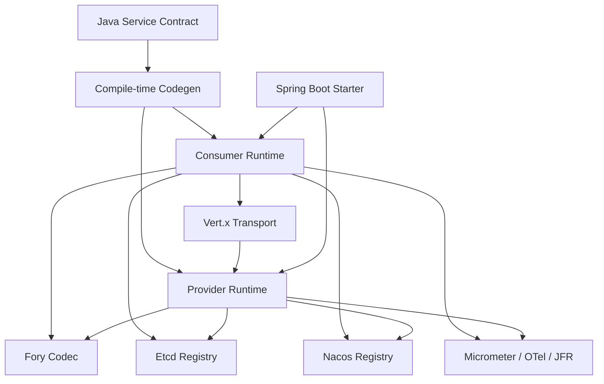

# OTRYX RPC

简体中文 | [English](README.en-US.md)

<!-- release-status:project=ga -->
<!-- release-status:version=1.0.1 -->
<!-- release-status:wire=v1 -->

<!-- doc-section:overview -->
## 项目简介

OTRYX RPC 是一个面向 **Java 服务间通信** 的轻量、高性能、可扩展 RPC 框架。1.0.1 在 1.0.0 GA 的 Wire v1 与 Public Core API 兼容边界上，补齐 Provider 异步完成线程隔离、健康路径热区优化以及 Maven Central Patch Release 工程。

**当前源码版本：1.0.1 Release Prep**  
**Java：21**  
**Spring Boot：3.5.4**  
**Wire：v1（1.0.x 冻结）**  
**License：MIT**

项目不把 GitHub shared runner 的性能数字包装成生产承诺。官方性能/容量数字必须来自受控固定环境 Evidence。

<!-- doc-section:capabilities -->
## 核心能力

- **Unary RPC**：Generated Stub/Dispatcher 优先，Proxy/MethodHandle fallback。
- **Transport**：Vert.x TCP 长连接、连接分片、Heartbeat、Reconnect、CANCEL、GO_AWAY、Graceful Drain。
- **Security**：PLAINTEXT / TLS / mTLS、Hostname Verification、证书校验与在线 Reload。
- **Registry**：Memory、Etcd、Nacos；Consumer 热路径只读本地服务目录。
- **Load Balancing**：P2C + EWMA + inflight + static weight。
- **Resilience**：整体 Deadline、显式幂等 Retry、Retry Budget、Circuit Breaker、Outlier Ejection、Provider Admission。
- **Provider Execution**：默认 Virtual Thread；CPU 有界线程池；DIRECT 默认关闭。
- **Codec**：Fory；Stable Type ID 冲突检测；零参数编码复用不可变空数组（Wire v1 不变，性能增益需实测）。
- **Compatibility**：Wire v1、Schema Fingerprint v1、N/N+1 mixed deployment 与 rollback。
- **Observability**：Micrometer、OpenTelemetry、JFR、Grafana Dashboard、Prometheus Alert Example。
- **Engineering**：JMH、10k logical-concurrency soak、Etcd/Nacos Chaos、Rolling Compatibility、Release Readiness。

详细矩阵见 [功能描述](docs/features.md)。

<!-- doc-section:architecture -->
## 架构


```mermaid
flowchart TB
    Contract[Java Service Contract]
    Codegen[Compile-time Codegen]
    Client[Consumer Runtime]
    Server[Provider Runtime]
    Fory[Fory Codec]
    Vertx[Vert.x Transport]
    Etcd[Etcd Registry]
    Nacos[Nacos Registry]
    Obs[Micrometer / OTel / JFR]
    Starter[Spring Boot Starter]

    Contract --> Codegen
    Codegen --> Client
    Codegen --> Server
    Client --> Vertx --> Server
    Client --> Fory
    Server --> Fory
    Client --> Etcd
    Client --> Nacos
    Server --> Etcd
    Server --> Nacos
    Client --> Obs
    Server --> Obs
    Starter --> Client
    Starter --> Server
```

设计核心：**控制面与数据面分离、第三方技术通过 Adapter 隔离、能在编译期/启动期绑定的信息不进入单次 RPC 热路径。**

- [需求蓝图](docs/requirements-blueprint.md)
- [技术方案](docs/technical-solution.md)
- [架构设计](docs/architecture.md)
- [调用链详设](docs/detailed-design.md)
- [项目构造思路](docs/project-structure.md)

<!-- doc-section:compatibility -->
## 兼容性

1.0.x 冻结：

- Wire Protocol v1；
- Public Core API；
- Stable Type ID 规则；
- Schema Fingerprint v1；
- 已分配 Codec / Message Type；
- Registry Compatibility Metadata key。

自动化 Rolling Compatibility 验证：

```text
N Consumer   -> N Provider
N+1 Consumer -> N Provider
N Consumer   -> N+1 Provider
N+1 Consumer -> N+1 Provider
N+1 Consumer -> N Provider rollback
```

详见 [Wire Compatibility](docs/wire-compatibility.md) 与 [升级/回滚](docs/upgrade-rollback.md)。

<!-- doc-section:quick-start -->
## 快速开始

### Spring Boot 轻量接入

Java 21 / Spring Boot 3.5.4 项目可引入以下依赖，默认使用 Memory Registry、JDK Proxy、Fory 和 Vert.x，无须安装 Etcd/Nacos。需要生产注册中心时按需添加 Nacos 或 Etcd Adapter。完整兼容 Starter `otryx-spring-boot-starter` 仍然保留，参见 [Starter 配置指南](docs/starter.md)。

```xml
<dependency>
    <groupId>com.peachsoft.otryx</groupId>
    <artifactId>otryx-spring-boot-starter-lite</artifactId>
    <version>1.0.1</version>
</dependency>
```

当前仓库版本为 Release Prep；公开仓库构件是否可下载取决于后续 Maven Central 发布。启动时会对 `otryx.rpc.*` 配置执行 Fail-fast 校验并输出不含凭据的诊断摘要。无需 Docker 的真实回环 RPC 测试见 [Starter 指南](docs/starter.md)。

### 环境

- JDK 21
- Maven 3.9+
- Docker（官方 Nacos 示例）

### 从源码运行官方独立进程示例

```bash
git clone https://github.com/Ryan-Guizhou/otryx.git
cd otryx

docker compose -f otryx-examples/docker-compose.yml up -d
mvn -B -ntp -pl otryx-examples -am clean package
```

启动 Provider：

```bash
java -jar otryx-examples/otryx-example-provider/target/*-exec.jar
```

另一个终端启动 Consumer：

```bash
java -jar otryx-examples/otryx-example-consumer/target/*-exec.jar
```

预期：

```text
RPC demo completed successfully: Hello, OTRYX RPC!
```

完整说明见 [快速开始](docs/getting-started.md)。

<!-- doc-section:dependency -->
## Spring Boot 依赖

1.0.1 坐标（正式发布后由 Maven Central 提供；发布前可从源码安装）：

```xml
<dependency>
    <groupId>com.peachsoft.otryx</groupId>
    <artifactId>otryx-spring-boot-starter</artifactId>
    <version>1.0.1</version>
</dependency>
```

如果 1.0.1 尚未出现在你使用的 Maven Repository，可先从源码安装：

```bash
mvn -B -ntp clean install -DskipTests
```

然后本地 Maven Repository 即可解析同样的 1.0.1 坐标。

<!-- doc-section:configuration -->
## 最小使用方式

Provider：

```java
@OtryxRpcService(
        interfaceClass = OrderService.class,
        version = "1.0.0")
public class OrderServiceImpl implements OrderService {
}
```

Consumer：

```java
@OtryxRpcReference(version = "1.0.0")
private OrderService orderService;
```

完整配置、执行模型、安全、Codegen 和 Registry 说明见 [Spring Boot Starter](docs/starter.md)。

<!-- doc-section:operations -->
## 生产与运维

- [生产配置与安全加固](docs/production-configuration.md)
- [TLS / mTLS](docs/security.md)
- [可观测性](docs/observability.md)
- [Dashboard / Alert / SLO](docs/production-observability.md)
- [容量规划](docs/capacity-planning.md)
- [性能证据](docs/performance-evidence.md)
- [升级与回滚](docs/upgrade-rollback.md)

> GA 不等于“任何机器都有同一容量”。连接数、线程、Heap、QPS/Core 与 p99 必须在目标环境验证。

<!-- doc-section:documentation -->
## 文档导航

### 产品与设计

- [需求蓝图](docs/requirements-blueprint.md)
- [技术方案](docs/technical-solution.md)
- [功能描述](docs/features.md)
- [详细设计](docs/detailed-design.md)
- [项目构造思路](docs/project-structure.md)
- [架构设计](docs/architecture.md)
- [协议](docs/protocol.md)
- [SPI](docs/spi.md)

### 使用与运维

- [快速开始](docs/getting-started.md)
- [Starter 与配置](docs/starter.md)
- [Nacos Registry](docs/registry-nacos.md)
- [FAQ](docs/faq.md)

### 发布

- [发布策略](docs/release-policy.md)
- [发布就绪](docs/release-readiness.md)
- [1.0.0-RC1 Release Notes](docs/release-notes-1.0.0-RC1.md)
- [1.0.0 Release Notes](docs/release-notes-1.0.0.md)
- [1.0.1 Release Notes](docs/release-notes-1.0.1.md)
- [CHANGELOG](CHANGELOG.md)
- [Roadmap](ROADMAP.md)

<!-- doc-section:development -->
## 开发与贡献

基础门禁：

```bash
python3 scripts/check_project.py
mvn -B -ntp clean verify -Pquality
```

涉及 Registry、Wire、Transport 或热路径时，还需运行对应 Integration/Chaos/Rolling Compatibility/Benchmark。

- [贡献规范](CONTRIBUTING.md)
- [开发指南](docs/development.md)
- [Agent 工程规范与 Skills](docs/engineering/agent-governance-plan.md)
- [Java 命名、注释、日志与禁用 API](docs/engineering/java-coding-standard.md)
- [Security Policy](SECURITY.md)
- [Code of Conduct](CODE_OF_CONDUCT.md)

<!-- doc-section:license -->
## License

[MIT](LICENSE)
