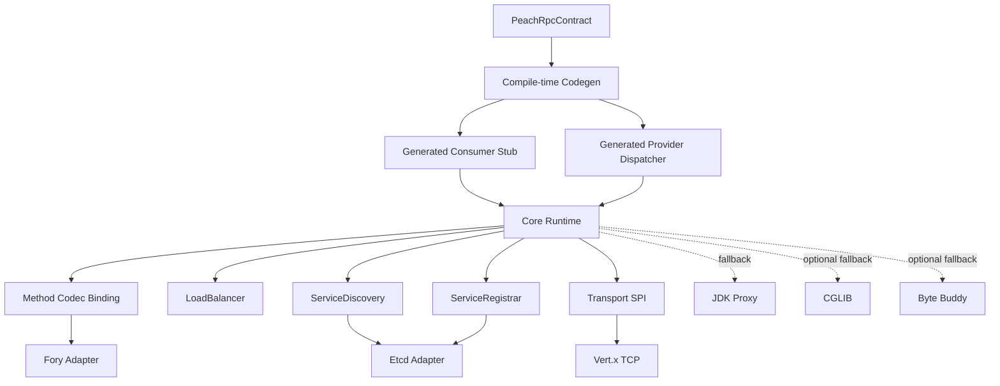
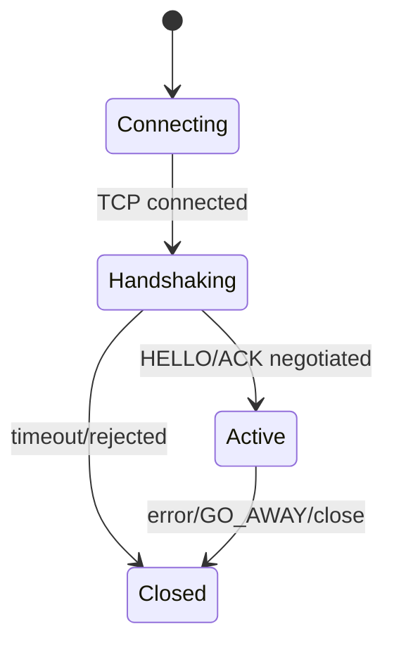

# Peach RPC 架构设计

## 1. 设计目标

Peach RPC 的长期目标是高吞吐、低尾延迟、高并发和可控资源使用，同时保持清晰扩展边界。

核心原则：

> 能在编译期确定的信息，不放到启动阶段；能在启动阶段绑定的信息，不放进单次 RPC 热路径。

## 2. 当前模块边界

当前 Reactor 保留 11 个具有真实依赖隔离价值的模块。编译期 Codegen、Vert.x、Etcd、Fory、CGLIB、Byte Buddy 与 Spring 均不把第三方类型泄漏到 Core 公共契约。



## 3. Consumer 数据面

`refer()` 阶段预计算：

1. Service ID；
2. Method ID 与冲突检测；
3. ServiceDirectory；
4. RpcMethodDescriptor；
5. RpcMethodCodec；
6. Generated Consumer Factory。

请求热路径：

```mermaid
flowchart LR
    Stub[Generated Stub] --> CallSite[invoke0..4 / invokeN]
    CallSite --> Codec[Pre-bound Method Codec]
    Codec --> Directory[ServiceInstance array snapshot]
    Directory --> LB[P2C + EWMA]
    LB --> Encode[Unary Request Fast Encode]
    Encode --> Group[Endpoint Connection Group]
    Group --> Conn[Event-loop Connection]
    Conn --> Pending[Connection-local Pending Table]
    Pending --> TCP[TCP]
```



默认 P2C/EWMA 直接读取 `ServiceInstance[]` 和实时 EndpointStats，不构造临时候选 List。

## 4. Provider 数据面

Provider 注册阶段优先发现 Generated Server Dispatcher。存在生成代码时不构建 MethodHandle 调用路径；不存在时使用 MethodHandle fallback。

请求处理：

```text
FrameAccumulator
 -> RpcFrameView
 -> deadline / serviceId / methodId / codec
 -> admission
 -> payload slice decode
 -> generated dispatcher or MethodHandle fallback
 -> business execution
 -> unary response fast encode
```

业务代码仍默认进入受 Semaphore 限制的虚拟线程执行器，不运行在 Event Loop。

## 5. 连接模型

Vert.x Client 为每个 Endpoint 维护可配置数量的连接分片。

每条连接拥有 Event Loop 本地状态：

- Request ID counter；
- pending HashMap；
- inflight；
- FrameAccumulator；
- negotiated capabilities。

连接建立后必须完成 HELLO / HELLO_ACK。Client/Server 均设置独立 handshake timeout。



## 6. Codec 边界

`RpcCodec` 是启动期 SPI，`RpcMethodCodec` 是方法级热路径绑定。

Fory 当前支持 payload slice decode，但为了保持 Codec ID 1 wire compatibility，参数对象图仍以 Object[] 表示。

显式 Fory 类型注册尚未启用。稳定 Type ID、冲突检测和滚动升级兼容策略必须先完成，不能依赖 Classpath 或注册顺序。

## 7. 协议快路径

控制帧继续使用通用 `RpcFrame` 编码。

Unary 数据面使用专用：

```java
RpcProtocolCodec.encodeRequest(...);
RpcProtocolCodec.encodeResponse(...);
```

Request deadline 直接写 ASCII metadata，不创建 Map/Long String/StringBuilder。接收端 `RpcFrameView` 不复制 Metadata/Payload。

## 8. 控制面

Registry 仍然只位于控制面。Consumer 热路径不访问 Etcd。

`ServiceDirectory` 在 Registry snapshot 更新时转换为数组快照，旧 revision 被忽略。

## 9. 当前明确未完成

- Transport/Core 仍以 byte[] frame 为边界；
- FrameAccumulator 仍需产出完整 byte[]；
- Fory 参数仍存在 Object[]；
- CANCEL 尚未传播；
- Retry Budget、Circuit Breaker、Outlier Ejection 未实现；
- GO_AWAY 尚未实现完整 graceful drain；
- TLS/mTLS 未实现；
- Provider execution policy 尚未拆分 direct / CPU / blocking virtual；
- OpenTelemetry/Micrometer/JFR 仍待接入。

详细热路径说明见 [V2-B 实现说明](high-performance-kernel-v2b.md)。
