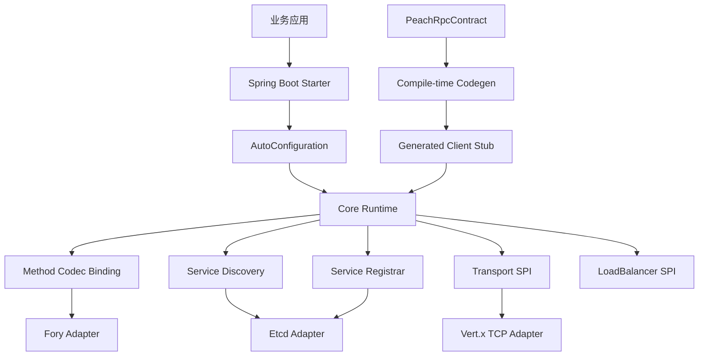
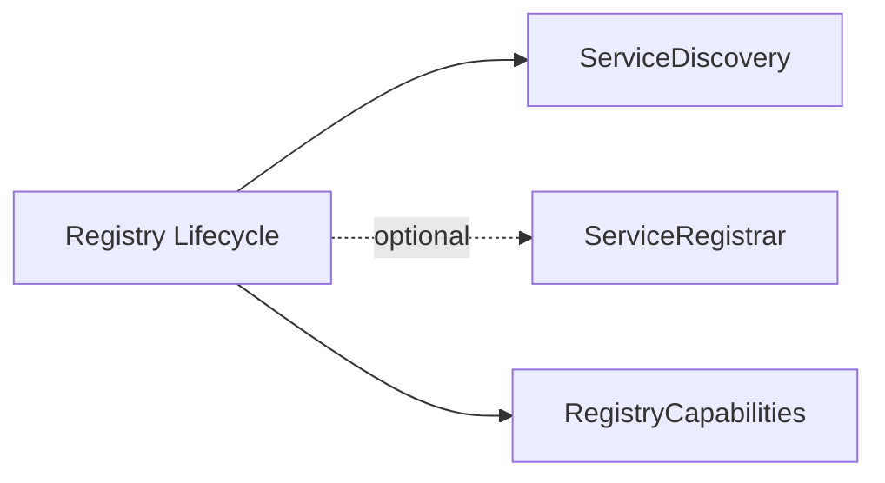

# Peach RPC 架构设计

## 1. 设计目标

Peach RPC 的长期目标是高吞吐、低尾延迟、高并发和可控资源使用，同时保持清晰扩展边界，能够作为 `peach-cloud` 等中型 Java 微服务项目的基础 RPC 组件。

核心设计原则是：

> 能在编译期确定的信息，不放到启动阶段；能在启动阶段绑定的信息，不放进单次 RPC 热路径。

## 2. 当前模块边界

当前 Maven Reactor 保留真正具有依赖隔离价值的模块。新增 `peach-rpc-codegen` 是编译期 annotation processor，不属于运行时热路径，也不会把编译器实现依赖带入 Core。



## 3. Current：数据面

Consumer 在 `refer()` 阶段完成：

1. Service ID 计算。
2. Method ID 计算与冲突检查。
3. `ServiceDirectory` 建立。
4. `RpcMethodDescriptor` 构建。
5. 默认 Codec 的方法级 `RpcMethodCodec` 绑定。
6. Generated Client Stub 发现。

如果存在编译期生成的 Stub，Consumer 优先使用：

```text
Generated Stub
  -> methodId
  -> pre-bound RpcMethodCodec
  -> local ServiceDirectory
  -> LoadBalancer
  -> Transport
```

不存在生成 Stub 时，才回退到 JDK Proxy 或其他 `ProxyFactory`。

Provider 当前仍在服务注册阶段构建已绑定目标对象的 MethodHandle 分发表，同时为每个方法预绑定当前可用 Codec。Generated Server Dispatcher 属于 V2-B，而不是本 PR 已完成能力。

## 4. Current：Codec Binding

V1 的通用路径为：

```text
Method + Object[]
 -> RpcInvocationPayload
 -> RpcCodec.encode(Object)
```

V2-A 改为：

```text
RpcMethodDescriptor
 -> RpcCodec.bind(...)
 -> RpcMethodCodec
 -> encodeArguments / decodeArguments
 -> encodeResult / decodeResult
 -> encodeError / decodeError
```

通用 `RpcCodec.encode/decode` 暂时保留作为兼容适配入口，但高性能调用链不再依赖通用 Invocation/Result Envelope。

这一边界允许后续：

- Fory 为 Java 方法预建类型信息与显式注册表；
- Protobuf 为特定 RPC 方法绑定 generated message parser；
- 自定义 Codec 使用直接 Buffer 编码，而不要求先包装成通用 Object。

## 5. Current：控制面

`Registry` 不再强制所有实现同时支持注册和发现。



所有 Registry 必须具备服务发现能力；主动注册是可选能力。

因此：

- Etcd / Nacos / ZooKeeper / Consul 可以同时提供 Discovery + Registrar；
- Kubernetes EndpointSlice Adapter 可以只提供 Discovery；
- Provider 在配置 discovery-only Registry 时会在启动阶段 fail-fast，而不是在运行过程中产生模糊错误。

Etcd 仍然只位于控制面：初始 Range 获取快照和 revision，随后从 `revision + 1` 建立 Watch；Watch 失败后重新 Range/Watch。Consumer 请求热路径不访问 Etcd。

## 6. Current：协议兼容性地基

V2-A 固化协议级 Codec 与 Compression ID，并增加：

- `HELLO`
- `HELLO_ACK`
- `RpcConnectionCapabilities`
- `RpcHandshakeCodec`
- 协议版本 / Codec / Compression / Feature / MaxFrame 协商算法

**注意：当前只是协议模型和协商算法已经实现。Vert.x TCP 连接尚未真正执行 HELLO/HELLO_ACK，真实连接握手属于 V2-B。**

## 7. Spring Boot 边界

Core 不依赖 Spring。Spring Boot 自动配置继续负责：

- 配置属性绑定；
- SPI 实现选择；
- Registry 生命周期；
- Consumer 使用 `ServiceDiscovery`；
- Provider 从 Registry 获取可选 `ServiceRegistrar`；
- Client/Server Bean 创建；
- `@PeachRpcService` 服务导出；
- `@PeachRpcReference` Consumer 注入；
- Provider 生命周期接入 Spring `SmartLifecycle`。

Starter 的普通使用方式保持兼容；Generated Stub 是可选编译期增强。

## 8. Next：V2-B

下一阶段重点：

1. Generated Server Dispatcher。
2. Vert.x 连接真实 HELLO/HELLO_ACK。
3. Byte Buddy Runtime Stub fallback。
4. Fory 服务契约类型扫描与显式注册。
5. Event Loop 亲和连接组。
6. connection-local pending table。
7. Buffer-oriented Codec 路径，继续减少 `byte[]` 分配和拷贝。

## 9. Future：V2-C

在 Core 契约稳定后扩展：

- Codec：Protobuf、Kryo、Hessian2、JSON；
- Registry：Nacos、ZooKeeper、Consul、Kubernetes EndpointSlice、Eureka；
- Protobuf/IDL 跨语言模式；
- Registry Capability 兼容性矩阵。
