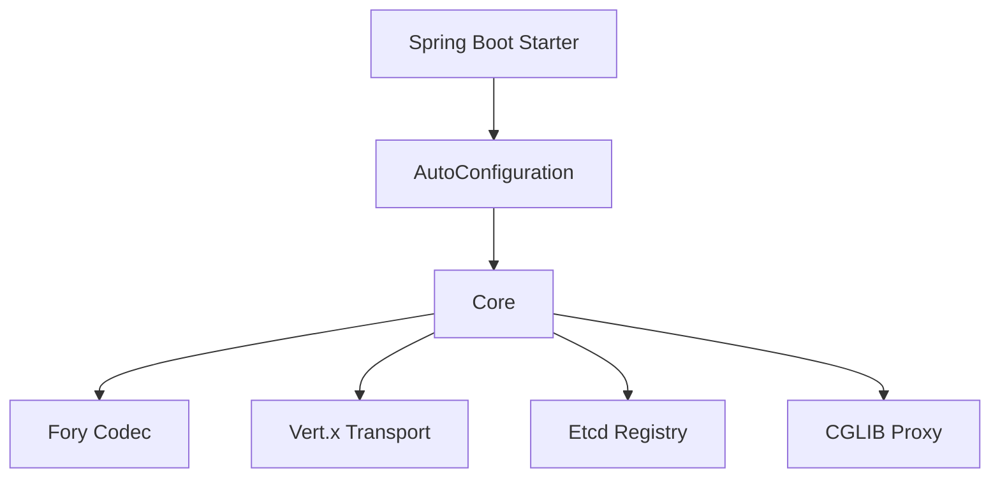

# Peach RPC 架构设计

## 1. 设计目标

Peach RPC 的长期目标是高吞吐、低尾延迟、高并发和可控资源使用，同时保持清晰扩展边界，能够作为 `peach-cloud` 等中型 Java 微服务项目的基础 RPC 组件。

## 2. 当前模块边界

当前 Maven Reactor 只保留真正有依赖隔离价值的模块。`peach-rpc-core` 聚合公共 API、SPI、协议、内存注册中心、P2C/EWMA 和 JDK Proxy；Vert.x、Jetcd、Fory、CGLIB、Spring Boot 分别位于适配器模块中。

## 3. 数据面

Consumer 在 `refer()` 阶段预计算 Service ID、Method ID 和本地 `ServiceDirectory`。单次调用只执行本地快照读取、负载均衡、编码和 Transport 发送。Vert.x Transport 使用长连接并通过 Request ID 匹配并发响应。

Provider 在注册阶段构建 MethodHandle 分发表。请求经过协议校验和并发准入后，业务调用转移到虚拟线程执行，避免阻塞 Event Loop。

## 4. 控制面

Etcd 只负责服务状态同步：初始 Range 获取快照和 revision，随后从 `revision + 1` 建立 Watch。Watch 失败后重新进行 Range/Watch。Consumer 请求不会访问 Etcd。

## 5. SPI 边界

当前扩展点：`RpcCodec`、`RegistryFactory`、`RpcTransportFactory`、`LoadBalancer`、`ProxyFactory`。SPI 在启动阶段解析并缓存，禁止每次 RPC 调用动态发现实现。

## 6. Spring Boot 边界

Core 不依赖 Spring。`peach-rpc-spring-boot-autoconfigure` 只负责：

- 配置属性绑定；
- SPI 实现选择；
- Client/Server Bean 创建；
- `@PeachRpcService` 服务导出；
- `@PeachRpcReference` Consumer 注入；
- Provider 生命周期接入 Spring `SmartLifecycle`。

## 7. 后续性能演进

优先级依次为：编译期生成 Stub/Dispatcher、Event Loop 亲和连接组、取消传播、Retry Budget、异常实例剔除、TLS/mTLS、Micrometer/OpenTelemetry/JFR、流式 RPC。
