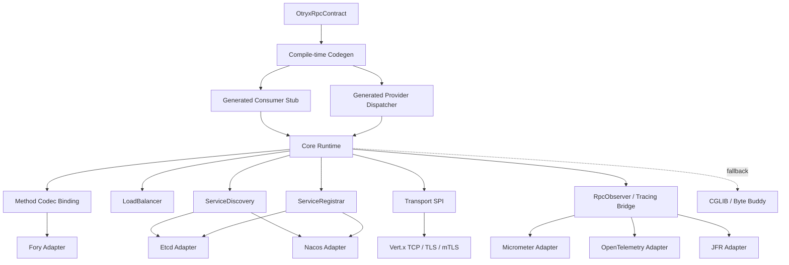
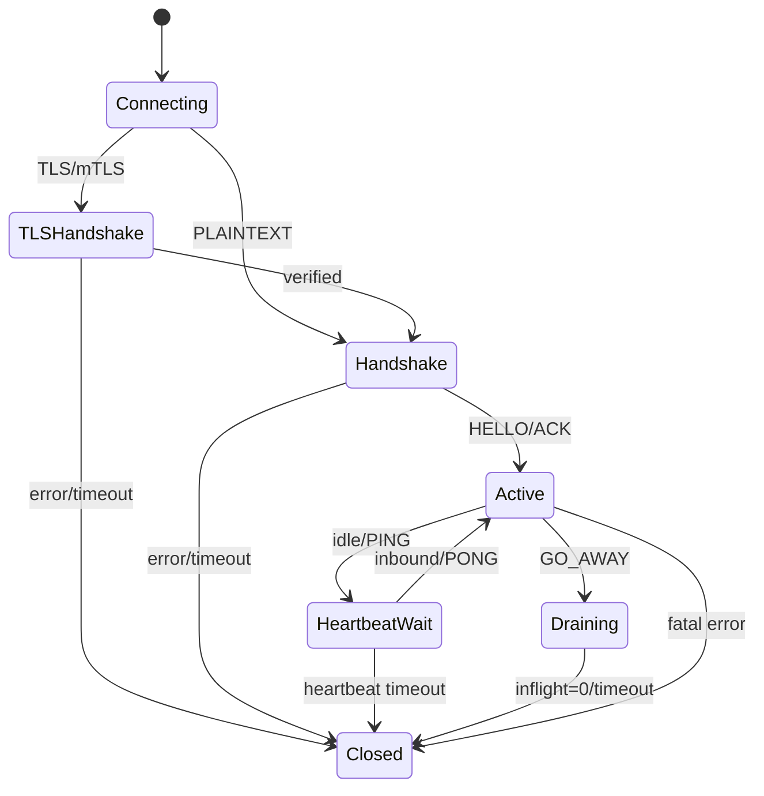

# OTRYX RPC 2.0 架构设计

> OTRYX 2.0.0-SNAPSHOT 属于公开 Java API / GAV 的破坏性命名空间迁移；继承历史 Wire v1 并不代表新旧 Java API 保证互通。详见 [迁移指南](migration-to-otryx.md)。

> 状态：**Current / 2.0.0-SNAPSHOT Migration**


## 1. 核心原则

OTRYX RPC 的设计目标是高吞吐、低尾延迟、可控资源和可预测故障行为，同时维持清晰扩展边界。

> 能在编译期确定的信息，不放到启动阶段；能在启动阶段绑定的信息，不放进单次 RPC 热路径。

## 2. 模块边界

当前 Reactor 有 16 个顶层模块。Core 不泄漏 Vert.x、Etcd、Nacos、Fory、Spring、Micrometer、OpenTelemetry、JFR 等第三方类型。


```mermaid
flowchart TB
    Contract[OtryxRpcContract] --> Codegen[Compile-time Codegen]
    Codegen --> Stub[Generated Consumer Stub]
    Codegen --> Dispatcher[Generated Provider Dispatcher]
    Stub --> Core[Core Runtime]
    Dispatcher --> Core
    Core --> Codec[Method Codec Binding]
    Core --> LB[LoadBalancer]
    Core --> Discovery[ServiceDiscovery]
    Core --> Registrar[ServiceRegistrar]
    Core --> Transport[Transport SPI]
    Codec --> Fory[Fory Adapter]
    Discovery --> Etcd[Etcd Adapter]
    Registrar --> Etcd
    Discovery --> Nacos[Nacos Adapter]
    Registrar --> Nacos
    Transport --> Vertx[Vert.x TCP / TLS / mTLS]
    Core --> Obs[RpcObserver / Tracing Bridge]
    Obs --> Metrics[Micrometer Adapter]
    Obs --> Tracing[OpenTelemetry Adapter]
    Obs --> Jfr[JFR Adapter]
    Core -. fallback .-> Cglib[CGLIB / Byte Buddy]
```

完整模块责任见 [项目构造思路](project-structure.md)。

## 3. Consumer 数据面

`refer()` 阶段预绑定：

- Service/Method identity；
- `RpcMethodDescriptor`；
- `RpcMethodCodec`；
- Generated Consumer Factory 或 Proxy fallback；
- ServiceDirectory；
- LoadBalancer；
- Method Circuit Breaker。

单次调用：

```mermaid
flowchart LR
    Stub[Generated Stub / Proxy]
    Call[Logical Call]
    Dir[ServiceInstance[] Snapshot]
    Compat[Compatibility Filtered]
    LB[P2C + EWMA]
    Codec[Method Codec]
    Conn[Endpoint Connection]
    Pending[Connection-local Pending]
    Wire[Wire v1]

    Stub --> Call --> Dir --> Compat --> LB --> Codec --> Conn --> Pending --> Wire
```

热路径不访问 Registry，不扫描 SPI，不解析配置。

## 4. Provider 数据面

```text
FrameAccumulator
 -> RpcFrameView / protocol validation
 -> connection-local request tracking
 -> admission
 -> service/method binding
 -> payload decode
 -> generated dispatcher or MethodHandle fallback
 -> execution policy
 -> response encode
```

执行模式：

- `BLOCKING_VIRTUAL`：默认；
- `CPU`：有界固定线程池；
- `DIRECT`：默认关闭，必须显式允许。

## 5. Wire v1

Wire 由固定 Header、Metadata、Payload 构成。

数据帧：

- REQUEST；
- RESPONSE。

控制帧：

- HELLO；
- HELLO_ACK；
- PING；
- PONG；
- CANCEL；
- GO_AWAY。

1.0.x 冻结 Wire v1。详见 [协议](protocol.md)。

## 6. Stable Type ID 与 Schema

`RpcTypeIds` 根据规范化 Java Type 计算稳定 ID：

- 1..1023：Framework；
- 1024..2147483646：User Contract。

`RpcTypeRegistry` 在方法绑定阶段做冲突检测。

`RpcSchemaFingerprint` 使用 SHA-256 计算服务契约 Fingerprint，并在 Registry Metadata 发布：

```text
peach.rpc.protocol.version
peach.rpc.schema.version
peach.rpc.schema.fingerprint
```

Consumer 在 Snapshot 更新阶段做 compatibility filtering，不增加单次 RPC 热路径判断。

## 7. Registry 控制面

Consumer 使用本地 `ServiceDirectory`。Registry Adapter 只负责更新 Snapshot。

### Etcd

- Range；
- Watch；
- Lease；
- keepalive；
- TTL watchdog；
- compaction recovery；
- restart recovery；
- leader transfer Chaos。

### Nacos

- temporary instance；
- lookup / subscribe；
- namespace / group / cluster；
- weight / metadata；
- health/enabled filter；
- local unregister convergence；
- remote NamingEvent convergence；
- pause/unpause Chaos。

## 8. Connection 生命周期


```mermaid
stateDiagram-v2
    [*] --> Connecting
    Connecting --> TLSHandshake: TLS/mTLS
    Connecting --> Handshake: PLAINTEXT
    TLSHandshake --> Handshake: verified
    TLSHandshake --> Closed: error/timeout
    Handshake --> Active: HELLO/ACK
    Handshake --> Closed: error/timeout
    Active --> HeartbeatWait: idle/PING
    HeartbeatWait --> Active: inbound/PONG
    HeartbeatWait --> Closed: heartbeat timeout
    Active --> Draining: GO_AWAY
    Draining --> Closed: inflight=0/timeout
    Active --> Closed: fatal error
```

异常连接通过 request-driven reconnect、exponential backoff 和 full jitter 重建。

## 9. Timeout / Retry / Circuit / Outlier

### Timeout

Consumer 的 logical Deadline 覆盖连接获取、HELLO/ACK 和请求。

### Retry

仅 `@OtryxRpcIdempotent` 方法允许自动 Retry，并受：

- max attempts；
- Retry Budget；
- Deadline；
- backoff + jitter。

### Circuit

方法级 CLOSED/OPEN/HALF_OPEN；HALF_OPEN 只允许一个并发 probe。

### Outlier

Endpoint 基础设施失败可触发临时本地剔除。

## 10. Graceful Shutdown

Provider 关闭顺序：

1. Registry unregister；
2. GO_AWAY；
3. stop accepting new request；
4. wait inflight；
5. close transport/runtime。

## 11. Security

TLS/mTLS handshake 先于 OTRYX RPC HELLO。Consumer 默认开启 hostname verification。TLS 失败不会降级为 PLAINTEXT。

## 12. Observability

Core 定义低依赖：

- `RpcObserver`；
- `RpcTracingBridge`；
- `RpcMetadataPropagator`。

Adapter：

- Micrometer；
- OpenTelemetry；
- JFR。

Telemetry callback 异常会被隔离。

## 13. 自动化验证

- Unit/Property/Race；
- Registry Contract TestKit；
- Etcd/Nacos Integration；
- TLS/mTLS；
- OpenTelemetry RPC E2E；
- Independent JVM Examples；
- Etcd/Nacos Chaos；
- Rolling Compatibility；
- Benchmark/10k soak；
- Release Readiness。

## 14. 已知限制

- Unary only；
- Fory Native 主要面向 Java；
- Compression 仅 NONE；
- Transport/Core 仍以完整 `byte[]` frame 为边界；
- 官方性能/容量数字需要固定环境 Evidence。

更完整的设计权衡见 [技术方案](technical-solution.md) 与 [详细设计](detailed-design.md)。
