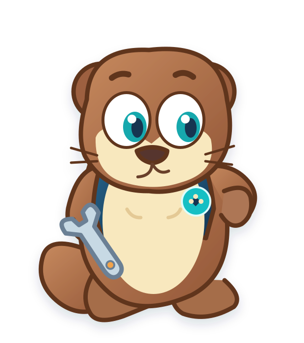

# OTRYX 品牌规范与吉祥物设计

## 品牌定位

**OTRYX RPC** — Simple to Call. Built to Scale.

主张：**让分布式通信，简单而可靠。** 不是靠无界缓存或复杂概念换取漂亮的数字，而是依靠架构边界、受控背压、清晰契约和可重复的工程验证。

## 吉祥物 Otti

以已确认的原始科技水獭参考图为形象基准：温暖的棕色外形、奶油色腹部、青蓝色大眼睛、蓝色工程师马甲、友好的笑容与扳手。角色主要特质是**聪明、敏捷、协作、可靠**，避免做成严肃或具攻击性的猛兽图腾。

角色故事：在由无数服务组成的河流中，Otti 懂得理解水流、选择可靠路径，与伙伴协作，让每一次 RPC 请求精准抵达。将复杂留在框架内部，让简单留给开发者。

## 色彩系统

| 名称 | HEX | 场景 |
|---|---|---|
| 深海蓝 | #153451 | 背景、正文、信任感 |
| 科技青 | #16BFC4 | 高亮、连接、活力 |
| 水獭棕 | #9E6848 | 吉祥物皮毛 |
| 奶油白 | #F8E8BE | 面部、腹部 |
| 暖橙色 | #F2A34A | 温度、交互重点 |

## 文档图片与来源

- docs/images/brand/：Logo / Banner；
- docs/images/mascot/：吉祥物主形象与表情；
- docs/images/architecture/：以实际模块和 SPI 关系为依据的架构图；
- docs/images/flows/：调用流程和兼容演进图。

公开文档采用仓库相对链接，不使用临时外链。图片需要与源码现状保持一致。SVG 图属于可维护的设计源文件；性能数字只有经过可复现 Benchmark/Soak Evidence 才能出现在品牌图中。

**名称风险：** 已存在 Otryx Systems 的软件相关服务品牌/第三方商标记录。项目正式宣传或商业使用前应另行核查商标及图形权益。
