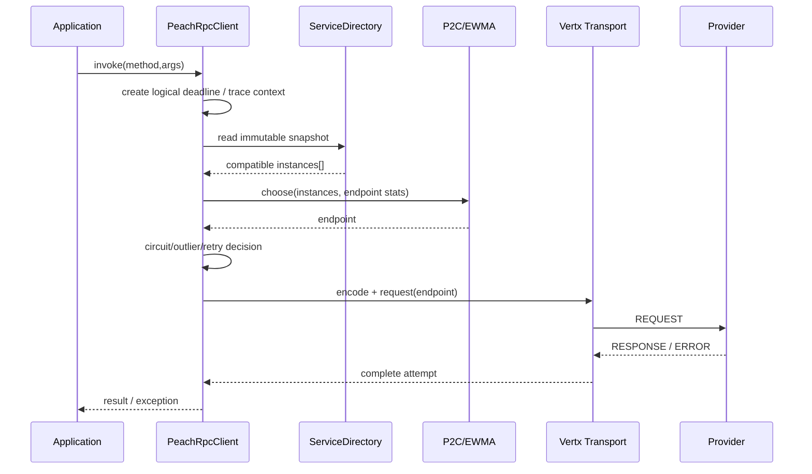
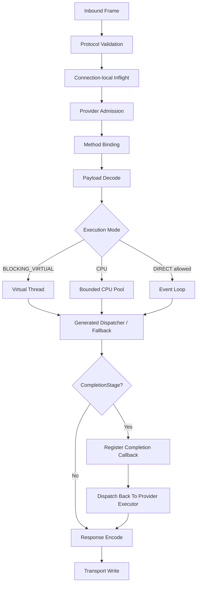
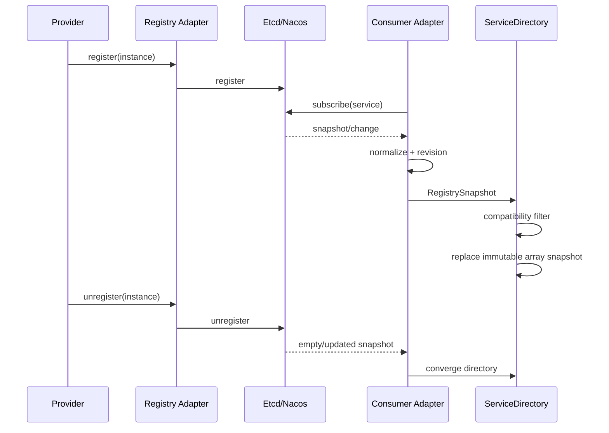
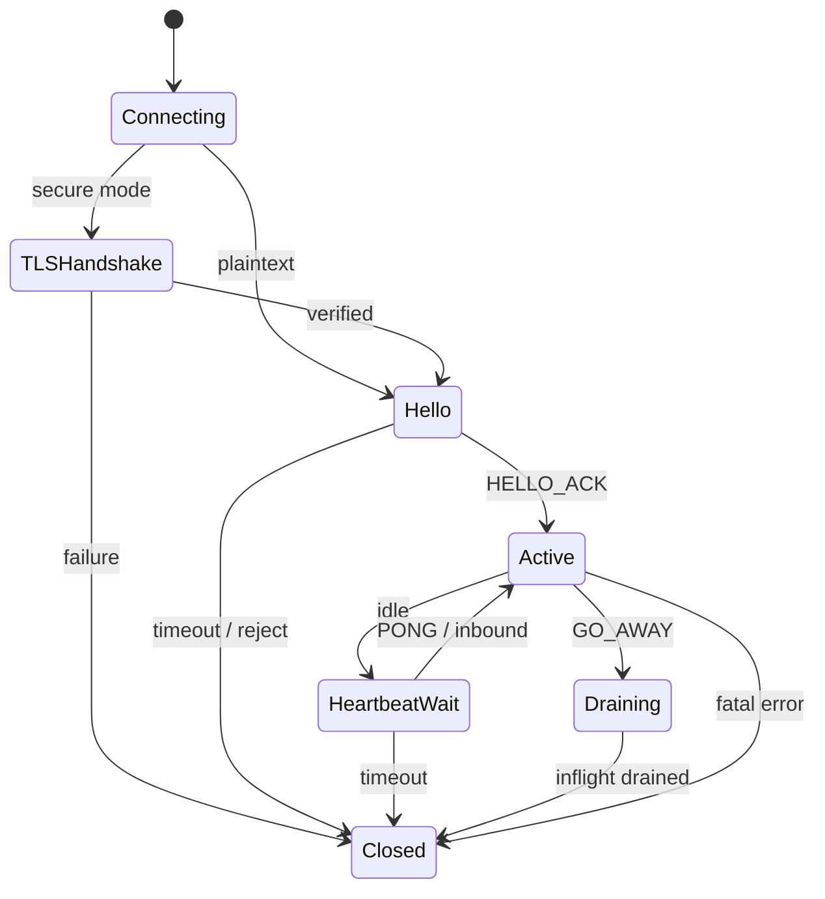
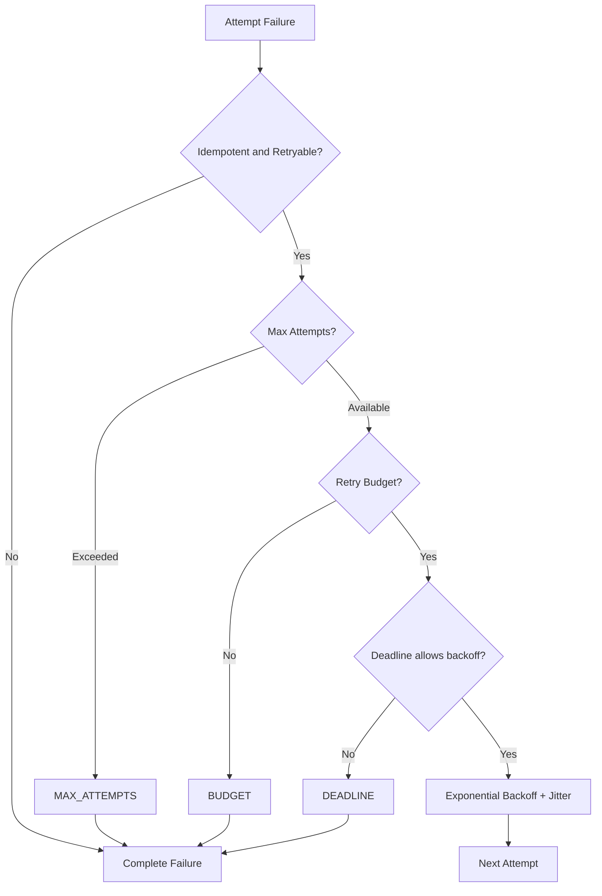
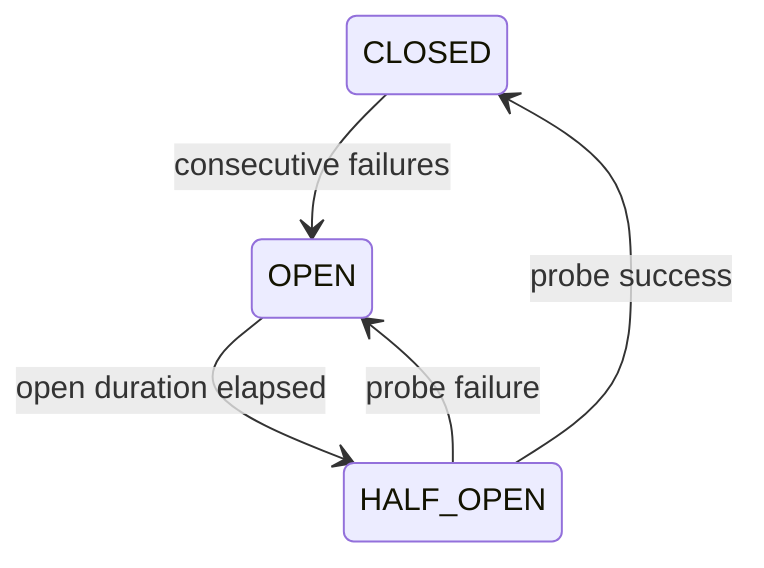
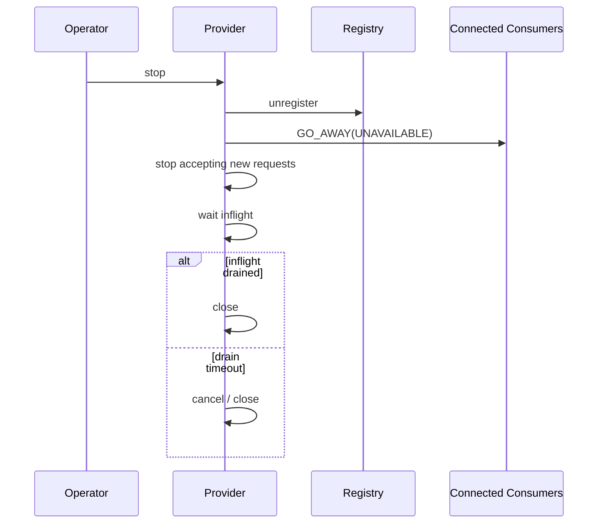

# Peach RPC 1.0 详细设计

> 状态：**Current / 1.0.0 GA**

## 1. Consumer 调用链



关键约束：

- `ServiceDirectory` 读取不触发 Registry I/O；
- 单次 logical call 可以包含多个 Attempt；
- Timeout 结束后不允许 Retry 越过 Deadline；
- CANCEL 可传播到 Provider。

## 2. Provider 请求处理



### Admission

Provider 最大并发必须有边界。CPU 模式还具有独立有界队列；满时返回 OVERLOADED。

对于业务方法返回的 `CompletionStage`，Provider 不在 CPU/Virtual Thread worker 上执行 `join()`。框架注册完成回调后立即归还执行 worker，但 **admission permit 会一直持有到异步业务真正完成、失败或取消**，因此异步化不会绕过 Provider 最大业务并发保护。

异步 Stage 若稍后在业务线程、Netty/Vert.x EventLoop 或其他执行器上完成，框架不会直接在该线程执行响应序列化，而是重新调度到 Provider 管理的执行资源，并恢复 Trace/Metadata Scope 后再编码响应。CPU 方法回到有界 CPU Pool；异步 DIRECT 完成也通过 CPU Pool 隔离，避免业务 Future 的完成线程承担不可控的编码工作。若有界 CPU Pool 连异步完成任务也无法接收，当前 RPC fail-fast 为 `OVERLOADED` 并释放 admission，而不是回退到外部 completion thread 执行编码。正常完成路径也遵循“先完成响应编码与 admission 释放，再对外完成响应 Future”的顺序，避免调用方刚收到响应就因资源计数尚未归还而看到瞬时 `OVERLOADED`。

### Cancellation

Transport 根据 Request ID 找到 connection-local inflight Future，Core 再向业务执行任务传播取消。

## 3. Registry 与本地目录



### Etcd

- Lease 作为 Provider 生命周期；
- Watch 出错后重新 Range；
- compaction 后从有效 revision 恢复；
- keepalive + TTL watchdog。

### Nacos

- Provider 使用临时实例；
- SDK 阻塞调用在 Adapter 控制面执行器；
- 本地主动 unregister 后同步收敛当前进程 subscription；
- 远端 Provider 生命周期仍以 NamingEvent 为主通道。

## 4. 连接状态机



## 5. Retry 时序



## 6. Circuit Breaker

方法级状态：



HALF_OPEN 同时只放行一个探测调用。

## 7. Graceful Shutdown



## 8. Compatibility Filter

每个 Provider 实例可携带：

- `peach.rpc.protocol.version`；
- `peach.rpc.schema.version`；
- `peach.rpc.schema.fingerprint`。

Consumer Snapshot 更新时：

1. 缺失 Fingerprint 的旧 Provider -> LEGACY；
2. Fingerprint 一致 -> COMPATIBLE；
3. Fingerprint 明确不一致 -> INCOMPATIBLE 并从本地目录剔除。

## 9. Observability 事件模型

一次逻辑调用：

```text
client.calls = 1
client.attempts = 1..N
client.retries = attempts - 1
client.retry.exhausted = optional final stop reason
```

这样 QPS/SLO 不会被 Retry 放大，而 Attempt 指标仍能反映网络实际负载。

## 10. 关键并发回归

自动化覆盖：

- response vs timeout；
- response vs cancel；
- cancel vs disconnect；
- drain vs new request；
- close vs heartbeat；
- HALF_OPEN concurrent probe；
- duplicate Request ID；
- random fragmentation/coalescing。

## 11. 资源所有权

| 资源 | Owner | 生命周期 |
|---|---|---|
| ServiceDirectory | Consumer Runtime | refer -> client close |
| EndpointStats | Consumer Runtime | endpoint active -> directory removal |
| Connection Group | Transport Client | endpoint use -> client close |
| Registry Subscription | Registry Adapter | subscribe -> close |
| Provider Execution Pool | Server Runtime | server start -> close |
| Observer Adapter | Spring/Core composition | runtime lifecycle |

## 12. 错误与恢复原则

- 协议错误优先 fail-fast；
- Telemetry 错误隔离；
- Registry 短时错误保留 last-known-good；
- Retry 不能替代容量；
- Circuit/Outlier 不能隐藏长期故障；
- TLS 错误不允许自动降级到明文。
