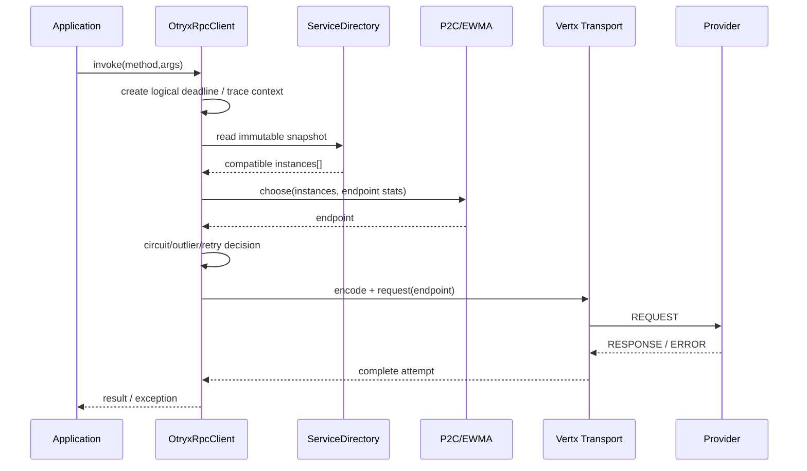
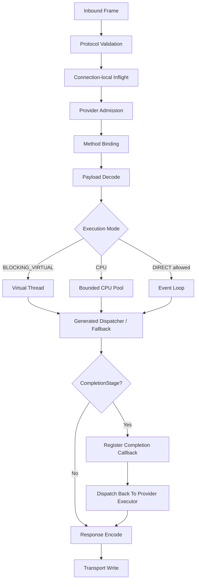
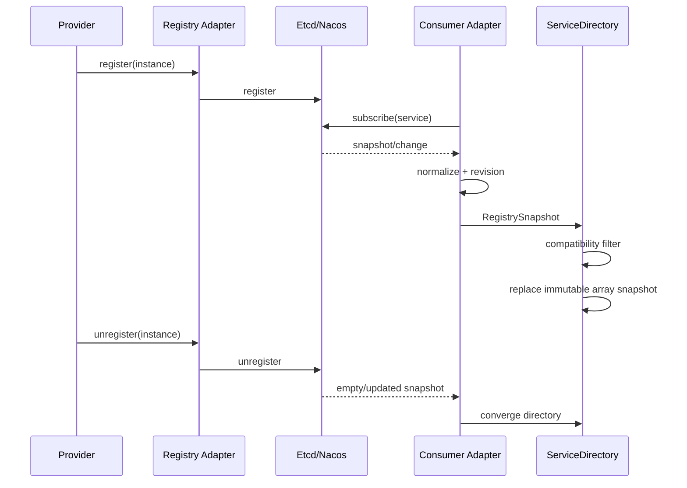
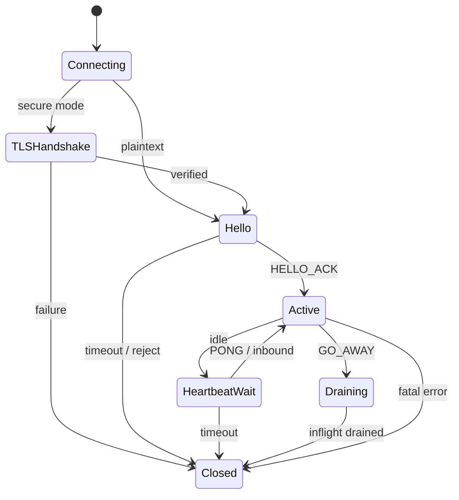
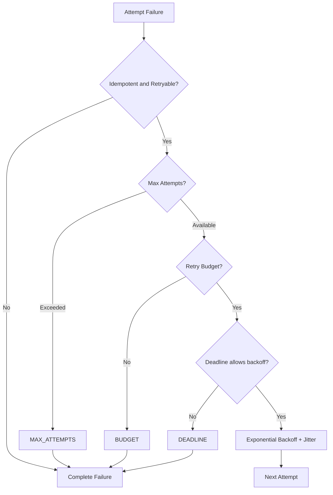
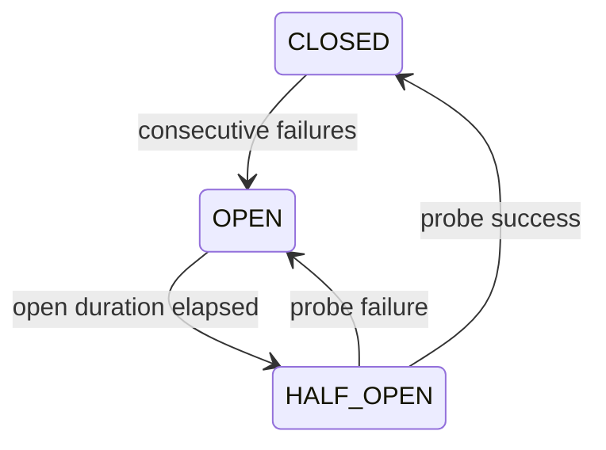
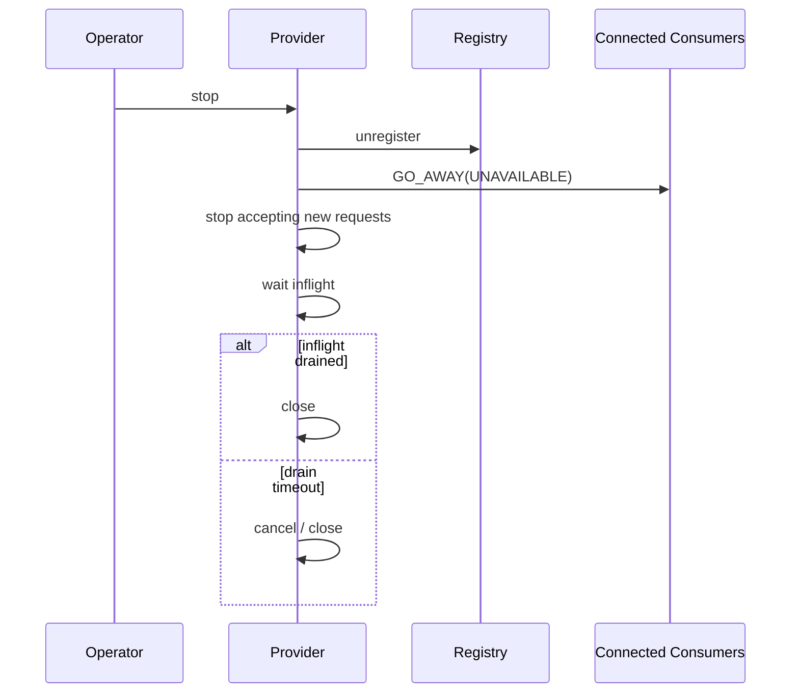

# OTRYX RPC 1.0 详细设计

> 状态：**Current / 2.0.0-SNAPSHOT Migration**

## 1. Consumer 调用链



关键约束：

- `ServiceDirectory` 读取不触发 Registry I/O；
- 单次 logical call 可以包含多个 Attempt；
- Timeout 结束后不允许 Retry 越过 Deadline；
- CANCEL 可传播到 Provider。

## 2. Provider 请求处理



### Admission

Provider 通过全局、服务、方法三级并发额度及已准入 Frame 字节预算保护业务资源，CPU 模式还有独立的有界队列；拒绝时返回 `OVERLOADED`。详见 [Provider 分层 Admission 设计](provider-admission.md)。这些额度不代表 JVM Heap 的硬上限。

准入租约只有在两个条件**同时满足**后归还：

1. 响应 Future 已成功、异常或取消而进入终态；
2. 实际业务执行已经结束：同步方法执行线程退出，或业务返回的异步 `CompletionStage` 已真实进入终态且必要的响应完成处理已结束。

`CompletableFuture.cancel(true)` 不能证明业务代码或外部 IO 已停止，因此不会仅凭逻辑请求取消提前释放 Provider 并发额度。取消发生在 CPU 队列中、业务尚未获得执行所有权时，框架会通过原子执行归属判定直接回收租约。已经开始的同步任务尝试中断，但必须等其真正退出后才释放。对业务自建异步 Stage 不进行强制 `cancel`，以免把 Future 的逻辑取消误判为底层执行已结束。

异步 `CompletionStage` 不占用 CPU/虚拟线程等待 `join()`。异步结果完成后，Provider 将结果序列化派发至受管理的执行器；队列饱和时返回 `OVERLOADED`。响应 Future 对外完成与最终业务执行账本归还之间可能存在极短的异步时序差，因此运维/并发测试应依据 Lease 指标判断资源释放，而不是只依赖响应 Future 终态。

### Cancellation

Transport 根据 Request ID 取消 connection-local 请求，Provider 随后尝试取消排队任务或中断正在执行的 Worker。**取消只保证逻辑请求终止，不保证用户业务立即停止**。忽略中断、永不结束的业务 Stage 会继续占用配置配额以防止超过实际执行上限；业务必须具备协作式取消或自身超时治理。

## 3. Registry 与本地目录



### Etcd

- Lease 作为 Provider 生命周期；
- Watch 出错后重新 Range；
- compaction 后从有效 revision 恢复；
- keepalive + TTL watchdog。

### Nacos

- Provider 使用临时实例；
- SDK 阻塞调用在 Adapter 控制面执行器；
- 本地主动 unregister 后同步收敛当前进程 subscription；
- 远端 Provider 生命周期仍以 NamingEvent 为主通道。

## 4. 连接状态机



## 5. Retry 时序



## 6. Circuit Breaker

方法级状态：



HALF_OPEN 同时只放行一个探测调用。

## 7. Graceful Shutdown



## 8. Compatibility Filter

每个 Provider 实例可携带：

- `peach.rpc.protocol.version`；
- `peach.rpc.schema.version`；
- `peach.rpc.schema.fingerprint`。

Consumer Snapshot 更新时：

1. 缺失 Fingerprint 的旧 Provider -> LEGACY；
2. Fingerprint 一致 -> COMPATIBLE；
3. Fingerprint 明确不一致 -> INCOMPATIBLE 并从本地目录剔除。

## 9. Observability 事件模型

一次逻辑调用：

```text
client.calls = 1
client.attempts = 1..N
client.retries = attempts - 1
client.retry.exhausted = optional final stop reason
```

这样 QPS/SLO 不会被 Retry 放大，而 Attempt 指标仍能反映网络实际负载。

## 10. 关键并发回归

自动化覆盖：

- response vs timeout；
- response vs cancel；
- cancel vs disconnect；
- drain vs new request；
- close vs heartbeat；
- HALF_OPEN concurrent probe；
- duplicate Request ID；
- random fragmentation/coalescing。

## 11. 资源所有权

| 资源 | Owner | 生命周期 |
|---|---|---|
| ServiceDirectory | Consumer Runtime | refer -> client close |
| EndpointStats | Consumer Runtime | endpoint active -> directory removal |
| Connection Group | Transport Client | endpoint use -> client close |
| Registry Subscription | Registry Adapter | subscribe -> close |
| Provider Execution Pool | Server Runtime | server start -> close |
| Observer Adapter | Spring/Core composition | runtime lifecycle |

## 12. 错误与恢复原则

- 协议错误优先 fail-fast；
- Telemetry 错误隔离；
- Registry 短时错误保留 last-known-good；
- Retry 不能替代容量；
- Circuit/Outlier 不能隐藏长期故障；
- TLS 错误不允许自动降级到明文。
