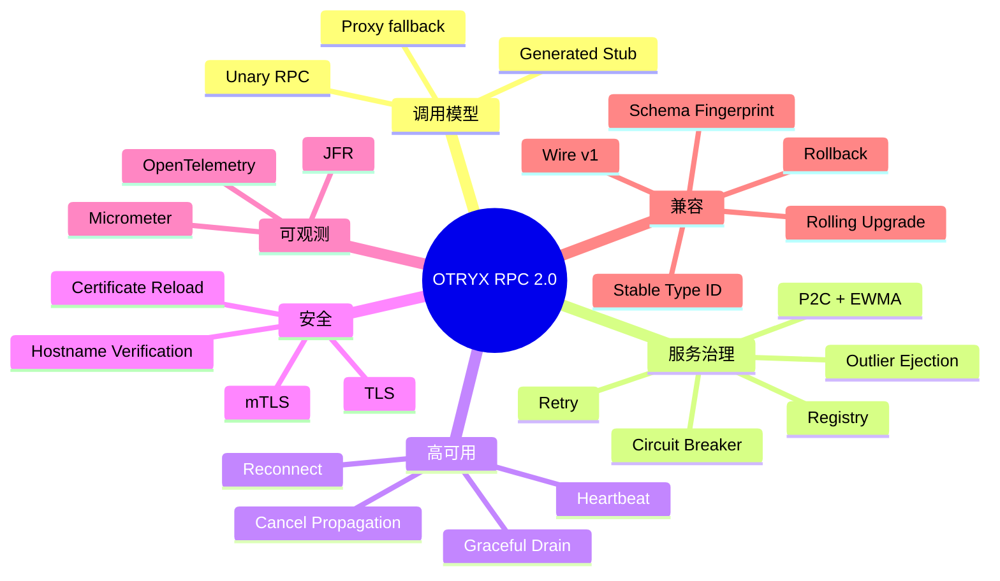

# OTRYX RPC 2.0 功能描述

> OTRYX 2.0.0-SNAPSHOT 属于公开 Java API / GAV 的破坏性命名空间迁移；继承历史 Wire v1 并不代表新旧 Java API 保证互通。详见 [迁移指南](migration.md)。

> 状态：**2.0.0-SNAPSHOT Migration**

## 1. 功能总览

## 2. API 与 Codegen

- Java Interface 作为服务契约；
- `@OtryxRpcContract` 编译期生成 Consumer/Provider 路径；
- Generated path 缺失时使用 Proxy / MethodHandle fallback；
- CGLIB 和 Byte Buddy 为可选 Proxy Adapter。

## 3. Registry

### Memory

适合单进程测试和简单场景。

### Etcd

- register / unregister；
- Range / Watch；
- Lease / keepalive；
- compaction recovery；
- restart recovery；
- 三节点 leader transfer Chaos。

### Nacos

- 临时实例；
- register / unregister / lookup / subscribe；
- namespace / group / cluster；
- weight / metadata；
- 健康和 enabled 过滤；
- pause/unpause recovery Chaos；
- 本地注销和远端 Provider 消失后的订阅收敛。

## 4. Transport

Vert.x Transport 提供：

- TCP 长连接；
- 每 endpoint 多连接分片；
- connection-local Request ID；
- handshake timeout；
- heartbeat；
- idle detection；
- reconnect backoff；
- GO_AWAY / graceful drain；
- CANCEL；
- TLS/mTLS。

## 5. Protocol

Wire v1 包含：

- 固定 Header；
- Metadata；
- Payload；
- HELLO / HELLO_ACK；
- REQUEST / RESPONSE；
- PING / PONG；
- CANCEL；
- GO_AWAY。

协议实现会拒绝：

- bad magic；
- unsupported version；
- unknown type/status；
- invalid flags/compression；
- invalid length；
- malformed metadata；
- 错误握手顺序；
- duplicate Request ID；
- 非法控制帧。

## 6. Codec

默认 Fory。

方法绑定期间执行 Stable Type ID 冲突检查。Schema Fingerprint 用于服务级兼容判断，但不改变 Fory v1 Payload 格式。

## 7. 负载均衡

默认 `p2c-ewma`：

- Power of Two Choices；
- EWMA latency；
- inflight；
- static weight；
- outlier state。

选择过程读取本地数组快照，不访问 Registry。

## 8. Retry / Circuit / Outlier

### Retry

只有 `@OtryxRpcIdempotent` 方法可自动重试。

### Circuit

方法级 CLOSED / OPEN / HALF_OPEN。

### Outlier

按 endpoint 基础设施失败做本地临时剔除。

## 9. Provider Execution

| 模式 | 用途 | 边界 |
|---|---|---|
| BLOCKING_VIRTUAL | JDBC、文件、同步 SDK | 默认 |
| CPU | CPU 密集 | 有界线程数和队列 |
| DIRECT | 极短纯内存 | 默认禁止 |

## 10. Security

- PLAINTEXT / TLS / MTLS；
- hostname verification；
- CA trust；
- certificate/private-key/trust material；
- PEM reload；
- certificate expiry warning；
- Credential/Secret 不进入运行日志。

## 11. Observability

### Micrometer

覆盖 logical call、attempt、retry、retry exhausted、timeout、inflight、Circuit state/reject、Outlier、Provider admission、Connection、Registry、TLS 等。

### OpenTelemetry

CLIENT/SERVER Span + W3C Trace Context/Baggage。

### JFR

记录慢调用、失败、reconnect、heartbeat timeout、Registry recovery、TLS/证书事件。

## 12. Spring Boot Starter

- `@OtryxRpcService`；
- `@OtryxRpcReference`；
- 按实际 Provider/Consumer 使用惰性创建 Runtime；
- Provider advertised endpoint 与 bind endpoint 分离；
- 支持 Registry、Transport、Security、Execution、Observability 配置。

## 13. Compatibility

- Wire v1；
- Stable Type ID；
- Schema Fingerprint v1；
- N Consumer -> N+1 Provider；
- N+1 Consumer -> N Provider；
- N/N+1 mixed；
- Provider rollback。

自动化矩阵见 [Wire Compatibility](wire-compatibility.md)。

## 14. 工程化

- Maven Reactor；
- Javadoc doclint；
- Repository static gate；
- Independent JVM E2E；
- JMH benchmark；
- 10k logical-concurrency soak harness；
- Etcd/Nacos Chaos；
- Rolling Compatibility；
- Release Readiness；
- RC1/GA Release Workflow。

## 15. 1.0 不包含

- Streaming RPC；
- 跨语言 SDK；
- Protobuf IDL；
- ZooKeeper/Consul/Eureka Adapter；
- HTTP/2/gRPC Transport；
- 非 NONE 数据面压缩。

这些内容如果进入后续版本，必须保持 1.0.x 已冻结契约的升级边界。
