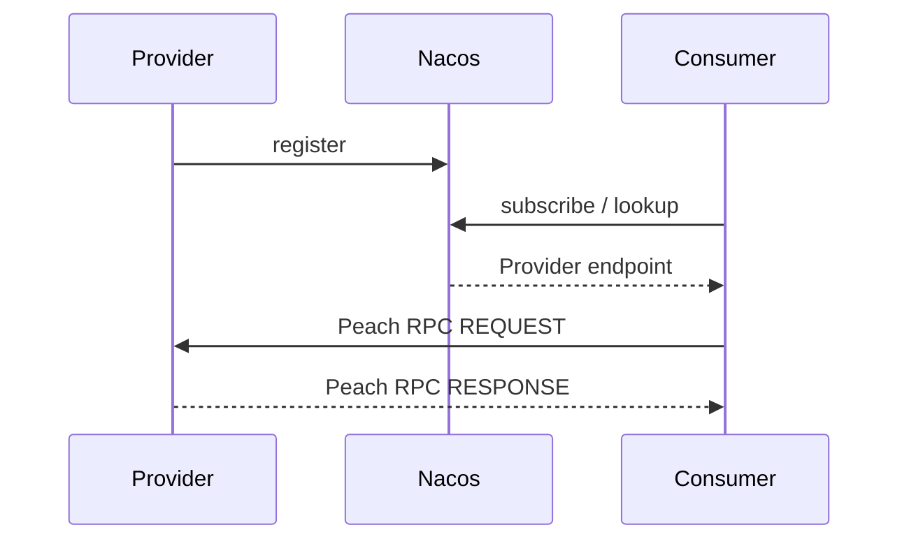

# Peach RPC 快速开始

> 目标：从干净环境运行一个真实的 Provider/Consumer 独立进程调用。

## 1. 前置条件

- JDK 21；
- Maven 3.9+；
- Docker（用于官方 Nacos 示例）。

确认：

```bash
java -version
mvn -version
docker version
```

## 2. 获取源码

```bash
git clone https://github.com/Ryan-Guizhou/peach-rpc.git
cd peach-rpc
```

## 3. 先验证仓库

```bash
python3 scripts/check_project.py
mvn -B -ntp clean verify -Pquality
```

Windows 没有 `python3` 命令时可使用已安装 Python 的等价入口执行同一脚本。

## 4. 启动官方 Nacos 示例环境

在仓库根目录：

```bash
docker compose -f peach-rpc-examples/docker-compose.yml up -d
```

该 Compose 只负责示例所需外部基础设施。

## 5. 构建 Examples

```bash
mvn -B -ntp -pl peach-rpc-examples -am clean package
```

## 6. 启动 Provider

```bash
java -jar peach-rpc-examples/peach-rpc-example-provider/target/*-exec.jar
```

成功时会看到类似：

```text
Peach RPC server started: bind=0.0.0.0:19090, advertised=127.0.0.1:19090
```

## 7. 启动 Consumer

另一个终端：

```bash
java -jar peach-rpc-examples/peach-rpc-example-consumer/target/*-exec.jar
```

预期：

```text
RPC demo completed successfully: Hello, Peach RPC!
```

## 8. 你刚刚运行了什么



Provider 和 Consumer 是两个独立 JVM；Contract 位于共享 API 模块。

## 9. 在 Spring Boot 项目中引入

GA 坐标：

```xml
<dependency>
    <groupId>io.peach.rpc</groupId>
    <artifactId>peach-rpc-spring-boot-starter</artifactId>
    <version>1.0.0</version>
</dependency>
```

如果 GA Artifact 尚未发布到你的 Maven Repository，可以从源码执行：

```bash
mvn -B -ntp clean install -DskipTests
```

然后本地 Maven Repository 即可解析同样的 `1.0.0` 坐标。

## 10. Provider 最小代码

```java
@PeachRpcService(
        interfaceClass = OrderService.class,
        version = "1.0.0")
public class OrderServiceImpl
        implements OrderService {
}
```

## 11. Consumer 最小代码

```java
@PeachRpcReference(version = "1.0.0")
private OrderService orderService;
```

## 12. 下一步

- [Starter 与完整配置](starter.md)
- [项目构造与模块](project-structure.md)
- [技术方案](technical-solution.md)
- [TLS/mTLS](security.md)
- [可观测性](observability.md)
- [升级与回滚](upgrade-rollback.md)
- [FAQ](faq.md)
