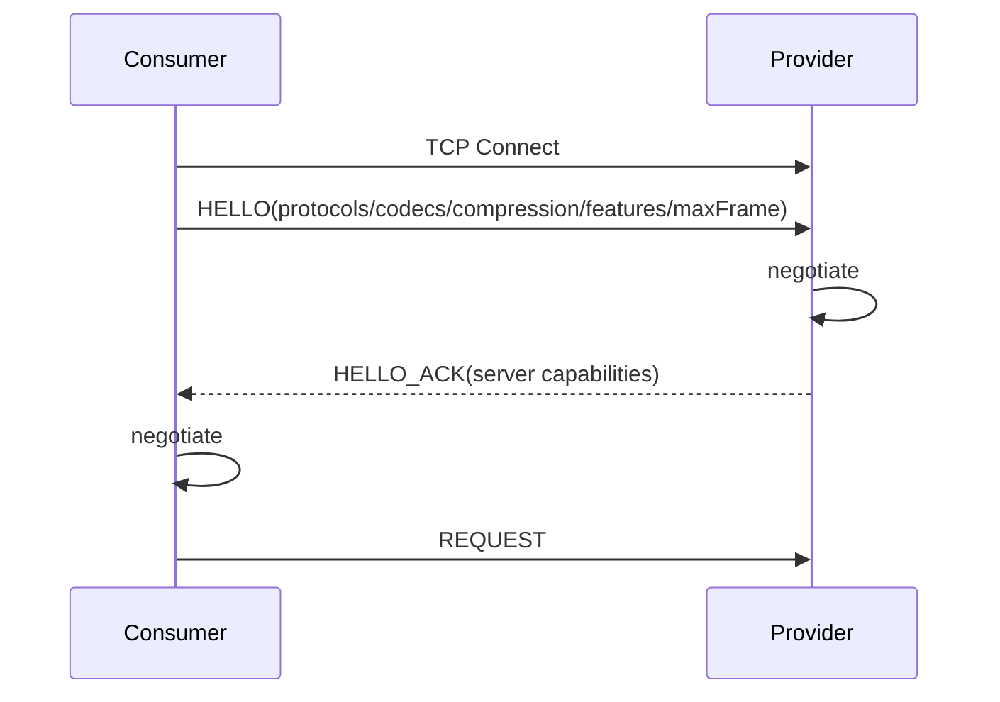

# Peach RPC 高性能内核 V2-B 实现说明

## 1. 目标

V2-B 的目标不是扩展更多注册中心或序列化器，而是继续替换 V2-A 中已经识别出的热路径动态行为和稳定分配。

核心原则保持不变：

> 编译期能确定的信息不进入启动期；启动期能绑定的信息不进入单次 RPC；单次 RPC 必须尽量只做必要的编码、选择、网络 I/O 和结果完成。

## 2. 已实现能力

### 2.1 Generated Consumer CallSite

`@PeachRpcContract` 的 Annotation Processor 同时生成 Consumer Stub 和 Provider Dispatcher。

Consumer 常见 0~4 参数方法使用：

```text
invoke0
invoke1
invoke2
invoke3
invoke4
```

超过 4 个参数时使用 `invokeN(Object[])` fallback。

这消除了 Generated Stub 自身为常见方法创建参数数组的行为，但当前 Fory Codec ID 1 为保持 wire compatibility，仍使用 Object[] 作为参数对象图，因此**尚未实现端到端无 Object[]**。

### 2.2 Generated Provider Dispatcher

Provider 注册服务时优先发现编译期生成的 Server Factory。

存在生成代码时：

```text
methodId
  -> generated switch
  -> target.method(...)
```

不存在生成代码时才回退：

```text
methodId
  -> MethodHandle
  -> target
```

当前 Codec 解码仍先生成 Object[]，因此 Generated Dispatcher 解决的是反射/MethodHandle 通用分派成本，不代表 Provider 参数链已经零数组。

### 2.3 真实 HELLO / HELLO_ACK

Vert.x TCP 连接建立后必须先完成：



双方必须存在共同：

- Protocol Version；
- Codec；
- Compression。

MaxFrame 取较小值，Feature 取交集。

Client 和 Server 都有独立 `handshakeTimeout`。TCP 建连成功但协议握手未完成时不会永久占用连接。

### 2.4 Event Loop Connection State

每条 Vert.x Connection 的以下状态只在所属 Event Loop 访问：

- connection-local Request ID；
- `HashMap<Long, PendingRequest>`；
- inflight；
- FrameAccumulator；
- negotiated capabilities。

因此响应完成路径不需要一个全局 ConcurrentHashMap<RequestId, Future>。

每个 Endpoint 支持配置多个连接分片。连接选择使用线程本地起始 shard + thread-local round-robin，避免热点端点上所有调用线程竞争单个 AtomicInteger。

### 2.5 Unary 协议快路径

接收端使用 `RpcFrameView` 直接引用完整帧 byte[]，Metadata/Payload 通过 offset/length 描述。

Unary 发送端新增：

```java
RpcProtocolCodec.encodeRequest(...);
RpcProtocolCodec.encodeResponse(...);
```

普通 REQUEST 不再构建：

```text
RpcFrame
Map.of(deadline)
Long.toString(deadline)
generic metadata StringBuilder
```

Deadline 直接写为 ASCII metadata。

固定 Header 的 primitive read/write 也不再依赖每次构造 ByteBuffer。

### 2.6 Load Balancer 无分配默认主路径

ServiceDirectory 在控制面更新时将 Registry List 转成不可变语义的 `ServiceInstance[]`。

默认 P2C/EWMA 请求路径：

```text
ServiceInstance[]
  -> random choose 2
  -> read EWMA/inflight
  -> score
  -> selected instance
```

不再每请求执行：

```text
stream
 -> N x LoadBalanceContext
 -> List
```

旧 `select(List<LoadBalanceContext>)` 仍保留为 0.x 兼容 fallback。第三方旧 LoadBalancer 仍可工作，但会承担兼容适配分配成本。

### 2.7 Fory 当前优化边界

当前 Fory Method Codec 已支持从完整 Frame 的 payload slice 直接解码，避免 Core 为 payload 再创建一次 byte[] 副本。

当前没有启用 `requireClassRegistration(true)` 和自动类型 ID 注册。

原因是类型注册属于 wire compatibility 契约：双方必须拥有稳定一致的类型标识和注册生命周期。V2-B 不采用“扫描到什么就按顺序注册什么”的方式，以免滚动升级、模块加载顺序或不同服务集合造成类型 ID 漂移。

后续若启用显式注册，必须同时具备：

1. 稳定 Type ID 生成规则；
2. 编译期或启动期冲突检测；
3. Schema fingerprint；
4. Client/Server capability 校验；
5. 滚动升级兼容策略。

### 2.8 Byte Buddy fallback

新增独立 `peach-rpc-proxy-bytebuddy` 模块。

定位：

```text
Generated Stub
    ↓ missing
Byte Buddy / JDK / CGLIB fallback
```

Byte Buddy 不进入 Starter 默认依赖，也不是性能主线。

## 3. 当前仍存在的热路径成本

V2-B 没有宣称零分配。

当前明确存在：

- Fory 参数对象图仍使用 Object[]；
- Codec 输出仍是 byte[]；
- Transport/Core API 边界仍是完整 byte[] frame；
- FrameAccumulator 重组完整帧时需要 byte[]；
- CompletableFuture/PendingRequest 仍按调用创建；
- Deadline 时钟读取；
- EndpointStats 使用原子变量；
- Provider Semaphore 并发准入；
- Provider 默认业务执行仍为每请求虚拟线程任务。

这些成本必须通过基准判断优先级，不能仅凭理论复杂化实现。

## 4. 性能基准

当前 JMH 已包含：

- Generated Stub / JDK Proxy / Byte Buddy；
- full frame decode / RpcFrameView；
- generic request encode / unary request fast encode；
- List LoadBalanceContext / array + metrics P2C。

基准模块只提供可重复测量能力。仓库文档不写未经固定机器、JVM、参数和 warmup 验证的百分比结论。

## 5. V2-B 之后的生产内核收尾

V2-B.1 第一批已经完成：

1. Raw Vert.x echo 与完整 RPC Added Latency 基线；
2. Cancellation；
3. Retry Budget；
4. outlier ejection / circuit breaking；
5. graceful GO_AWAY drain。

后续仍需：

1. Buffer ownership / Buffer-oriented Codec；
2. Provider execution policy：direct / CPU / blocking virtual；
3. TLS/mTLS；
4. metrics/tracing/JFR；
5. Fory 稳定 Type ID / Schema fingerprint；
6. Etcd compaction/recovery 专项测试。

具体实现边界见 [V2-B.1 生产内核第一批](production-kernel-v2b1.md)。

### 生态扩展

在上述热路径边界稳定后，再新增：

- Protobuf；
- Kryo；
- Hessian2；
- JSON；
- Nacos；
- ZooKeeper；
- Consul；
- Kubernetes EndpointSlice；
- Eureka。
