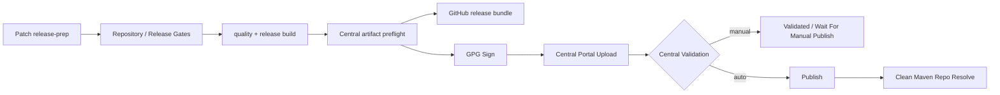

# Maven 结构与发布

## 1. 版本基线

根 POM 使用 `${revision}` 统一版本。

当前稳定基线：

```xml
<revision>1.0.0</revision>
```

1.0.x Patch Release 在 release-prep PR 中同步提升：

- 根 POM `revision`；
- `docs/release-status.properties`；
- 中英文 README release status；
- CHANGELOG；
- 对应 `docs/release-notes-<version>.md`。

已发布版本不可覆盖。1.0.x 修复必须使用新的 Patch 版本。

运行环境：

- JDK 21；
- Spring Boot 3.5.4。

## 2. Reactor

```text
peach-rpc-core
├── peach-rpc-codegen
├── peach-rpc-codec-fory
├── peach-rpc-transport-vertx
├── peach-rpc-registry-etcd
├── peach-rpc-registry-nacos
├── peach-rpc-proxy-cglib
├── peach-rpc-proxy-bytebuddy
├── peach-rpc-observability-micrometer
├── peach-rpc-observability-opentelemetry
├── peach-rpc-observability-jfr
└── peach-rpc-spring-boot-autoconfigure
    └── peach-rpc-spring-boot-starter
peach-rpc-examples
peach-rpc-benchmarks
```

实际构建顺序由 Maven 依赖图决定。

## 3. 本地验证

```bash
python3 scripts/check_project.py
python3 scripts/check_central_publication.py
mvn -B -ntp clean verify -Pquality
```

`quality` Profile 执行 Javadoc doclint。

`check_central_publication.py` 只校验发布配置和 POM 元数据，不需要 Central Token 或 GPG 私钥，因此可以安全地在普通 CI 中执行。

## 4. Release Profile

`release` Profile 负责生成 Maven Central 和 GitHub Release 都需要的构建产物：

- 主 JAR；
- Source JAR；
- Javadoc JAR。

普通验证：

```bash
mvn -B -ntp clean verify -Pquality,release
```

指定 Patch 版本：

```bash
mvn -B -ntp -Drevision=1.0.1 clean verify -Pquality,release
```

生成后可以校验公开模块的主 JAR、Source JAR 和 Javadoc JAR：

```bash
python3 scripts/check_central_publication.py \
  --version 1.0.1 \
  --require-artifacts
```

## 5. Maven Central Profile

`central-release` Profile **只用于真正的 Central 发布**，不会在普通 CI 中启用。

它包含：

- `maven-gpg-plugin`：对发布文件生成 GPG/PGP 签名；
- `central-publishing-maven-plugin`：生成 Central Portal bundle 并上传；
- `publishingServerId=central`；
- 默认 `autoPublish=false`；
- 默认等待到 `validated`；
- Central 要求的 checksum；
- 对 examples / benchmarks 的发布排除。

公开发布模块：

- `peach-rpc-parent`；
- `peach-rpc-core`；
- `peach-rpc-codegen`；
- Codec / Transport / Registry / Proxy Adapter；
- Observability Adapter；
- Spring Boot Autoconfigure；
- Spring Boot Starter。

不发布：

- `peach-rpc-examples`；
- `peach-rpc-example-api`；
- `peach-rpc-example-provider`；
- `peach-rpc-example-consumer`；
- `peach-rpc-benchmarks`。

## 6. Central Portal 前置条件

真正发布前必须由项目维护者完成：

1. 在 Central Publisher Portal 注册组织/账号；
2. 验证 `io.peach.rpc` namespace 的所有权；
3. 生成 Portal User Token；
4. 准备用于 Maven Central 的 PGP/GPG signing key；
5. 在 GitHub Repository Secrets 配置：
   - `CENTRAL_USERNAME`；
   - `CENTRAL_PASSWORD`；
   - `MAVEN_GPG_PRIVATE_KEY`；
   - `MAVEN_GPG_PASSPHRASE`。

> **Namespace 阻塞条件**：Central 的 DNS namespace 按 groupId 反向解析。若首次申请 `io.peach.rpc`，需要证明对精确域名 `peach.rpc` 的控制权（DNS TXT 验证）。如果项目维护者并不控制该域名，则在第一次公开 Central Release 之前必须重新决定 groupId，例如使用已验证的自有域名，或使用 GitHub 个人 namespace。这个决定属于发布坐标兼容性决策，不能由 CI 自动替代，也不应在未确认的情况下自动修改现有 `io.peach.rpc` 坐标。

Token、私钥和 passphrase 禁止写入 POM、workflow 文件、Release Bundle 或日志。

## 7. Patch Release Workflow

人工触发 `.github/workflows/release.yml`。

输入：

- `version`：稳定的 `1.0.x` Patch，例如 `1.0.1`；
- `publish_github`：是否创建 GitHub Release；
- `publish_central`：是否上传到 Central Portal；
- `central_auto_publish`：Central 验证通过后是否自动 publish。

发布链：



真正 publish 时还有两层不可变保护：

- Git Tag 已存在则拒绝；
- Maven Central 已存在相同 `io.peach.rpc:peach-rpc-parent:<version>` 则拒绝。

因此不能通过 workflow 覆盖已发布版本。

## 8. Central 发布模式

### 8.1 仅验证，不自动发布

推荐第一次正式接入时使用：

```text
publish_central = true
central_auto_publish = false
```

Bundle 上传后等待 Central Portal 进入 `VALIDATED`，再由维护者在 Portal 检查并手动 Publish。

### 8.2 自动发布

发布链已经稳定后使用：

```text
publish_central = true
central_auto_publish = true
```

Workflow 会等待 `PUBLISHED`，随后创建一个全新的 Maven local repository，只依赖公开 Maven Central 解析：

```xml
<dependency>
    <groupId>io.peach.rpc</groupId>
    <artifactId>peach-rpc-spring-boot-starter</artifactId>
    <version>&lt;release-version&gt;</version>
</dependency>
```

这一步用来验证“源码仓库里能构建”与“外部使用者真的能从 Central 使用”是同一件事。

## 9. 本地使用

当前公开文档仍以实际稳定版本为准。若对应版本尚未发布到目标 Maven Repository，可先在源码根目录：

```bash
mvn -B -ntp clean install -DskipTests
```

然后从本地 Maven Repository 解析同一坐标。

## 10. 发布边界

项目不在 POM 中硬编码私有 Nexus/Artifactory。

Central Portal 发布使用 GitHub Secrets 注入临时 Credential；组织内部私服继续通过组织自己的 Maven `settings.xml` / deployment policy 管理。

版本、Release Notes、兼容和回滚规则见 [发布策略](release-policy.md)。
