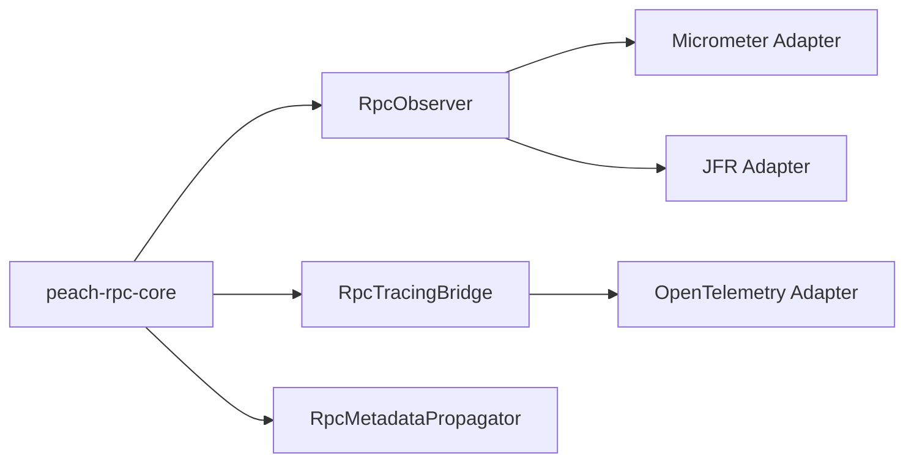
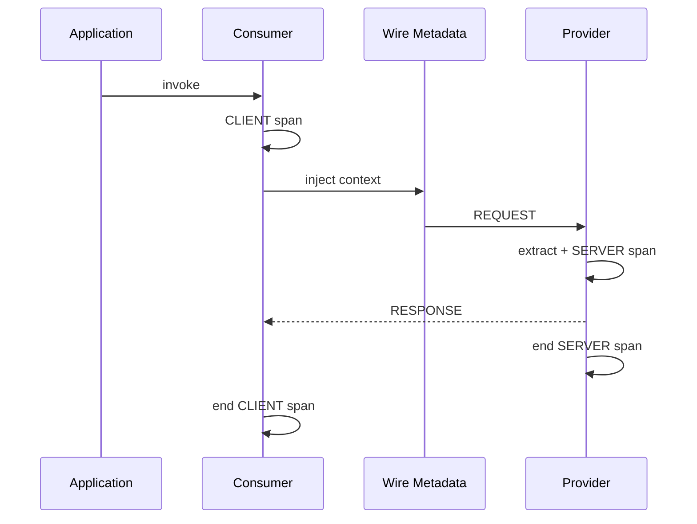

# Peach RPC 可观测性

> 状态：**1.0.1 Release Prep**  
> Core 不直接依赖 Micrometer、OpenTelemetry 或 JFR。

## 1. 架构边界



未安装 Adapter 时使用 NOOP 路径。

## 2. Micrometer

依赖：

```xml
<dependency>
    <groupId>io.peach.rpc</groupId>
    <artifactId>peach-rpc-observability-micrometer</artifactId>
    <version>1.0.1</version>
</dependency>
```

Spring Context 中存在 `MeterRegistry` 时可自动装配 RPC Observer。

### 标准指标

- `peach.rpc.client.calls`；
- `peach.rpc.client.attempts`；
- `peach.rpc.client.retries`；
- `peach.rpc.client.retry.exhausted`；
- `peach.rpc.client.inflight`；
- `peach.rpc.client.timeouts`；
- `peach.rpc.client.circuit.rejected`；
- `peach.rpc.client.circuit.state`；
- `peach.rpc.client.outlier.ejected`；
- `peach.rpc.server.invocations`；
- `peach.rpc.server.inflight`；
- `peach.rpc.server.admission.rejected`；
- `peach.rpc.server.overloaded`；
- `peach.rpc.connection.active`；
- `peach.rpc.connection.established`；
- `peach.rpc.connection.reconnects`；
- `peach.rpc.connection.heartbeat.timeouts`；
- `peach.rpc.connection.closed`；
- `peach.rpc.registry.operations`；
- `peach.rpc.registry.failures`；
- `peach.rpc.registry.recoveries`；
- `peach.rpc.tls.handshake`；
- `peach.rpc.tls.certificate.reload`；
- `peach.rpc.tls.certificate.expiry.warnings`。

默认不把 endpoint、instanceId、service、method、exception message、traceId 放进 Meter Tag，避免高基数。

## 3. Call 与 Attempt

一次业务调用可能产生多个网络 Attempt：

```text
client.calls = 1
client.attempts = 1..N
client.retries = attempts - 1
```

业务 QPS、成功率、Latency SLO 以 logical call 为主；Attempt 用于诊断 Retry Amplification。

## 4. OpenTelemetry

依赖：

```xml
<dependency>
    <groupId>io.peach.rpc</groupId>
    <artifactId>peach-rpc-observability-opentelemetry</artifactId>
    <version>1.0.1</version>
</dependency>
```

真实 RPC 路径传播 W3C Trace Context/Baggage。



## 5. JFR

依赖：

```xml
<dependency>
    <groupId>io.peach.rpc</groupId>
    <artifactId>peach-rpc-observability-jfr</artifactId>
    <version>1.0.1</version>
</dependency>
```

启用示例：

```yaml
peach:
  rpc:
    observability:
      jfr:
        enabled: true
        slow-threshold: 100ms
```

JFR 用于低频高价值诊断：慢/失败调用、Retry、reconnect、heartbeat timeout、Registry recovery、TLS/证书事件。

## 6. Metadata 安全边界

- key/value 不允许换行；
- key 不允许 `=`；
- key/value 有长度限制；
- 总 metadata 最大 65535 bytes；
- Deadline/Timeout Budget 为保留键；
- 未启用 Trace Adapter 时不创建额外 Trace Metadata。

## 7. 故障隔离

> telemetry failure must not become RPC failure.

Observer/Propagator Adapter 回调异常必须被隔离，不得改变 RPC 业务成功与否。

## 8. 生产入口

- [生产可观测与 SLO](production-observability.md)
- [Grafana Dashboard](../deploy/observability/grafana/peach-rpc-dashboard.json)
- [Prometheus Alert Example](../deploy/observability/prometheus/peach-rpc-alerts.example.yml)
