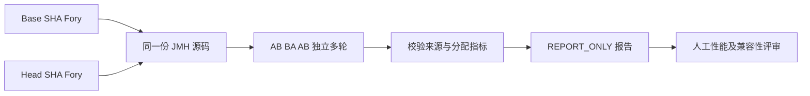

# Peach RPC 性能证据与容量验证

> 状态：**Tooling Current / Environment-specific Evidence Required for Numeric Claims**

## 1. 原则

Peach RPC 区分：

1. **性能工具是否可用**；
2. **某个固定环境的结果是否可重复**；
3. **结果是否可以晋级为容量建议或官方性能声明**。

GitHub shared runner 只用于验证工具和行为，不作为生产 SLO 来源。

## 2. 工具

仓库提供：

- JMH 参数化 Benchmark；
- payload / concurrency / connection-shard matrix；
- sample + throughput；
- `-prof gc`；
- Fory 零参数和多参数编解码分配 JMH（`scripts/run_fory_argument_allocation.sh`）；
- Provider execution/fault scenario；
- TLS/PLAINTEXT security matrix；
- Retry/Circuit/Outlier resilience matrix；
- 10k logical-concurrency Virtual Thread soak；
- Evidence validator；
- repeatability compare；
- baseline candidate；
- before/after regression closure。

## 3. Evidence 流程


## 4. 固定环境要求

至少记录：

- Commit SHA；
- JDK；
- JVM flags；
- OS/Kernel；
- CPU；
- Memory；
- Runner identity；
- physical host fingerprint；
- payload；
- concurrency；
- connection shard；
- execution/fault scenario。

不同 physical host 的结果不能自动合并为同一受控基线。

## 5. 指标

- throughput；
- p50/p99/p99.9；
- QPS/Core；
- allocation/op；
- GC；
- CPU；
- heap；
- inflight；
- connection count；
- error rate；
- overload success/error；
- failure category。

## 6. 10k Soak

10k 指 logical concurrency，不等于创建 10k TCP 连接。

正式 soak 应在目标硬件运行足够时间，至少记录：

- warmup；
- duration；
- concurrency；
- payload；
- connections；
- client timeout；
- heap/GC/CPU；
- p99/p99.9；
- error breakdown。

## 7. 性能优化门

以下候选只有 Evidence 证明收益后才进入默认路径：

- Buffer-oriented Codec；
- FrameAccumulator copy reduction（已实现的 [定向 Allocation Profiling](transport-allocation-profiling.md)，Shared Runner 的 B/op 与采样延迟仅为 Smoke）；
- Object[] elimination（当前仅零参数复用空数组；1～N 参数仍使用兼容表示）；
- Future/PendingRequest allocation reduction；
- EndpointStats/admission contention 优化；
- Compression。

## 8. GA 边界

1.0.0 可以在没有厂商级固定硬件数字的情况下发布，因为：

- 正确性、兼容性、Chaos、Release Gate 独立可验证；
- 项目不发布未经验证的官方 QPS/SLO；
- 每个使用者的 CPU、Payload、业务方法、TLS、Registry 和 JVM 都不同。

但任何官方性能比较、生产容量推荐、QPS/Core 或 p99/p99.9 数字，都必须附带本流程产生的 Evidence。

## 10. Fory 参数编解码 A/B 分配量测量

当前代码已经具有 `ForyArgumentEncodingBenchmark`，可以把**完全相同的 Benchmark 源码**复制到历史 Base worktree，再分别构建 Base 与当前 Candidate。这避免了“优化前没有相同基准代码”的比较偏差：

```bash
# 在仓库根目录，必须具备历史提交；Base 应选零参数优化前的稳定提交。
BASE_SHA="dd2bfffb7423af332d0bb071bf5e9013f49afd01"
HEAD_SHA="$(git rev-parse HEAD)"
bash scripts/run_fory_allocation_comparison.sh "$BASE_SHA" "$HEAD_SHA"
```

脚本验证两个不同的完整 Git SHA，使用同一 JDK、JVM flags、参数矩阵、`-prof gc`，以 AB/BA 顺序执行。默认每侧三轮独立样本，保留 `avgt/sample` 原始 JSON，并通过 `scripts/compare_fory_allocation.py` 检查 JDK/JMH、场景完整度、B/op、sample p99 及来源。



共享 GitHub Runner 的 PR 自动检查强制标记为 `shared-ci-smoke`，只执行一对短基准用于证明工具可运行。受控微基准需在实际固定主机上显式配置 `PEACH_RPC_FORY_EVIDENCE_CLASS=controlled-micro`、`PEACH_RPC_RUNNER_ID`、`PEACH_RPC_HOST_FINGERPRINT`，至少三轮；GitHub Actions 不允许将自己声明为受控主机。**任何结果都只有 `REPORT_ONLY`，不自动给性能验收 PASS。**

报告包含相对差值与分配 CV，仍需要结合 JFR/AsyncProfiler、端到端 RPC p99/p99.9、CPU、GC 和长稳试验评估。零参数 `Object[0]` 在 JIT 优化后不一定形成实际分配；不能预设 B/op 一定下降。结果输出：`target/fory-allocation-comparison/`。

## 11. 相关文档

- [性能指南](performance.md)
- [容量规划](capacity-planning.md)
- [生产配置](production-configuration.md)
- [发布就绪](release-readiness.md)
