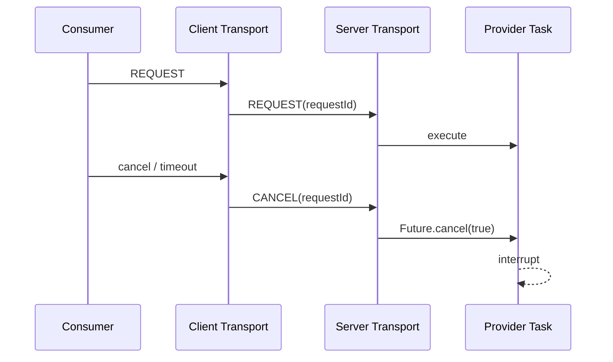

# Peach RPC V2-B.1 生产内核第一批

## 1. 范围

V2-B.1 第一批不扩展新的 Registry/Codec 生态，而是补齐 V2-B Unary 高性能主链在真实生产故障与发布场景下最关键的行为：

1. Cancellation；
2. Retry Budget；
3. Outlier Ejection；
4. Circuit Breaker；
5. Graceful Drain；
6. Raw Vert.x / 完整 RPC 端到端延迟基线。

TLS/mTLS、Observability、Buffer ownership 与 Fory 稳定 Type ID 不属于本批次，仍是后续生产门禁。

## 2. 调用取消

连接握手默认声明 `RpcFeature.CANCEL`。Consumer 的 Transport Future 在主动 `cancel(true)` 或请求 timeout 后，会向实际承载请求的连接发送：

```text
CANCEL(requestId)
```

Request ID 仍是 connection-local，因此 Provider 不需要全局 pending Map。Provider 在连接自己的 inflight table 中定位对应 Future，并执行 `cancel(true)`；Core 再把取消传播到虚拟线程执行任务。



取消是 best-effort：若请求已经完成或业务依赖不响应线程中断，框架不能强制回滚已发生的业务副作用。

## 3. 受预算的幂等重试

Peach RPC 不采用“所有请求固定重试 N 次”。自动重试需要同时满足：

- 服务方法标注 `@PeachRpcIdempotent`；
- 错误属于基础设施类可重试错误；
- 未超过 `maxAttempts`；
- 全局 Retry Budget 有余额；
- 整体 RPC Deadline 仍允许下一次 attempt。

当前可重试类别：

- 本地 `RpcUnavailableException`；
- 本地 `RpcOverloadedException`；
- 远端 `UNAVAILABLE`；
- 远端 `OVERLOADED`；
- 远端 `INTERNAL_ERROR`。

业务错误不会自动重试。所有 attempt 共享同一个逻辑 Deadline，退避采用有上限的随机窗口，避免同步重试风暴。

## 4. Outlier Ejection

`EndpointStats` 在原有 EWMA/inflight 基础上记录连续基础设施失败。达到阈值后 Endpoint 在固定时间内被标记为不可选：

```text
EndpointStats
  -> consecutive infrastructure failures
  -> ejectedUntil
  -> LoadBalanceMetrics.available=false
  -> P2C skips endpoint
```

该状态属于 Consumer 本地数据面保护，不写回 Registry，也不把单个 Consumer 的瞬时观察扩散为全局控制面事实。

## 5. Circuit Breaker

Circuit Breaker 按 Consumer 引用的方法绑定，主要保护“整个依赖方法持续失败”的场景，与实例级 Outlier Ejection 分工不同。

当前状态模型：

```text
CLOSED
  -> consecutive infrastructure failures
OPEN
  -> open duration elapsed
HALF_OPEN
  -> one probe
CLOSED or OPEN
```

业务异常不会触发熔断；最终基础设施失败才计入连续失败，重试中的中间 attempt 不单独把逻辑调用计算成多次熔断失败。

## 6. Graceful Drain

Provider 正常关闭顺序：

```text
STARTED
  -> DRAINING
  -> unregister service instances
  -> Transport sends GO_AWAY(UNAVAILABLE)
  -> reject new REQUEST on draining connection
  -> complete existing inflight
  -> inflight == 0 or drain timeout
  -> close transport/executor
```

协议错误或内部错误使用非 UNAVAILABLE 的 GO_AWAY，Consumer 仍按 fatal connection error 处理，不与部署排空混淆。

## 7. 性能基线

`EndToEndLatencyBenchmark` 在同一 JMH 进程中提供：

- `rawVertxEcho`：Raw Vert.x TCP loopback；
- `peachRpcEcho`：完整 Generated Stub -> Fory -> Protocol -> Vert.x -> Provider -> Response。

两个方法固定单并发和相同 payload，AverageTime 的差值用于观察当前环境的 RPC Added Latency。

该基准只建立可重复测量方法，不在仓库中写没有固定 CPU/JDK/JVM/fork/warmup 的性能提升百分比。

## 8. 当前边界

本批次之后仍未解决：

- Transport/Core 仍以完整 `byte[]` frame 为主要边界；
- Fory 参数对象图仍存在 Object[]；
- TLS/mTLS 未实现；
- Micrometer/OpenTelemetry/JFR 未接入；
- Fory 稳定 Type ID / Schema fingerprint 未实现；
- Etcd compaction 等真实故障集成测试仍需加强；
- Streaming RPC 未实现。

因此 V2-B.1 第一批完成后项目仍保持 Preview 状态，而不是直接宣称 Production GA。
