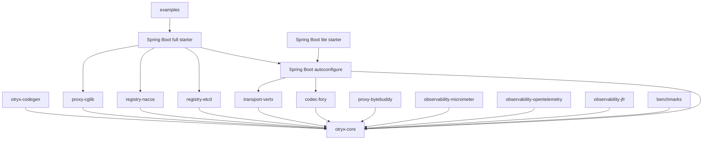

# OTRYX RPC 项目构造思路与模块结构

> 状态：**2.0.0-SNAPSHOT Migration**

## 1. 构造原则

OTRYX RPC 的模块不是按“功能名越细越好”拆分，而是按**第三方依赖隔离、生命周期边界和可替换性**拆分。

原则：

1. Core 只定义稳定契约和运行时；
2. 第三方技术进入独立 Adapter；
3. 编译期能力与运行时能力分离；
4. Examples/Benchmarks 不成为业务依赖；
5. Starter 只负责组装，不重新发明 Core 语义；
6. 文档、测试和发布门禁与代码同步演进。

## 2. Maven Reactor

当前固定 16 个顶层模块：

| 模块 | 责任 |
|---|---|
| otryx-core | API、协议、运行时、Registry/Transport/Codec SPI、Resilience |
| otryx-codegen | 编译期 Consumer Stub / Provider Dispatcher |
| otryx-codec-fory | Fory Codec Adapter |
| otryx-transport-vertx | Vert.x TCP/TLS/mTLS Transport |
| otryx-registry-etcd | Etcd Registry Adapter |
| otryx-registry-nacos | Nacos Registry Adapter |
| otryx-proxy-cglib | CGLIB fallback |
| otryx-proxy-bytebuddy | Byte Buddy fallback |
| otryx-observability-micrometer | Metrics Adapter |
| otryx-observability-opentelemetry | Tracing Adapter |
| otryx-observability-jfr | JFR Adapter |
| otryx-spring-boot-autoconfigure | Spring Boot AutoConfiguration |
| otryx-spring-boot-starter | 兼容完整业务依赖入口（Etcd/Nacos/CGLIB） |
| otryx-spring-boot-starter-lite | 推荐新业务的轻量依赖入口 |
| otryx-examples | 独立 Provider/Consumer 示例 |
| otryx-benchmarks | JMH/Soak 性能工具 |

## 3. 依赖方向



## 4. 为什么 Core 不依赖第三方实现

Core 禁止直接 import：

- Vert.x；
- Etcd；
- Nacos；
- Spring；
- Fory；
- CGLIB；
- Micrometer；
- OpenTelemetry；
- JFR。

这样做使：

- Wire/Registry/Transport 契约可独立测试；
- Adapter 可以替换；
- 业务引入的第三方依赖可控；
- 未来扩展不会迫使 Core API 携带第三方类型。

## 5. 编译期与运行时

```text
Java Interface
   |
@OtryxRpcContract
   |
Annotation Processor
   +--> Generated Consumer Factory
   +--> Generated Server Factory

Runtime
   +--> generated path preferred
   +--> Proxy / MethodHandle fallback
```

把能够在编译期确定的信息提前生成，减少运行时反射和动态装配。

## 6. Starter 的位置

已有项目使用兼容完整 Starter；新项目推荐使用轻量 Starter（Memory/JDK Proxy/Fory/Vert.x），再按需加入 Registry/Proxy Adapter：

```xml
<dependency>
    <groupId>com.peachsoft.otryx</groupId>
    <artifactId>otryx-spring-boot-starter-lite</artifactId>
    <version>1.0.1</version>
</dependency>
```

完整 Starter 保留历史 Adapter 传递依赖；轻量 Starter 不带入 Etcd、Nacos、CGLIB。两者都复用同一个 AutoConfiguration，业务仍可以直接依赖 Core + 指定 Adapter 进行非 Spring 使用。

## 7. 测试结构

- Core Unit / Property / Race；
- Registry Adapter 真实集成；
- Registry Contract TestKit；
- TLS/mTLS；
- OpenTelemetry real RPC trace；
- Independent JVM Example E2E；
- Etcd Chaos；
- Nacos Chaos；
- Rolling Compatibility；
- Benchmark / 10k soak；
- Release Readiness。

## 8. 新贡献者阅读顺序

1. [需求蓝图](requirements-blueprint.md)
2. [技术方案](technical-solution.md)
3. [架构设计](architecture.md)
4. [调用链详设](detailed-design.md)
5. [SPI](spi.md)
6. 对应 Adapter 源码与测试
7. [开发与贡献](development.md)

## 9. 新增 Adapter 的边界

新增 Registry/Codec/Transport/Proxy/Observability 实现时：

- 优先新模块；
- 不把第三方类型泄漏到 Core；
- 复用现有 Contract Test；
- 定义 close/lifecycle；
- 明确 timeout/线程/阻塞边界；
- 补故障和恢复测试；
- 更新文档与 README 能力矩阵。
