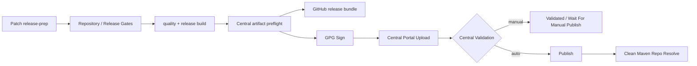

# Maven 结构与发布

## 1. 版本基线

根 POM 使用 `${revision}` 统一版本。

当前 **OTRYX RPC 1.0 首发开发基线**（与历史 Peach RPC 1.x 不保证互通）：

```xml
<revision>1.0.0-SNAPSHOT</revision>
```

> 本仓库当前为破坏性 API/GAV 迁移后的开发版，不能被视为已完成 Maven Central 发布。参见 [公开发布核查表](../publication-readiness.md)。

历史 Peach RPC 1.0.x Patch Release 仅在历史版本维护流程中同步提升：

- 根 POM `revision`；
- `docs/release-status.properties`；
- 中英文 README release status；
- CHANGELOG；
- 对应 `docs/archive/releases/release-notes-<version>.md`。

已发布版本不可覆盖。1.0.x 修复必须使用新的 Patch 版本。

运行环境：

- JDK 21；
- Spring Boot 3.5.4。

## 2. Reactor

当前 Maven 采用按能力分组的聚合模块（目录层级，不等同于最终发布坐标）：

```text
otryx-rpc (root parent)
├── otryx-core
├── otryx-codegen
├── otryx-registry
│   ├── otryx-registry-etcd
│   ├── otryx-registry-nacos
│   ├── otryx-registry-http
│   ├── otryx-registry-consul
│   └── otryx-registry-eureka
├── otryx-serialization
│   └── otryx-serialization-fory
├── otryx-transport
│   └── otryx-transport-vertx
├── otryx-proxy
│   ├── otryx-proxy-cglib
│   └── otryx-proxy-bytebuddy
├── otryx-observability
│   ├── otryx-observability-micrometer
│   ├── otryx-observability-opentelemetry
│   └── otryx-observability-jfr
├── otryx-spring-boot
│   ├── otryx-spring-boot-autoconfigure
│   ├── otryx-spring-boot-starter
│   └── otryx-spring-boot-starter-lite
├── otryx-examples
└── otryx-benchmarks
```

实际构建顺序由 Maven 依赖图决定。

## 3. 本地验证

```bash
python3 scripts/check_project.py
python3 scripts/check_central_publication.py
mvn -B -ntp clean verify -Pquality
```

`quality` Profile 执行 Javadoc doclint。

`check_central_publication.py` 只校验发布配置和 POM 元数据，不需要 Central Token 或 GPG 私钥，因此可以安全地在普通 CI 中执行。

## 4. Release Profile

`release` Profile 负责生成 Maven Central 和 GitHub Release 都需要的构建产物：

- 主 JAR；
- Source JAR；
- Javadoc JAR。

普通验证：

```bash
mvn -B -ntp clean verify -Pquality,release
```

历史 1.0.x Patch 示例（仅适用于匹配的历史维护分支，**不适用于当前 当前 main**）：

```bash
mvn -B -ntp -Drevision=1.0.1 clean verify -Pquality,release
```

历史 Patch 生成后可以校验公开模块的主 JAR、Source JAR 和 Javadoc JAR：

```bash
python3 scripts/check_central_publication.py \
  --version 1.0.1 \
  --require-artifacts
```

## 5. Maven Central Profile

`central-release` Profile **只用于真正的 Central 发布**，不会在普通 CI 中启用。

它包含：

- `maven-gpg-plugin`：对发布文件生成 GPG/PGP 签名；
- `central-publishing-maven-plugin`：生成 Central Portal bundle 并上传；
- `publishingServerId=central`；
- 默认 `autoPublish=false`；
- 默认等待到 `validated`；
- Central 要求的 checksum；
- 对 examples / benchmarks 的发布排除。

公开发布模块：

- `otryx-rpc`；
- `otryx-core`；
- `otryx-codegen`；
- Codec / Transport / Registry / Proxy Adapter；
- Observability Adapter；
- Spring Boot Autoconfigure；
- Spring Boot Starter。

不发布：

- `otryx-examples`；
- `otryx-example-api`；
- `otryx-example-provider`；
- `otryx-example-consumer`；
- `otryx-benchmarks`。

### 5.1 纯依赖 Starter 的 Source/Javadoc

`otryx-spring-boot-starter` 是依赖聚合 Starter，本身不承载实现类。Maven Central 对 JAR 包仍要求 `sources` / `javadoc` classifier，因此该模块在 `release` Profile 中：

- 跳过标准 Source Plugin 的空源码归档；
- 跳过 JDK Javadoc Tool；
- 使用 Maven Jar Plugin 从 `src/central-placeholder/README.md` 生成 placeholder `-sources.jar` 与 `-javadoc.jar`。

这样既满足 Central Artifact 形态要求，也不会为了生成 Javadoc 人为增加无业务意义的 public marker type。

## 6. Central Portal 前置条件

真正发布前必须由项目维护者完成：

1. 在 Central Publisher Portal 注册组织/账号；
2. 验证能够覆盖 `com.peachsoft.otryx` 的 Central namespace 权限：维护者须拥有 `peachsoft.com` 并验证 `com.peachsoft`，或拥有 `otryx.peachsoft.com` 并验证精确的 `com.peachsoft.otryx`；
3. 生成 Portal User Token；
4. 准备用于 Maven Central 的 PGP/GPG signing key；
5. 在 GitHub Repository Secrets 配置：
   - `CENTRAL_USERNAME`；
   - `CENTRAL_PASSWORD`；
   - `MAVEN_GPG_PRIVATE_KEY`；
   - `MAVEN_GPG_PASSPHRASE`。

> **Namespace 阻塞条件：** `io.peach` 并不能覆盖 `com.peachsoft.otryx`。Central 官方要求反向 DNS 与 TXT 验证；`com.peachsoft` 对应 `peachsoft.com`，精确的 `com.peachsoft.otryx` 对应 `otryx.peachsoft.com`。如果两者都无法证明所有权，维护者必须在发布前确认新 groupId（例如经 GitHub 身份验证的 `io.github.<用户名>`）并评审全仓再迁移，而不能通过 CI 自动推断所有权。参见 [Sonatype Namespace 官方文档](https://central.sonatype.org/register/namespace/) 和 [公开发布核查表](../publication-readiness.md)。

Token、私钥和 passphrase 禁止写入 POM、workflow 文件、Release Bundle 或日志。

## 7. 历史 Peach RPC 1.0.x Patch Release Workflow（不能发布 OTRYX 首发版本）

`.github/workflows/release.yml` 当前仍保留历史 Patch 发布参数与检查路径，只用于说明既有发布设计。**当前 main 的 `1.0.0-SNAPSHOT` 不具备经验证的 OTRYX 首发 RC/GA 发布流水线，不应把历史工作流作为可直接执行的生产发布步骤。** 必须先完成新的首发发布设计、实际门禁和授权验收。

输入：

- `version`：稳定的 `1.0.x` Patch，例如 `1.0.1`；
- `publish_github`：是否创建 GitHub Release；
- `publish_central`：是否上传到 Central Portal；
- `central_auto_publish`：Central 验证通过后是否自动 publish。

发布链：



真正 publish 时还有两层不可变保护：

- Git Tag 已存在则拒绝；
- Maven Central 已存在相同 `com.peachsoft.otryx:otryx-rpc:<version>` 则拒绝。

因此不能通过 workflow 覆盖已发布版本。

## 8. Central 发布模式

### 8.1 仅验证，不自动发布

推荐第一次正式接入时使用：

```text
publish_central = true
central_auto_publish = false
```

Bundle 上传后等待 Central Portal 进入 `VALIDATED`，再由维护者在 Portal 检查并手动 Publish。

### 8.2 自动发布

发布链已经稳定后使用：

```text
publish_central = true
central_auto_publish = true
```

Workflow 会等待 `PUBLISHED`，随后创建一个全新的 Maven local repository，只依赖公开 Maven Central 解析：

```xml
<dependency>
    <groupId>com.peachsoft.otryx</groupId>
    <artifactId>otryx-spring-boot-starter</artifactId>
    <version>&lt;release-version&gt;</version>
</dependency>
```

这一步用来验证“源码仓库里能构建”与“外部使用者真的能从 Central 使用”是同一件事。

## 9. 本地使用

以下 1.0.1 发布流程只适用于旧版稳定分支。当前 OTRYX 源码是 **1.0.0-SNAPSHOT**，尚未发布 Maven Central；本地开发使用源码安装而不是 1.0.1 坐标。

```bash
mvn -B -ntp clean install -DskipTests
```

然后从本地 Maven Repository 解析同一坐标。

## 10. 发布边界

项目不在 POM 中硬编码私有 Nexus/Artifactory。

Central Portal 发布使用 GitHub Secrets 注入临时 Credential；组织内部私服继续通过组织自己的 Maven `settings.xml` / deployment policy 管理。

版本、Release Notes、兼容和回滚规则见 [发布策略](../archive/releases/release-policy.md)。
