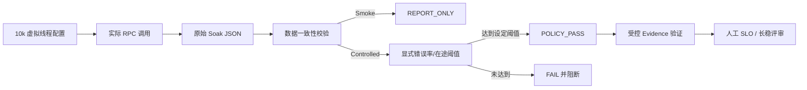

# OTRYX RPC 长稳 Soak 质量门禁与高可用验收

> 状态：**质量门禁已实现；固定主机 30 分钟以上运行与生产 SLO 仍待真实证据**。

## 1. 为什么需要另一道门

`PerformanceSoakRunner` 使用最多 10k 个 Virtual Thread 驱动同步 RPC。这里必须区分：
- `concurrency`：配置的逻辑并发调用者数；
- `maxLogicalInflight`：测试期间实际观察到的最大在途逻辑 RPC 数；
- `successes/errors/errorRate`：真正完成的调用及其错误；
- `p99Micros/p999Micros`：成功请求的延迟指标。

之前的 Soak smoke 仅验证有成功请求，不能证明错误率、实际并发或业务 SLO 达标。因此新增 `scripts/check_soak_quality.py` 将结构性验证和受控运行阈值检查分离。

## 2. 验收状态与实现流程



基础检查要求：成功/失败次数为非负整数、至少一次成功；结果中的 `errorRate` 与成功/失败计数一致；`errorsByType` 分类计数一致；`maxLogicalInflight` 在 1 到已配置 `concurrency` 之间；时长和吞吐为正、p50/p99/p99.9 单调有效。CI 短时 smoke 永远标为 `REPORT_ONLY`，不因结果无异常而自动认定为容量测试成功。

受控模式在开始固定环境测试**之前**必须由使用者明确配置：

- `OTRYX_RPC_SOAK_MAX_ERROR_RATE`：应用可接受的最大错误率（0～1），不能沿用未知业务的假设；
- `OTRYX_RPC_SOAK_MIN_OBSERVED_INFLIGHT`：最低实际观测并发数，必须在 1 与配置调用者数之间；
- 可选 `OTRYX_RPC_SOAK_MAX_P99_MICROS`：本次环境容许的最大 p99（微秒）。

这三个阈值是使用者的 SLO 决策，框架不会擅自填入“行业通用”数值。

## 3. 固定 Runner 运行

在仓库根目录，按实际工作负载配置完整矩阵、Runner ID、CPU/JVM 参数后运行：

```bash
export OTRYX_RPC_RUNNER_ID="<fixed-runner-id>"
export OTRYX_RPC_EVIDENCE_CLASS="controlled"
export OTRYX_RPC_SOAK_CONCURRENCY="10000"
export OTRYX_RPC_SOAK_DURATION_SECONDS="1800"
export OTRYX_RPC_SOAK_MAX_ERROR_RATE="<your-error-rate-limit>"
export OTRYX_RPC_SOAK_MIN_OBSERVED_INFLIGHT="<your-measured-concurrency-floor>"
# 可选：OTRYX_RPC_SOAK_MAX_P99_MICROS="<your-p99-budget>"
bash scripts/run_v2d2_fixed_evidence.sh target/v2d2-fixed-evidence
```

这些占位符必须换成可解析的实际值。完整受控流程包括机器指纹预检、全矩阵 JMH、至少 1800 秒 Soak、阈值验证与证据包清单。该流程在触发超标时**非零退出**，不会生成错误的“验收通过”结论。

质量报告：
- `soak-smoke-quality/report.json`：仅结构检查，不代表 SLO；
- `soak-policy/report.json`：受控阈值判定、请求数据 SHA-256 与失败原因；
- `validation-report.json`：综合结构校验，要求受控策略 `POLICY_PASS` 且 SHA-256 与当前 `soak.json` 完全一致。

任何修改 `soak.json` 后的旧策略报告都会被拒绝。必要时通过 `python3 scripts/test_soak_quality.py` 运行负面测试，覆盖高错误率但有成功请求、实际在途量不足、无阈值、异常分布不一致和延迟异常等。

## 4. 其他高可用场景

已有独立流程：
- [Etcd Chaos](../../.github/workflows/etcd-chaos.yml) 模拟 Leader Transfer；
- [Nacos Chaos](../../.github/workflows/nacos-chaos.yml) 模拟暂停与恢复；
- [Rolling Compatibility](../../.github/workflows/rolling-compatibility.yml) 验证 N/N+1 与回滚；
- [升级与回滚说明](../upgrade-rollback.md) 给出具体恢复操作。

这些流程不能代替真实生产负载下的 TLS/mTLS、GC、网络抖动、Provider 重启、连接排队、Admission 饱和及长时间运行证据。发布容量数字必须依靠目标环境多轮采集与人工审核。

## 5. 阶段验收范围

**已实现**：代码级结构与策略校验、失败阻断、不可复用的原始数据摘要、负面单元测试、原有 Chaos/Compatibility workflow。

**待运行/提交真实证据**：目标规格固定 Runner、至少三次受控重复、30 分钟长稳（必要时延长至数小时/24h）、TLS/mTLS 和故障注入矩阵结果、allocation/profiling、实际 SLO 判断。

