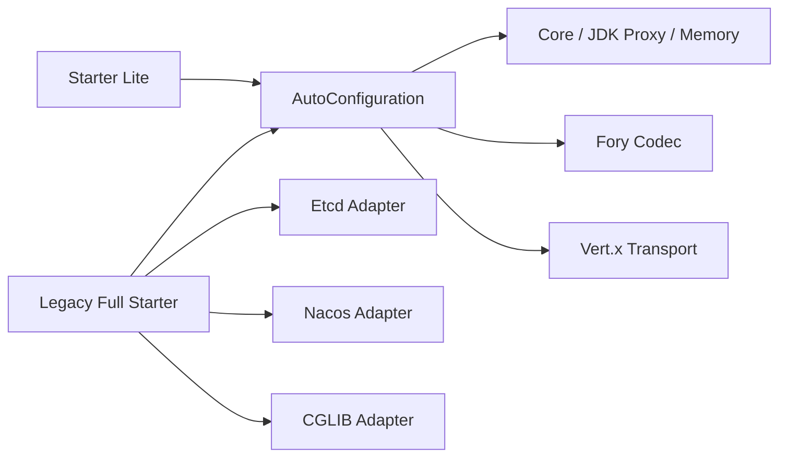

# Spring Boot Starter 与配置

> 当前 Maven 坐标：`com.peachsoft.otryx:otryx-* : 1.0.0-SNAPSHOT`（源码开发版，须本地 install，尚未从 Maven Central 发布）。历史 Peach RPC 1.0.x Java API 不与 OTRYX 1.0 自动兼容。参见[迁移指南](../migration.md)。

## 1. 引入

### 1.1 新项目推荐：轻量 Starter

轻量接入采用 `otryx-spring-boot-starter-lite`，默认是 **Memory Registry、JDK Proxy、Fory、Vert.x**，不额外带入 Etcd、Nacos、Consul、Eureka 或 CGLIB。它保留和完整 Starter 相同的注解、配置、Wire v1 与 Public Core API：

```xml
<dependency>
    <groupId>com.peachsoft.otryx</groupId>
    <artifactId>otryx-spring-boot-starter-lite</artifactId>
    <version>1.0.0-SNAPSHOT</version>
</dependency>
```

需要 Nacos 时仅增加对应 Adapter，并按下文配置 Registry：

```xml
<dependency>
    <groupId>com.peachsoft.otryx</groupId>
    <artifactId>otryx-registry-nacos</artifactId>
    <version>1.0.0-SNAPSHOT</version>
</dependency>
```

Etcd 则引入 `otryx-registry-etcd`。Consul 或 Eureka 需要额外引入对应 `otryx-registry-consul` / `otryx-registry-eureka` Adapter，分别配置 `registry.type=consul` / `eureka`：

```xml
<dependency>
    <groupId>com.peachsoft.otryx</groupId>
    <artifactId>otryx-registry-consul</artifactId>
    <version>1.0.0-SNAPSHOT</version>
</dependency>
```

将 `artifactId` 改为 `otryx-registry-eureka` 即可选择 Eureka；完整配置分别见 [Consul 接入](registry-consul.md)、[Eureka 接入](registry-eureka.md)。二者通过 `otryx-registry-http` 共享控制面，不需要单独声明 HTTP 子模块。

CGLIB fallback 则引入 `otryx-proxy-cglib`，Byte Buddy 使用 `otryx-proxy-bytebuddy`。SPI 自动发现实际已安装的 Adapter；如果配置了未加入类路径的 `otryx.rpc.registry.type=nacos`，应按缺失 Adapter 处理，不能假设轻量 Starter 自带 SDK。

### 1.2 兼容模式：完整 Starter

已在使用的 `otryx-spring-boot-starter` **继续保留**原有 Etcd、Nacos、CGLIB 的传递依赖，避免在 1.0.x 期间破坏依赖兼容：

```xml
<dependency>
    <groupId>com.peachsoft.otryx</groupId>
    <artifactId>otryx-spring-boot-starter</artifactId>
    <version>1.0.0-SNAPSHOT</version>
</dependency>
```

两种 Starter 请选择一种，避免重复声明；不要同时依赖。当前版本仍处于源码 Release Prep，实际 Maven Central 可用性以正式发布结果为准。




### 1.3 零外部依赖的真实 RPC 冒烟

仓库包含 `OtryxRpcAutoConfigurationTest.memoryRegistryShouldCompleteRealRpcWithoutExternalInfrastructure`，在一个 Spring 测试上下文内启动真实 Vert.x Provider/Consumer，使用内存 Registry、回环地址、随机端口完成 `DemoService.call()`。不依赖 Nacos、Etcd、Docker 或外部数据库。

从仓库根目录执行：

```bash
mvn -B -ntp -pl otryx-spring-boot-autoconfigure -am \
  -Dtest=OtryxRpcAutoConfigurationTest \
  -Dsurefire.failIfNoSpecifiedTests=false test
```

这是源码测试命令。若业务项目单独引用已发布的 Lite Starter，需先引入双方共享的 RPC 接口定义，然后分别声明 `@OtryxRpcService` 和 `@OtryxRpcReference`，单 JVM 内存模式适合本地冒烟，跨进程生产环境必须换用 Etcd、Nacos、Consul、Eureka 或等价的共享注册中心。

## 2. Provider

```java
@OtryxRpcService(interfaceClass = OrderService.class, version = "1.0.0")
public class OrderServiceImpl implements OrderService {
}
```

```yaml
otryx:
  rpc:
    registry:
      type: nacos
      endpoints: 127.0.0.1:8848
      namespace: public
      nacos:
        group: OTRYX_RPC
        cluster: DEFAULT
    server:
      host: 0.0.0.0
      port: 19090
      advertised-host: 10.0.0.15
```

存在 `@OtryxRpcService` 时才会创建 Provider 运行时，并在 `SmartLifecycle` 阶段统一启动。当前 Registry 必须暴露 `ServiceRegistrar`；discovery-only Registry 会 fail-fast。`@OtryxRpcService` 不允许使用 lazy 或非 singleton Bean，以保证全部服务在 Server 启动前完成绑定。

Provider 方法默认执行在虚拟线程。CPU 密集方法可以显式声明：

```java
@OtryxRpcExecution(RpcExecutionMode.CPU)
Report buildReport();
```

极短且确定不阻塞的纯内存方法才可以使用 DIRECT：

```java
@OtryxRpcExecution(RpcExecutionMode.DIRECT)
int healthScore();
```

DIRECT 默认禁止。只有配置 `otryx.rpc.server.execution.allow-direct=true` 后才能注册包含 DIRECT 方法的服务，避免业务代码意外阻塞 Vert.x Event Loop。

## 3. Consumer

```java
@OtryxRpcReference(version = "1.0.0")
private OrderService orderService;
```

默认调用超时为 3 秒，可通过 `otryx.rpc.client.timeout` 修改。调用的逻辑 Deadline 从参数编码**开始前**计算，覆盖编码耗时、连接建立、HELLO/ACK 握手、排队、重试和响应完成；超过 Deadline 的逻辑调用由独立调度器终止并尽可能取消下游请求。同步参数编码属于用户调用线程运行的代码，框架无法安全地强行中断任意阻塞的编码器；编码返回后会检查剩余预算。请求同时携带旧 `deadlineEpochMillis` 与新 `timeoutBudgetMillis`，新 Provider 优先使用相对预算语义避免跨节点 wall-clock 偏差，旧 Provider 仍可使用绝对 Deadline，支持滚动升级。

Consumer 在请求编码之前预留有界响应完成容量，容量不足时**不执行参数序列化**，直接返回 `RpcOverloadedException`；同步编码失败则立即归还预留容量。

Vert.x Transport 每隔 1 分钟尝试清退连续空闲至少 5 分钟的 Endpoint 连接池，仅清退无活跃请求的分组，重访时重新连接；这是当前源码内部的固定策略，尚无对应 Spring 配置项。Consumer 的负载统计也会周期性清退注册目录中已消失、且无在途请求的 Endpoint，避免频繁上下线导致的长期堆积。

自动重试默认最多 2 次 attempt，但**只有显式标注 `@OtryxRpcIdempotent` 的服务方法才允许重试**。未标注方法无论 Retry Budget 是否有余额都不会由框架自动重试：

```java
@OtryxRpcIdempotent
Order findById(Long id);
```

该注解表示业务方确认“相同参数重复执行不会产生不可接受的重复副作用”。创建订单、扣款、转账等接口不应仅为了获得重试而添加该注解，除非业务本身已有可靠幂等键/幂等语义。

Consumer 响应解码、同步 Future continuation 被调度到独立的有界 completion executor。程序化 Builder 可调整 `responseCompletionThreads(int)` 和 `responseCompletionQueueCapacity(int)`，饱和时快速拒绝而非阻塞 EventLoop。

## 4. 可选：编译期 Consumer Stub

普通 Starter 不要求代码生成，因此现有业务可继续使用 JDK Proxy fallback。

需要高性能调用路径时，服务接口标注：

```java
@OtryxRpcContract
public interface OrderService {
    Order findById(Long id);
}
```

并在业务模块 Maven Compiler 中配置：

```xml
<plugin>
    <groupId>org.apache.maven.plugins</groupId>
    <artifactId>maven-compiler-plugin</artifactId>
    <configuration>
        <annotationProcessorPaths>
            <path>
                <groupId>com.peachsoft.otryx</groupId>
                <artifactId>otryx-codegen</artifactId>
                <version>${otryx.version}</version>
            </path>
        </annotationProcessorPaths>
    </configuration>
</plugin>
```

编译器同时生成 `<Service>OtryxRpcClientFactory` 与 `<Service>OtryxRpcServerFactory`。Consumer `refer()` 优先使用 Generated Stub；Provider 注册服务时优先使用 Generated Dispatcher。缺失生成代码时分别回退到配置的 `ProxyFactory` 与 MethodHandle。

## 5. 主要配置

- `otryx.rpc.enabled`：总开关。
- `otryx.rpc.registry.type`：`memory`、`etcd`、`nacos`、`consul` 或 `eureka`，也可以是自定义 SPI 名称。
- `otryx.rpc.registry.endpoints`：默认空，由 Adapter 决定；Etcd 默认 `http://127.0.0.1:2379`，Nacos 默认 `127.0.0.1:8848`。
- `otryx.rpc.registry.namespace`：默认空，由 Adapter 决定；Etcd 默认 `default`，Nacos 默认 `public`。
- `otryx.rpc.registry.nacos.group` / `cluster`：Nacos 管理分组与集群，默认 `OTRYX_RPC` / `DEFAULT`；RPC 接口自身的 group 仍属于 `ServiceKey`，两者不是同一概念。
- `otryx.rpc.registry.nacos.username` / `password`：Nacos 用户名密码；日志和异常不得输出密码。
- `otryx.rpc.registry.consul.*`：ACL Token、TTL、心跳、轮询、请求超时、Datacenter/Enterprise namespace，详见 [Consul](registry-consul.md)。
- `otryx.rpc.registry.eureka.*`：Basic Auth、Lease、心跳、轮询、请求超时，详见 [Eureka](registry-eureka.md)。
- `otryx.rpc.transport.type`：默认 `vertx`。
- `otryx.rpc.transport.handshake-timeout`：协议握手超时，默认 3 秒。
- `otryx.rpc.transport.connections-per-endpoint`：每个服务端点连接分片数，默认 1。
- `otryx.rpc.transport.heartbeat-interval`：空闲连接发送 PING 前的间隔，默认 30 秒。
- `otryx.rpc.transport.heartbeat-timeout`：PING 后等待任意有效入站流量/PONG 的最大时间，默认 10 秒。
- `otryx.rpc.transport.reconnect-base-backoff`：异常连接下一次 request-driven 重连的基础 full-jitter 窗口，默认 50ms。
- `otryx.rpc.transport.reconnect-max-backoff`：重连 full-jitter 最大窗口，默认 3 秒。
- `otryx.rpc.transport.security.mode`：`PLAINTEXT` / `TLS` / `MTLS`，默认 `PLAINTEXT`。
- `otryx.rpc.transport.security.certificate-path`：本端 PEM 证书路径；Provider TLS/MTLS 与 Consumer MTLS 需要。
- `otryx.rpc.transport.security.private-key-path`：本端 PEM 私钥路径。
- `otryx.rpc.transport.security.trust-certificate-path`：信任 CA PEM 路径；Consumer TLS/MTLS 与 Provider MTLS 需要。
- `otryx.rpc.transport.security.hostname-verification`：Consumer Hostname Verification，默认 true。
- `otryx.rpc.transport.security.handshake-timeout`：TLS handshake timeout，默认 3 秒。
- `otryx.rpc.transport.security.reload-interval`：证书文件变化检查周期，默认 30 秒。
- `otryx.rpc.transport.security.expiry-warning-threshold`：证书过期前告警窗口，默认 7 天。
- `otryx.rpc.client.enabled`：默认 true，表示允许 Consumer；没有 `@OtryxRpcReference` 时不会创建连接。
- `otryx.rpc.server.enabled`：默认 true，表示允许 Provider；没有 `@OtryxRpcService` 时不会监听端口。
- `otryx.rpc.client.proxy`：Generated Stub 缺失时的 fallback，默认 `jdk`；可显式选择 `cglib` 或可选 Byte Buddy 模块提供的 `bytebuddy`。
- `otryx.rpc.client.load-balancer`：默认 `p2c-ewma`。
- `otryx.rpc.server.host` / `port`：Provider 监听地址与端口；port=0 可用于动态端口测试。
- `otryx.rpc.server.advertised-host` / `advertised-port`：写入 Registry 的对外地址。绑定 `0.0.0.0`/`::` 时必须显式提供 advertised-host；advertised-port=0 使用实际监听端口。
- `otryx.rpc.server.max-concurrent`：Provider 最大并发业务执行数。
- `otryx.rpc.server.drain-timeout`：Provider 关闭时等待 inflight 排空的最大时间，默认 30 秒。
- `otryx.rpc.server.execution.allow-direct`：是否允许 DIRECT 方法运行在 Transport Event Loop，默认 false。
- `otryx.rpc.server.execution.cpu-parallelism`：CPU 执行池线程数，默认当前 JVM 可用处理器数。
- `otryx.rpc.server.execution.cpu-queue-capacity`：CPU 执行池有界队列容量，默认 1024。
- `otryx.rpc.transport.max-inflight-per-connection`：单连接最大未完成请求数。
- `otryx.rpc.client.resilience.max-attempts`：单次逻辑调用最大尝试次数，默认 2，包含首次调用。
- `otryx.rpc.client.resilience.retry-budget-ratio`：每个原始请求补充的全局重试额度比例，默认 0.10。
- `otryx.rpc.client.resilience.retry-budget-min-retries` / `retry-budget-max-retries`：重试预算突发下限/上限，默认 10/100。
- `otryx.rpc.client.resilience.retry-base-backoff` / `retry-max-backoff`：随机退避窗口，默认 10ms/100ms。
- `otryx.rpc.client.resilience.outlier-consecutive-failure-threshold`：Endpoint 连续基础设施失败剔除阈值，默认 5。
- `otryx.rpc.client.resilience.outlier-ejection-duration`：Endpoint 临时剔除时间，默认 30 秒。
- `otryx.rpc.client.resilience.circuit-consecutive-failure-threshold`：方法级熔断连续失败阈值，默认 20。
- `otryx.rpc.client.resilience.circuit-open-duration`：Circuit OPEN 时间，默认 10 秒。

## 6. TLS / mTLS

TLS/mTLS 配置属于 Transport，不修改 OTRYX RPC v1 Header。启用后顺序为：

~~~text
TCP connect
 -> TLS/mTLS handshake
 -> certificate verification
 -> HELLO / HELLO_ACK
 -> ACTIVE
~~~

完整证书校验、在线 Reload、迁移与测试说明见 [TLS / mTLS 安全指南](../security.md)。

## 7. 可观测性

Core 的 `RpcObserver`、`RpcTracingBridge`、`RpcMetadataPropagator` 不依赖具体观测框架。业务可按需添加 Adapter：

~~~xml
<dependency>
    <groupId>com.peachsoft.otryx</groupId>
    <artifactId>otryx-observability-micrometer</artifactId>
    <version>1.0.0-SNAPSHOT</version>
</dependency>
~~~

~~~xml
<dependency>
    <groupId>com.peachsoft.otryx</groupId>
    <artifactId>otryx-observability-opentelemetry</artifactId>
    <version>1.0.0-SNAPSHOT</version>
</dependency>
~~~

~~~xml
<dependency>
    <groupId>com.peachsoft.otryx</groupId>
    <artifactId>otryx-observability-jfr</artifactId>
    <version>1.0.0-SNAPSHOT</version>
</dependency>
~~~

三个 Adapter 都不是 Starter 强制依赖。Micrometer/OpenTelemetry 在对应 Bean 存在时自动装配；JFR 通过 `otryx.rpc.observability.jfr.enabled=true` 启用。

完整指标、Trace 和 JFR 说明见 [可观测性指南](../observability.md)。

## 8. 注解驱动运行时

`@OtryxRpcReference` 首次出现时惰性创建 Consumer；`@OtryxRpcService` 首次出现时创建 Provider，但 Server 只在所有服务 Bean 完成注册后启动。同一应用同时包含两类注解是合法的上下游组合服务。

程序化注入 `OtryxRpcClient` 会按需创建 Consumer。程序化注入 `OtryxRpcServer` 只创建运行时，不由注解生命周期自动启动；调用方应显式完成服务注册和 `start()`。

## 9. Bean 覆盖

自动配置对 Registry、Codec Registry、TransportFactory、LoadBalancer、ProxyFactory、Client、Server 均使用 `@ConditionalOnMissingBean`，业务项目可以通过声明同类型 Bean 覆盖默认装配。

## 10. 启动 Fail-fast 与脱敏诊断

Spring Boot 完成 `otryx.rpc.*` 参数绑定时会立即校验 Registry、Transport、Fory、Consumer 与 Provider 的已启用选项，出现零超时、负数限额、非法端口、退避范围错误或无效的 Fory 严格白名单会终止启动。错误直接指出具体配置键，如 `Invalid otryx.rpc.client.timeout: must be positive`。未启用的 Consumer/Provider 的专属配置不参与对应校验，避免影响单一角色部署。

无法找到已配置的 SPI 时（例如在 Lite Starter 上选择 `otryx.rpc.registry.type=nacos`，却未加入 `otryx-registry-nacos` 依赖），启动异常会指出配置键，并建议加入对应 Adapter。可用扩展列表来自实际 Classpath，不硬编码在诊断器中。

启动时输出 Registry、Transport、Proxy、Fory 安全模式、TLS 模式、启用角色与限额摘要，**不记录注册中心 username/password、密钥、证书或其文件内容**。默认的 `PLAINTEXT` 与 `TRUSTED_COMPATIBILITY` 会发出安全提醒；提醒不阻止本地开发，但面向不可信网络应开启 TLS/mTLS 与严格 Fory allowlist。

当未引入任一业务注解时，虽然会进行配置校验，Consumer/Provider 的实际运行时仍按需创建，不会因此提前建立远程连接。
