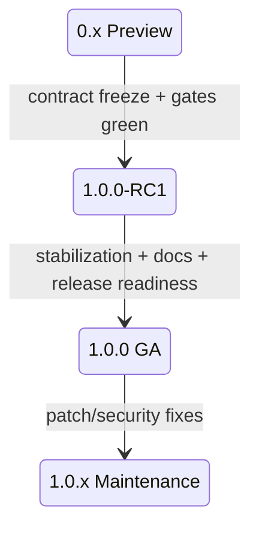

# Peach RPC 1.0 发布策略

> 状态：**1.0.0 GA**

## 1. 版本阶段

## 2. RC1

`1.0.0-RC1` 的目的不是增加功能，而是冻结 1.0.x 契约：

- Wire v1；
- Public Core API；
- Stable Type ID；
- Schema Fingerprint v1；
- Registry compatibility metadata；
- Codec/Message Type 编号。

RC1 必须通过：

- CI；
- Release Readiness；
- Etcd Chaos；
- Nacos Chaos；
- Rolling Compatibility；
- Independent JVM Examples。

## 3. GA

`1.0.0` 在 RC1 冻结边界上完成：

- Blocker/Major 问题清零；
- README/Quick Start/Design/Operations 文档收口；
- CHANGELOG/Security/Contribution/Code of Conduct；
- Maven release metadata；
- Release Bundle + SHA256；
- 公开已知限制；
- 自动 Release Workflow。

GA 不要求伪造统一的生产性能数字。没有固定环境 Evidence 时，禁止发布官方 QPS/SLO/容量承诺。

## 4. 1.0.x 兼容策略

1.0.x 默认只接受：

- Bug fix；
- Security fix；
- 文档和示例改进；
- 不破坏兼容的 Observability/Operations enhancement。

破坏 Wire/API/Stable Type/Schema 的改动必须进入新的兼容版本规划。

## 5. Deprecation

公开 API 弃用：

1. 标记 Deprecated；
2. Release Notes 说明替代入口；
3. 至少跨一个 Minor Release 保留；
4. 删除前明确兼容边界。

Wire ID、Codec ID、Message Type、Registry Metadata key 不通过普通 Deprecated 流程复用。

## 6. Artifact

Release Workflow 生成：

- 编译后的 Reactor JAR；
- Source JAR；
- Javadoc JAR；
- Release Notes；
- CHANGELOG；
- LICENSE；
- Artifact Inventory；
- SHA256SUMS；
- 压缩 Release Bundle。

Examples/Benchmarks 不作为业务 Starter 的传递依赖。

## 7. Release Workflow

人工触发 `.github/workflows/release.yml`：

- `stage=rc1` -> `1.0.0-RC1`；
- `stage=ga` -> `1.0.0`；
- `publish=false` 只验证和生成 Artifact；
- `publish=true` 在全部 gate 通过后创建 GitHub Release。

## 8. Secret 与日志

发布前确认：

- 私钥不进入 Artifact；
- Registry Password/Token 不进入日志；
- Runtime log 为英文；
- Dashboard/Alert 不包含 Secret；
- Benchmark 证书/私钥不进入 Evidence Bundle。

## 9. 性能声明

可以发布：

- Benchmark 方法；
- Evidence 工具；
- 使用者自己的测量结果。

只有受控固定环境、可重复 Evidence 才能晋级：

- 官方 QPS/Core；
- p99/p99.9；
- Production Capacity profile；
- 横向框架性能比较。

## 10. Release Notes

每次发布至少覆盖：

- Added；
- Changed；
- Fixed；
- Compatibility；
- Security；
- Performance evidence boundary；
- Operational notes；
- Upgrade/Rollback；
- Known limitations。

当前文件：

- [1.0.0-RC1](release-notes-1.0.0-RC1.md)
- [1.0.0](release-notes-1.0.0.md)

## 11. Rollback

已发布 Tag 不覆盖、不重写。发现 Blocker 时停止推广，修复后发布新的 RC/Patch，并重新运行全部门禁。

运行时滚动回滚见 [升级与回滚](upgrade-rollback.md)。
