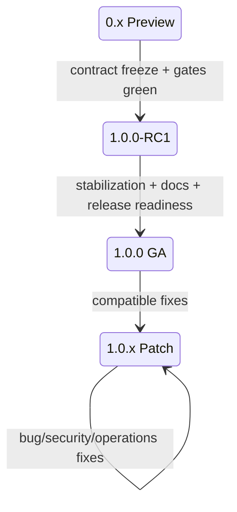

# OTRYX RPC 1.0 发布策略

> 状态：**2.0.0-SNAPSHOT Migration / 1.0.x Maintenance**

## 1. 版本阶段



## 2. 1.0.x 兼容边界

1.0.x 默认只接受：

- Bug fix；
- Security fix；
- 性能修复；
- 文档和示例改进；
- 不破坏兼容的 Observability/Operations enhancement。

以下契约继续冻结：

- Wire v1；
- Public Core API；
- Stable Type ID；
- Schema Fingerprint v1；
- Registry compatibility metadata；
- 已分配 Codec / Message Type ID。

需要破坏上述边界的改动不得伪装成 Patch Release，应进入新的兼容版本规划。

## 3. Patch Release 规则

Patch Release 使用稳定语义化版本：

```text
1.0.1
1.0.2
1.0.3
...
```

不允许：

- 重新发布 `1.0.0`；
- 使用新源码覆盖已经存在的 Tag；
- 使用新源码覆盖 Maven Central 已存在的 GAV；
- 在代码尚未进入 `main` 前先把 release status 改成新版本。

每次 Patch release-prep 必须同步：

- 根 POM `revision`；
- `docs/release-status.properties`；
- `README.md`；
- `README.en-US.md`；
- `CHANGELOG.md`；
- `docs/release-notes-<version>.md`。

## 4. 发布门禁

进入正式 Release Workflow 前至少需要：

- CI；
- Release Readiness；
- Rolling Compatibility；
- 涉及 Etcd/Nacos 行为时对应 Chaos；
- 独立 JVM Examples；
- Repository checks；
- Maven Central publication preflight。

热路径或性能改动还需要与改动对应的 benchmark / soak evidence。

## 5. Artifact

`release` Profile 生成：

- 主 JAR；
- Source JAR；
- Javadoc JAR。

GitHub Release Bundle 额外包含：

- Release Notes；
- CHANGELOG；
- LICENSE；
- Artifact Inventory；
- SHA256SUMS；
- 压缩 Release Bundle。

Maven Central 公开发布：

- `otryx-parent`；
- Core；
- Codegen；
- Codec / Transport / Registry / Proxy Adapter；
- Observability Adapter；
- Spring Boot Autoconfigure；
- Spring Boot Starter。

不上传 Central：

- Examples；
- Example API / Provider / Consumer；
- Benchmarks。

这些工程仍保留在源码仓库和 CI 中。

## 6. Maven Central

项目使用 Central Publisher Portal，而不是已经退役的 OSSRH 发布链。

POM 中的 `central-release` Profile 包含：

- Maven GPG signing；
- Sonatype Central Publishing Maven Plugin；
- 默认手动发布模式；
- 可选自动发布模式；
- Examples/Benchmarks exclusion。

普通 CI 不启用 `central-release`，因此不需要任何发布密钥。

正式 Central 发布要求项目维护者完成：

- Central namespace verification 能够覆盖 `com.peachsoft.otryx`（例如验证 `io.peach` 后发布其子组）；
- Central Portal User Token；
- PGP/GPG signing key；
- GitHub Repository Secrets。

具体配置见 [Maven 结构与发布](maven.md)。

## 7. Release Workflow

人工触发 `.github/workflows/release.yml`。

当前 workflow **只接受新的 1.0.x Patch Release**，例如 `1.0.1`，不会从 post-GA `main` 重新构建并发布旧的 `1.0.0`。

输入：

- `version`；
- `publish_github`；
- `publish_central`；
- `central_auto_publish`。

`publish_github=false`、`publish_central=false` 时，仅做发布前验证和 Bundle 构建。

真正发布时：

1. 必须从 `main` 运行；
2. 校验 Patch Release version/status/notes；
3. 完整运行 quality + release build；
4. 校验 Central Artifact shape；
5. 防止覆盖已存在 Git Tag；
6. 防止覆盖 Maven Central 已存在版本；
7. 可选签名并上传 Central；
8. 自动 Publish 模式下，从全新 Maven local repository 验证 Starter 可以被公网 Central 解析；
9. 可选创建 GitHub Release。

## 8. Secret 与日志

发布前确认：

- Portal Token 不进入仓库；
- PGP/GPG 私钥不进入仓库或 Release Bundle；
- passphrase 不进入日志；
- Registry Password/Token 不进入日志；
- Runtime log 为英文；
- Dashboard/Alert 不包含 Secret；
- Benchmark 证书/私钥不进入 Evidence Bundle。

## 9. 性能声明

可以公开：

- Benchmark 方法；
- Evidence 工具；
- 使用者自己的测量结果。

只有受控固定环境、可重复 Evidence 才能晋级：

- 官方 QPS/Core；
- p99/p99.9；
- Production Capacity profile；
- 横向框架性能比较。

## 10. Release Notes

每次发布至少覆盖：

- Added；
- Changed；
- Fixed；
- Compatibility；
- Security；
- Performance evidence boundary；
- Operational notes；
- Upgrade/Rollback；
- Known limitations。

历史：

- [1.0.0-RC1](release-notes-1.0.0-RC1.md)
- [1.0.0](release-notes-1.0.0.md)
- [1.0.1](release-notes-1.0.1.md)

新的 Patch Release Notes 在对应 release-prep PR 中新增，不能提前声明尚未进入 `main` 的代码已经发布。

## 11. Rollback

Maven Central 和 GitHub 已发布版本均视为不可变。

发现 Blocker 时：

1. 停止推广；
2. 不覆盖 Tag/GAV；
3. 修复代码；
4. 发布新的 Patch；
5. 重新运行全部门禁；
6. 在 CHANGELOG/Release Notes 明确说明。

运行时滚动回滚见 [升级与回滚](upgrade-rollback.md)。
