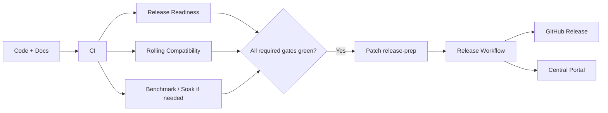

# Peach RPC 1.0.x 发布就绪清单

> 本文覆盖 1.0.0 历史 GA 与后续 1.0.x Patch Release。机器门禁由 `scripts/check_release_readiness.py`、`scripts/check_central_publication.py` 和 GitHub Actions 执行。

## 1. 当前发布状态

| 阶段 | 版本 | 状态 |
|---|---|---|
| RC1 | 1.0.0-RC1 | 历史兼容冻结基线 |
| GA | 1.0.0 | 当前稳定基线 |
| Patch | 1.0.x | 后续兼容修复版本 |

Patch Release 不允许重新使用 `1.0.0` 或任何已发布版本。

## 2. 自动化门禁

普通 PR 至少需要：

- CI；
- Release Readiness；
- Rolling Compatibility。

涉及 Registry/Transport/兼容边界时，需要运行对应 Etcd/Nacos Chaos 与兼容测试。

涉及热路径时，需要运行相应 JMH / soak / evidence harness。



## 3. 1.0.x Patch Gate

Patch release-prep 必须满足：

- 变更已经进入 `main`；
- Wire v1 不变；
- Stable Type ID 规则不变；
- Schema Fingerprint v1 不变；
- Public Core API 不出现不兼容删除/修改；
- 完整 Reactor/Javadoc 通过；
- N/N+1 + rollback 自动化通过；
- 涉及 Registry 时对应 Chaos 通过；
- Independent JVM Examples 通过；
- CHANGELOG 包含本 Patch；
- Release Notes 不含 TODO/TBD；
- 根 POM、release-status、README 中英文版本一致；
- Maven Central publication preflight 通过。

## 4. Central Portal Gate

仓库侧自动校验：

```bash
python3 scripts/check_central_publication.py
```

它验证：

- POM 必需元数据；
- `release` / `central-release` Profile；
- GPG signing 配置；
- Central Publishing Maven Plugin 配置；
- 公开模块清单；
- Examples/Benchmarks exclusion。

完成 release build 后，再验证真正准备发布的 JAR 形态：

```bash
python3 scripts/check_central_publication.py \
  --version <patch-version> \
  --require-artifacts
```

每个公开 JAR 模块必须同时存在：

- 主 JAR；
- Source JAR；
- Javadoc JAR。

## 5. 外部发布前置条件

以下条件无法由仓库 CI 代替：

- Central Publisher Portal 账号可用；
- `io.peach.rpc` namespace 已验证；
- Portal User Token 已生成；
- 发布签名私钥可用；
- GitHub Repository Secrets 已配置。

Secrets：

```text
CENTRAL_USERNAME
CENTRAL_PASSWORD
MAVEN_GPG_PRIVATE_KEY
MAVEN_GPG_PASSPHRASE
```

这里的 `CENTRAL_USERNAME` / `CENTRAL_PASSWORD` 是 Portal User Token 生成的 token credentials，不是把登录密码写进仓库。

## 6. Patch 发布验证命令

假设 release-prep 已经把仓库版本提升为 `1.0.1`：

```bash
python3 scripts/check_project.py
python3 scripts/check_release_version.py --stage patch --version 1.0.1
python3 scripts/check_release_readiness.py --stage patch --version 1.0.1
python3 scripts/check_central_publication.py

mvn -B -ntp clean verify -Pquality,release

python3 scripts/check_central_publication.py \
  --version 1.0.1 \
  --require-artifacts
```

这些命令不执行真正的 Central publish。

## 7. Release Workflow

`.github/workflows/release.yml` 的核心输入：

```text
version
publish_github
publish_central
central_auto_publish
```

### Dry Run

```text
publish_github = false
publish_central = false
```

执行：

- Patch version/readiness；
- Repository checks；
- 完整 release build；
- Central artifact preflight；
- GitHub release bundle。

### Central Validate Only

```text
publish_central = true
central_auto_publish = false
```

签名并上传 Central Portal，等待到 `VALIDATED`，不自动对外发布。

### Central Auto Publish

```text
publish_central = true
central_auto_publish = true
```

等待到 `PUBLISHED`，然后从全新 Maven local repository 解析 Spring Boot Starter，确认外部消费者可以真正使用。

## 8. 不可变保护

真正 publish 时自动检查：

- 只能从 `main` 发布；
- `v<version>` Git Tag 不得已存在；
- Maven Central 相同 Parent GAV 不得已存在。

一旦版本已经公开，禁止覆盖、删除后重发或使用不同源码重新生成同一个版本。

发现问题必须发布新的 Patch。

## 9. 性能证据边界

固定硬件 Evidence 不是普通 Patch 发布的绝对阻塞项，但以下内容没有受控 Evidence 时禁止声明：

- 官方 Production QPS；
- 官方 p99/p99.9 SLO；
- 官方 QPS/Core；
- 官方线程/连接/Heap 容量推荐值；
- “比某框架快 X%”等比较结论。

热路径优化至少需要对应 benchmark harness 能够测量修改的路径。

## 10. 发布后检查

- Tag 与版本一致；
- GitHub Release 附带 Release Notes、Bundle、SHA256SUMS；
- Central Portal Deployment 状态与预期一致；
- 如果自动发布，干净 Maven Repository 消费验证通过；
- Starter 坐标与 README 一致；
- Example 可独立进程运行；
- 没有 Secret 进入 Release Asset；
- CHANGELOG/Release Notes 与代码一致。

## 11. 回滚

如果 Release Artifact 或文档发现 Blocker：

1. 停止继续推广；
2. 不覆盖已发布 Tag/GAV；
3. 修复并提升 Patch 版本；
4. 运行全部门禁；
5. 发布新 Patch；
6. 在 CHANGELOG/Release Notes 说明影响与升级建议。
