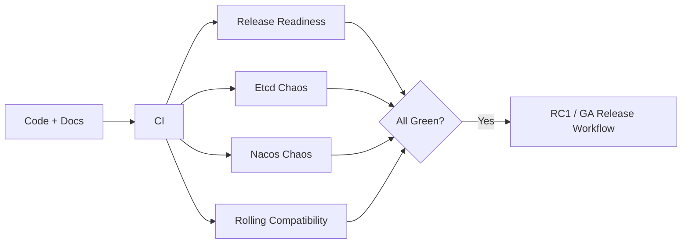

# Peach RPC 1.0 发布就绪清单

> 本文是 RC1/GA 的人类可读版本。机器门禁由 `scripts/check_release_readiness.py` 和 GitHub Actions 执行。

## 1. 发布状态

| 阶段 | 版本 | 目的 |
|---|---|---|
| RC1 | 1.0.0-RC1 | 冻结 Wire/Public API 并做最终稳定性验证 |
| GA | 1.0.0 | 正式稳定版本 |

## 2. 自动化门禁

GA PR 至少需要：

- CI；
- Release Readiness；
- Rolling Compatibility；
- Etcd Chaos；
- Nacos Chaos。



## 3. RC1 Gate

RC1 必须：

- Wire v1 Freeze；
- Stable Type ID Freeze；
- Schema Fingerprint v1 Freeze；
- Public Core API Freeze；
- 完整 Reactor/Javadoc 通过；
- Registry/Transport/TLS 关键测试通过；
- N/N+1 + rollback 自动化通过；
- Etcd/Nacos Chaos 通过；
- Release Notes 完成；
- Quick Start 可运行。

RC1 后不接受无兼容方案的上述契约变更。

## 4. GA Gate

GA 在 RC1 基础上增加：

- RC1 期间没有 Blocker/Major 未解决问题；
- 文档对外化完成；
- Preview/V2 阶段计划已从正式文档集清理；
- CHANGELOG、SECURITY、CONTRIBUTING、CODE_OF_CONDUCT 完整；
- Release Workflow 可重复构建 `1.0.0`；
- Artifact Inventory、SHA256 校验文件可生成；
- 升级/回滚/生产配置/可观测文档完成。

## 5. 性能证据边界

固定硬件 Evidence **不是发布开源 GA 的绝对阻塞项**，但以下内容没有 Evidence 时禁止声明：

- 官方 Production QPS；
- 官方 p99/p99.9 SLO；
- 官方 QPS/Core；
- 官方线程/连接/Heap 容量推荐值；
- “比某框架快 X%”等比较结论。

要发布上述数字，必须按 [Performance Evidence](performance-evidence.md) 在受控环境生成可重复证据。

## 6. 发布命令

RC1：

```bash
python3 scripts/check_release_version.py --stage rc1 --version 1.0.0-RC1
python3 scripts/check_release_readiness.py --stage rc1 --version 1.0.0-RC1
mvn -B -ntp -Drevision=1.0.0-RC1 clean verify -Pquality,release
```

GA：

```bash
python3 scripts/check_release_version.py --stage ga --version 1.0.0
python3 scripts/check_release_readiness.py --stage ga --version 1.0.0
mvn -B -ntp clean verify -Pquality,release
```

## 7. 发布后检查

- Tag 与版本一致；
- GitHub Release 附带 Release Notes、Bundle、SHA256SUMS；
- Starter 依赖坐标与 README 一致；
- Example 可从干净环境运行；
- 没有 Secret 进入 Release Asset；
- Issues/Security/Contribution 入口可用。

## 8. 回滚

如果 Release Artifact 或文档发现 Blocker：

1. 停止继续推广；
2. 不覆盖已发布 Tag；
3. 修复后发布新的 Patch/RC；
4. 运行全部门禁；
5. 在 CHANGELOG/Release Notes 明确说明。
