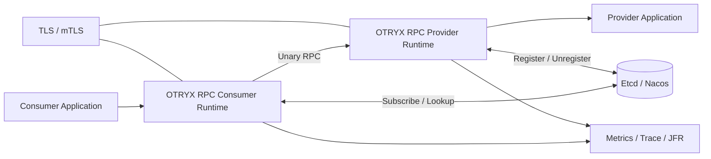

# OTRYX RPC 2.0 需求蓝图

> OTRYX 2.0.0-SNAPSHOT 属于公开 Java API / GAV 的破坏性命名空间迁移；继承历史 Wire v1 并不代表新旧 Java API 保证互通。详见 [迁移指南](migration-to-otryx.md)。

> 状态：**2.0.0-SNAPSHOT Migration / 继承自 Peach RPC 1.0.x 的 Wire v1 基线**  
> 目标读者：使用者、架构师、维护者、贡献者。

## 1. 背景与问题

OTRYX RPC 面向 Java 服务间通信。项目要解决的不是“再增加一个远程调用 API”，而是把以下能力放进一个边界清晰、可独立演进的 RPC 基础设施中：

- 高并发 Unary RPC；
- 服务注册、发现与本地目录；
- 超时、重试、熔断、异常实例剔除与优雅下线；
- TLS/mTLS、可观测性和可诊断性；
- N/N+1 滚动升级与回滚；
- 编译期 Codegen 与可插拔 Adapter；
- 可重复的性能、Chaos、兼容与发布门禁。

项目采用 MIT License，目标是让个人和团队可以无授权费用地学习、使用、修改和分发。

## 2. 项目目标

### 2.1 核心目标

| ID | 目标 |
|---|---|
| G-01 | 为 Java 服务提供稳定的 Unary RPC 调用能力 |
| G-02 | 请求热路径不访问注册中心，控制面与数据面解耦 |
| G-03 | 资源使用有界，故障行为可预测、可观测、可恢复 |
| G-04 | 允许 Registry、Transport、Codec、Proxy、Observability 通过明确边界扩展 |
| G-05 | Wire v1、Type ID、Schema Fingerprint 和 Public Core API 在 1.0.x 内保持兼容 |
| G-06 | 新使用者能够按文档从零运行官方 Provider/Consumer 示例 |
| G-07 | 发布过程具备自动化 CI、Chaos、Rolling Compatibility 与 Release Readiness 门禁 |

### 2.2 非目标

1. 1.0.x 不提供 Streaming RPC。
2. 1.0.x 不宣称跨语言 IDL/SDK。
3. 1.0.x 不提供 ZooKeeper、Consul、Eureka Adapter。
4. 1.0.x 不把 GitHub shared runner 数据包装成官方生产容量数字。
5. 1.0.x 不自动替业务判断幂等语义。

## 3. 使用者与典型场景

| 角色 | 目标 | 典型场景 |
|---|---|---|
| Java 服务开发者 | 快速完成服务调用 | Spring Boot Provider / Consumer |
| 平台工程师 | 统一通信与治理 | 注册发现、超时、重试、熔断、可观测 |
| 架构师 | 控制兼容和升级风险 | N/N+1 滚动升级、回滚、Schema 隔离 |
| SRE/运维 | 快速定位故障 | Metrics、Tracing、JFR、Dashboard、Alert |
| 框架贡献者 | 扩展底层能力 | SPI Adapter、Codegen、Benchmark、Chaos |

## 4. 系统上下文

读图重点：

- Registry 只属于控制面；
- Consumer 调用使用本地 `ServiceDirectory` 快照；
- TLS/mTLS 位于 Transport 层；
- Observability Adapter 不决定业务调用成败。

## 5. 功能需求

### FR-001 服务契约

- 服务由 Java Interface 定义。
- `@OtryxRpcContract` 可触发编译期 Consumer Stub 与 Provider Dispatcher 生成。
- 缺少生成代码时必须存在可工作的 fallback 路径。

### FR-002 Provider

- `@OtryxRpcService` 暴露服务。
- Provider 启动后向 Registry 注册实际 advertised endpoint。
- 关闭时先注销、进入 GO_AWAY/Drain，再释放资源。

### FR-003 Consumer

- `@OtryxRpcReference` 注入远程服务。
- Consumer 使用本地服务目录和负载均衡器选择 endpoint。
- 单次逻辑调用必须受整体 Deadline 约束。

### FR-004 Registry

- 内置 Memory、Etcd、Nacos。
- 支持 register、unregister、lookup、subscribe。
- Registry 故障不能让一次控制面异常立即清空 last-known-good 数据面目录。

### FR-005 Transport 与协议

- 当前默认 Transport 为 Vert.x TCP。
- Wire v1 使用固定 Header + Metadata + Payload。
- 支持 HELLO/ACK、PING/PONG、CANCEL、GO_AWAY。
- 支持 TLS/mTLS。

### FR-006 Resilience

- 自动 Retry 只允许显式 `@OtryxRpcIdempotent` 方法。
- Retry 受最大 Attempt、Budget、Deadline、Backoff/Jitter 约束。
- 支持方法级 Circuit Breaker。
- 支持 endpoint Outlier Ejection。
- Provider 支持 admission 与 CPU 有界队列。

### FR-007 可观测性

- Core 提供低依赖 Observer/Tracing/Metadata 契约。
- Micrometer、OpenTelemetry、JFR 使用独立 Adapter。
- Telemetry 异常不能反向导致 RPC 失败。

### FR-008 兼容升级

- Wire v1 在 1.0.x 冻结。
- Stable Type ID 与 Schema Fingerprint 在 1.0.x 冻结。
- N/N+1 与回滚必须由自动化 Rolling Compatibility 验证。
- 不兼容业务契约通过新的 `ServiceKey.version` 隔离。

## 6. 非功能需求

### 性能

- 热路径不得访问 Registry。
- 不应在热路径执行 SPI 扫描和配置解析。
- 性能优化必须由 Benchmark/Soak Evidence 驱动。
- 没有固定硬件证据时不得发布官方 QPS/SLO 数字。

### 可靠性

- 连接支持 heartbeat、idle detection、reconnect backoff。
- Provider 支持 graceful drain。
- Etcd/Nacos 有真实集成与 Chaos 测试。
- 关键并发 race 必须有自动化回归。

### 安全

- 支持 TLS/mTLS。
- Hostname Verification 默认开启。
- 密钥和 Registry Credential 不进入日志。
- 协议输入进行边界与状态机校验。

### 可维护性

- Core 不依赖 Vert.x、Etcd、Nacos、Spring、Micrometer、OTel、JFR。
- 公共/受保护框架 API 使用中文 Javadoc。
- Runtime 日志使用英文。
- 中英文 README 同步。

## 7. 故障与边界场景

必须覆盖：

- Registry 暂停、重启、leader transfer、watch 恢复；
- silent/half-open connection；
- handshake timeout；
- request timeout / cancel / response race；
- duplicate Request ID；
- malformed header / metadata / control frame；
- Provider overload；
- Retry exhausted；
- Circuit OPEN/HALF_OPEN；
- TLS/mTLS 握手或证书错误；
- N/N+1 mixed deployment 和 rollback。

## 8. 1.0 验收标准

1. `python3 scripts/check_project.py` 通过。
2. `mvn -B -ntp clean verify -Pquality` 通过。
3. Release Readiness 通过。
4. Etcd Chaos 通过。
5. Nacos Chaos 通过。
6. Rolling Compatibility 通过。
7. 独立 JVM Examples E2E 通过。
8. README、快速开始、配置、兼容、升级、运维和安全文档完整。
9. 1.0.0-RC1 与 1.0.0 Release Notes 均已冻结。
10. MIT License、Security、Contribution、Code of Conduct 对外可见。

## 9. 与后续版本的边界

1.1.x 可以扩展生态，但不允许静默破坏 1.0.x Wire/Public API 兼容。后续方向见根目录 [ROADMAP](../ROADMAP.md)。
