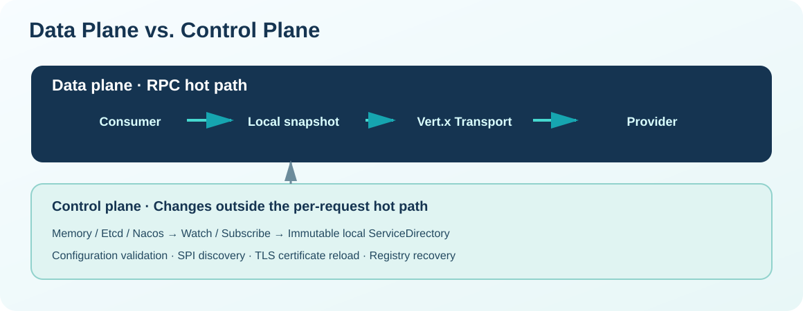
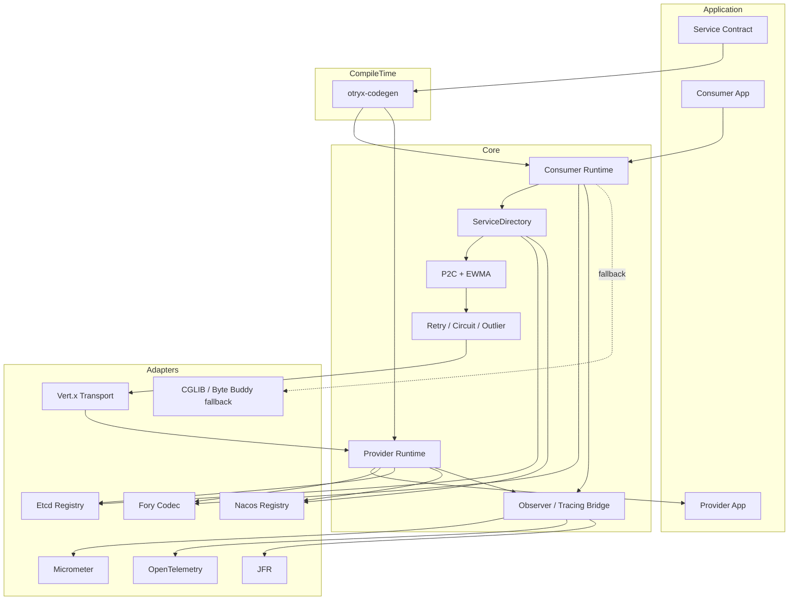
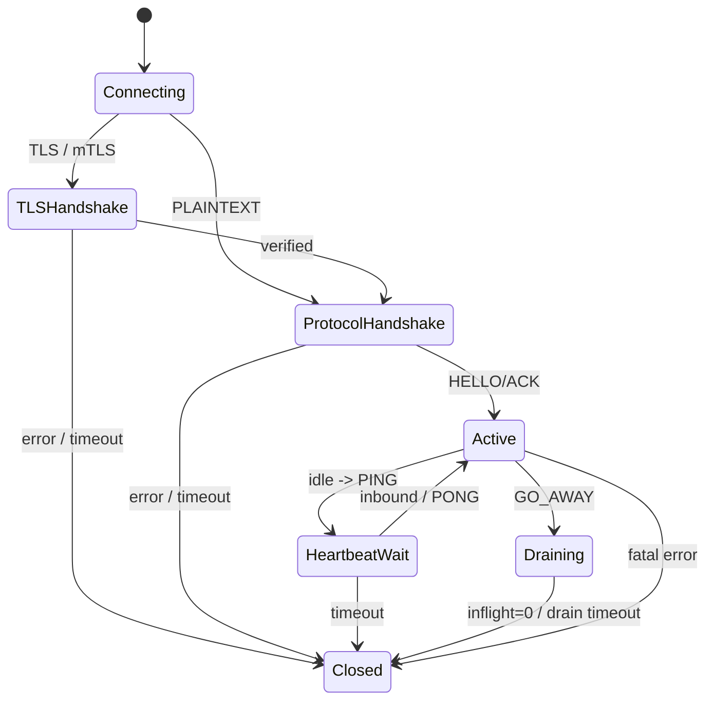
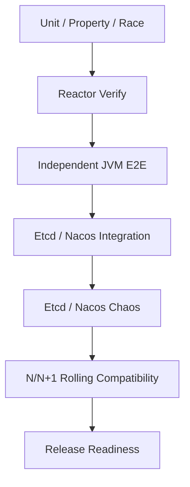

# OTRYX RPC 2.0 技术方案

> OTRYX 2.0.0-SNAPSHOT 属于公开 Java API / GAV 的破坏性命名空间迁移；继承历史 Wire v1 并不代表新旧 Java API 保证互通。详见 [迁移指南](migration-to-otryx.md)。

> 状态：**Current / 2.0.0-SNAPSHOT Migration**  
> 本文解释当前实现为什么这样设计，以及各边界如何协同。



## 1. 方案摘要

OTRYX RPC 采用“**Core 稳定契约 + Adapter 隔离第三方技术 + 启动期绑定 + 热路径最小动态行为**”的总体方案。

核心决策：

1. 控制面和数据面分离；
2. Wire v1 固定协议；
3. Consumer 使用本地不可变服务快照；
4. Provider 按业务执行模型隔离资源；
5. Retry/Circuit/Outlier 都是有边界的故障控制机制；
6. TLS/mTLS 位于 Transport；
7. Metrics/Trace/JFR 通过低依赖 Core 契约接入；
8. 兼容判断在 Registry Snapshot 更新时完成，不增加单次 RPC 热路径成本。

## 2. 约束

- JDK 21；
- Maven；
- Spring Boot 3.5.4；
- 默认 Transport：Vert.x；
- 默认 Codec：Fory；
- Registry：Memory / Etcd / Nacos；
- Wire Protocol：v1；
- 当前 RPC 模式：Unary；
- 当前主要语言：Java。

## 3. 总体架构



## 4. 数据面设计

### Consumer

`refer()` 期间完成方法描述、Codec、Generated Stub/Proxy、Directory、LoadBalancer 等绑定。

调用时：

```text
Generated Stub / Proxy
 -> logical call context
 -> ServiceDirectory snapshot
 -> compatibility filter
 -> P2C + EWMA
 -> circuit/outlier/retry decision
 -> method codec
 -> endpoint connection
 -> connection-local pending table
 -> wire
```

关键点：

- 不访问 Registry；
- Request ID 为 connection-local；
- Retry 只允许显式幂等方法；
- logical Deadline 覆盖连接获取、握手和业务请求。

### Provider

```text
FrameAccumulator
 -> protocol validation
 -> request tracking
 -> admission
 -> method binding
 -> payload decode
 -> generated dispatcher / MethodHandle fallback
 -> execution policy
 -> response encode
```

执行策略：

- `BLOCKING_VIRTUAL`：默认；
- `CPU`：有界平台线程池；
- `DIRECT`：默认禁止，只允许明确的极短非阻塞逻辑；
- 业务方法返回 `CompletionStage` 时采用 continuation 完成响应，不在 Provider worker 上 `join()`；异步阶段完成前仍占用 admission 配额，避免异步业务绕过并发上限；
- 未完成的异步 Stage 后续完成时，响应编码会重新进入 Provider 管理的执行资源并恢复 Trace/Metadata Scope，避免在业务 Future 的完成线程或 Vert.x/Netty EventLoop 上直接执行序列化；若有界 CPU Pool 无法接受异步完成任务，则 fail-fast 为 `OVERLOADED`，不采用 CallerRuns 回退。

## 5. 控制面设计

Registry Adapter 负责：

- Provider register/unregister；
- Consumer lookup/subscribe；
- 失败恢复；
- 快照归一化。

Core 只接收 `RegistrySnapshot`。Directory 根据 revision 更新本地数组快照。

Etcd 使用 Lease + Range/Watch；Nacos 使用临时实例 + Naming subscription。Nacos 以 NamingEvent 作为主更新通道，并用 5 秒低频完整视图 reconcile 兜底最后实例消失等通知缺口；reconcile 只在事件队列空闲时发布，避免旧查询结果覆盖新事件。Nacos 阻塞 SDK 被隔离到 Adapter 私有控制面执行器。

## 6. Wire 与兼容

Wire v1 分离：

- Protocol Version；
- Codec ID；
- Compression ID；
- Feature Capability；
- Type ID；
- Schema Fingerprint；
- ServiceKey Version。

Schema Fingerprint 放在 Registry Metadata，而不是每连接 HELLO 中。Consumer 在 Snapshot 更新时把明确不兼容实例从本地目录剔除。

## 7. 连接与生命周期



异常连接采用 request-driven reconnect + exponential backoff + full jitter。

## 8. Resilience

### Timeout

Consumer 维护整体 logical Deadline。新 Provider 优先使用相对 `timeoutBudgetMillis`，旧节点仍可以使用绝对 Deadline，支持滚动升级。

### Retry

只有 `@OtryxRpcIdempotent` 方法才允许自动 Retry。停止原因可观测为：

- MAX_ATTEMPTS；
- BUDGET；
- DEADLINE。

### Circuit Breaker

方法级 CLOSED / OPEN / HALF_OPEN。HALF_OPEN 并发只允许单 probe。

### Outlier Ejection

Endpoint 连续基础设施失败可在本地暂时剔除，避免故障节点持续进入负载均衡候选。

## 9. Security

TLS/mTLS 位于 Vert.x Transport：

```text
TCP
 -> TLS/mTLS handshake
 -> certificate / hostname verification
 -> OTRYX RPC HELLO/ACK
 -> RPC traffic
```

框架不允许 TLS 失败后自动降级到 PLAINTEXT。

## 10. Observability

Core 只定义：

- `RpcObserver`；
- `RpcTracingBridge`；
- `RpcMetadataPropagator`。

Adapter：

- Micrometer；
- OpenTelemetry；
- JFR。

原则：

> telemetry failure must not become RPC failure.

## 11. 测试与发布策略

自动化分层：



性能测试和容量 Evidence 单独管理，不把 shared runner 的波动数字写进 GA 性能承诺。

## 12. 主要权衡

| 决策 | 收益 | 代价 |
|---|---|---|
| Core 与 Adapter 分离 | 依赖边界清晰 | 模块数量增加 |
| Strict Schema Fingerprint | 升级行为确定 | 字段级宽松兼容留到未来 |
| Generated path + fallback | 性能与易用性兼顾 | 两条调用路径都需测试 |
| Virtual Thread 默认 | 阻塞业务接入简单 | 仍需 admission 保护 |
| Registry compatibility filtering | 热路径零额外兼容判断 | 控制面实现更复杂 |

## 13. 当前限制

- 仅 Unary RPC；
- Fory Native 主要面向 Java；
- Compression 数据面当前只允许 NONE；
- Transport/Core 仍以完整 `byte[]` Frame 为边界；
- 没有固定硬件 Evidence 时不提供官方生产容量数字。
